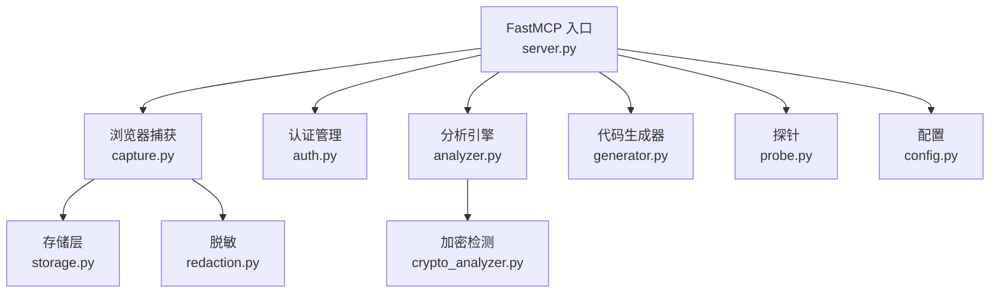
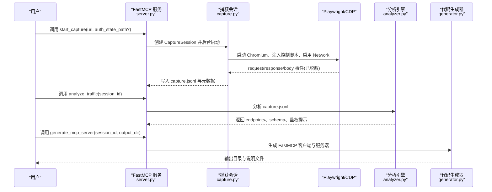
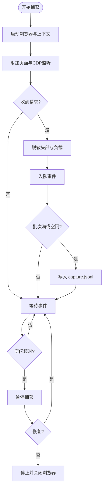
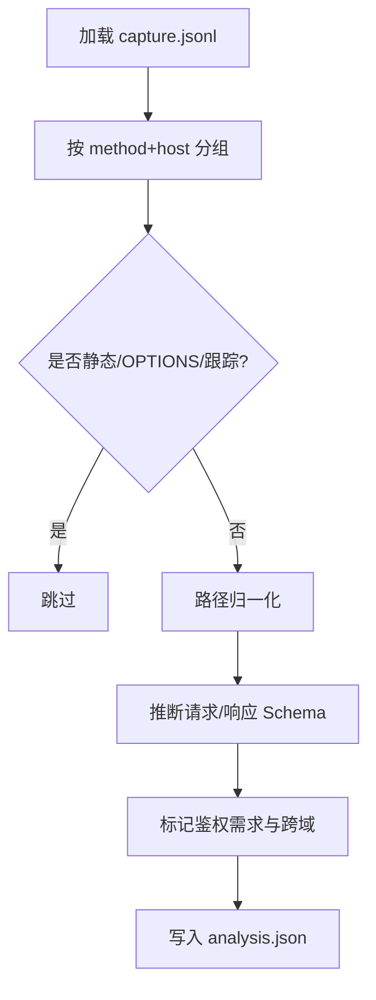
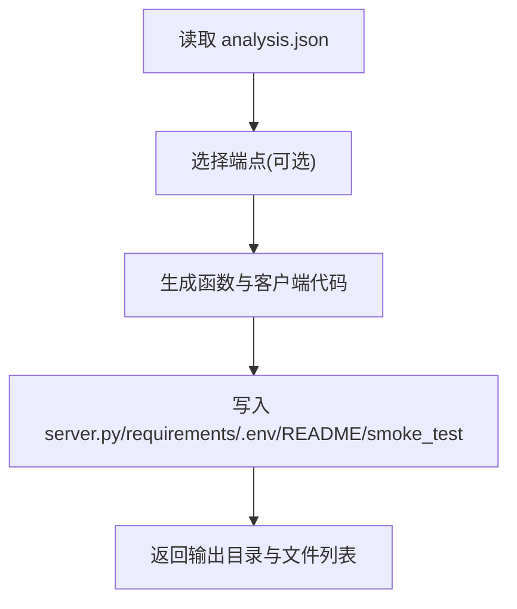
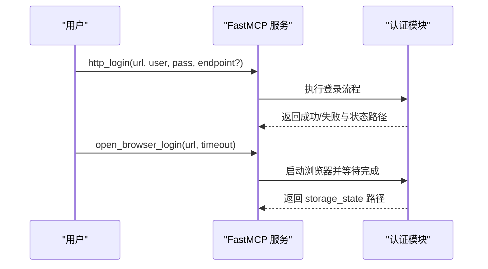
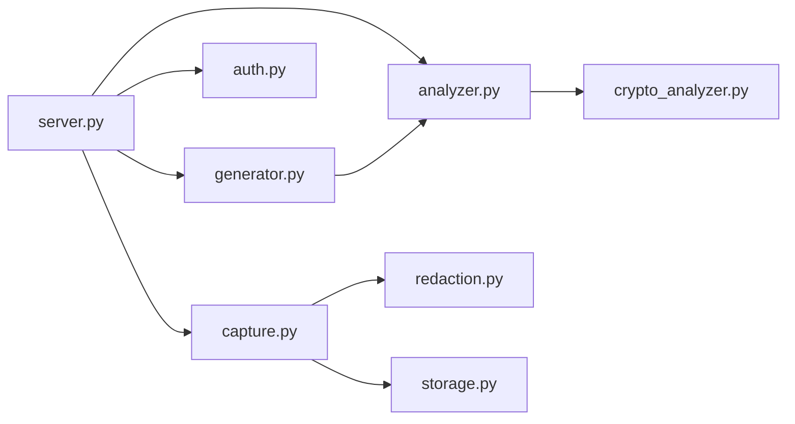

# 项目概述

## 目录
1. [简介](#简介)
2. [项目结构](#项目结构)
3. [核心组件](#核心组件)
4. [架构总览](#架构总览)
5. [详细组件分析](#详细组件分析)
6. [依赖关系分析](#依赖关系分析)
7. [性能考量](#性能考量)
8. [故障排查指南](#故障排查指南)
9. [结论](#结论)
10. [附录：快速开始与使用要点](#附录快速开始与使用要点)

## 简介
WebAPIExtractor 是一个基于 FastMCP 协议的自动化 Web API 发现与提取工具。它通过 Playwright 驱动浏览器、利用 CDP（Chrome DevTools Protocol）捕获网络流量，结合智能分析引擎对请求/响应进行归一化与模式识别，最终生成可运行的 Python/FastMCP 客户端代码，实现“从真实浏览器行为到可用接口”的端到端自动化。

核心价值与目标
- 自动化发现：无需人工梳理，自动捕获并归纳站点 API 路径与参数。
- 安全脱敏：在写入共享日志前对敏感字段进行脱敏，降低泄露风险。
- 认证管理：支持 HTTP 登录与交互式登录两种模式，持久化会话状态。
- 流量分析：过滤静态资源与 OPTIONS，推断 JSON Schema，识别跨域与鉴权需求。
- 代码生成：一键生成 FastMCP 服务与调用客户端，便于文档与测试复用。

适用场景
- API 文档自动生成：将捕获到的接口与示例数据转化为可读文档。
- 接口测试数据准备：基于真实流量构造用例，提升回归测试覆盖率。
- 逆向与集成：为第三方系统对接提供快速可用的 MCP 工具集。

技术栈关键词
- Playwright 浏览器自动化
- CDP 网络捕获
- 智能分析引擎（路径归一化、Schema 推断、鉴权候选识别）
- FastMCP 服务器与工具生成

## 项目结构
项目采用按功能划分的模块组织方式，入口由 FastMCP 暴露工具方法，内部职责清晰：
- server.py：FastMCP 工具注册与会话生命周期管理
- capture.py：Playwright + CDP 网络捕获与事件写入
- analyzer.py：捕获数据分析、路径归一化、Schema 推断
- generator.py：根据分析结果生成 Python/FastMCP 服务端与客户端
- auth.py：HTTP 登录与交互式登录流程
- config.py：运行时配置与环境变量
- storage.py：会话元数据持久化与孤儿会话恢复
- redaction.py：敏感信息脱敏
- crypto_analyzer.py：加密载荷与脚本指纹检测
- probe.py：登录页面探测与策略建议

## 核心组件
- 会话与生命周期管理：server.py 暴露 start_capture/get_capture_status/stop_capture/resume_capture/list_sessions 等工具，维护 CaptureSession 实例与持久化元数据。
- 浏览器与 CDP 捕获：capture.py 启动 Chromium，注入控制条脚本，订阅 Network.* 事件，实时脱敏并批量写入 capture.jsonl。
- 分析与推断：analyzer.py 加载事件流，过滤静态与 OPTIONS，归一化路径，推断 JSON Schema，标记鉴权需求与跨域。
- 代码生成：generator.py 读取 analysis.json，生成 FastMCP 工具函数、requirements、.env.example、README 与冒烟测试脚本。
- 认证管理：auth.py 提供 http_login 与 open_browser_login，保存 cookies/storage_state 到安全目录。
- 配置与存储：config.py 从环境变量加载限制；storage.py 原子写入 session.json，支持孤儿会话恢复。
- 安全与加密：redaction.py 对 Authorization/Cookie/JSON 敏感字段脱敏；crypto_analyzer.py 检测疑似密文与加密库线索。
- 登录探测：probe.py 无头浏览页面，识别表单、验证码、MFA、OAuth/SSO 等指标，给出认证模式建议。

## 架构总览
整体流程：用户通过 FastMCP 工具发起捕获 → 浏览器打开目标站点 → CDP 监听网络事件 → 脱敏后落盘 → 分析引擎聚合事件生成 endpoints → 可选加密检测 → 生成 FastMCP 客户端代码。

## 详细组件分析

### 浏览器捕获与 CDP 事件处理
- 启动流程：创建上下文、注入控制条脚本、绑定 __mcp_control、启用 CDP Network/Runtime、自动附加子目标。
- 事件处理：requestWillBeSent 记录请求与脱敏后的头部/负载；responseReceived 记录响应头与类型；loadingFinished 获取响应体并按限制截断，同时保存脚本片段。
- 写入策略：事件入队，批量化写入 capture.jsonl，空闲监控在超时后暂停捕获。
- 控制能力：通过控制条执行 pause/resume/stop，状态广播至页面。

### 分析引擎与路径归一化
- 事件聚合：按 requestId 关联 request/response/response_body。
- 过滤规则：忽略 OPTIONS、静态资源与跟踪域名。
- 路径归一化：保守分组，保留字面量如 latest，将高区分度且形似参数的段替换为 {id}。
- Schema 推断：递归构建 JSON Schema，标注必填字段。
- 输出：endpoints、auth_metadata、stats、base_url 并写入 analysis.json。

### 代码生成器
- 输入：analysis.json 中的 endpoints。
- 命名策略：基于路径片段与方法映射生成函数名，冲突时追加序号。
- 输出：
  - server.py：FastMCP 工具集合，封装 httpx 请求与鉴权头。
  - requirements.txt：运行依赖。
  - .env.example：API_BASE_URL、API_TOKEN 模板。
  - README.md：使用说明与变更警告。
  - smoke_test.py：冒烟测试脚本。

### 认证管理
- HTTP 登录：优先尝试 JSON 登录或解析 HTML 表单，成功后保存 cookies/token 到安全目录。
- 交互式登录：打开浏览器并注入控制条，用户完成登录后导出 storage_state。
- 安全：权限位设置、独立目录隔离、禁止提交敏感文件。

### 脱敏与安全
- 头部脱敏：Authorization 仅保留 scheme，Cookie/Set-Cookie 仅保留键名。
- 负载脱敏：匹配密码类字段与 token 类字段，替换为占位符并记录路径。
- 登录候选识别：基于 URL 模式与 POST 字段名判断是否为登录请求。

### 加密检测
- 密文特征：Base64/十六进制长度与字符集校验。
- 脚本线索：扫描已保存脚本中是否包含常见加密库关键字。
- 策略建议：根据是否存在密文与脚本线索给出 L1/L0/none 策略。

### 登录探测
- 无头浏览目标页，识别密码框、表单 action、文本与链接关键词。
- 输出认证模式（form/interactive）、表单字段、指标（验证码/MFA/OAuth/SSO）与置信度。

### 配置与存储
- 配置项：数据根目录、响应体大小限制、空闲超时、最大并发会话数，均支持环境变量覆盖。
- 存储：原子写入 session.json，支持服务器重启后恢复孤儿会话状态。

## 依赖关系分析
- 外部依赖：fastmcp、httpx、jinja2、playwright、pytest。
- 模块耦合：
  - server.py 聚合各子系统，作为统一入口。
  - capture.py 依赖 redaction.py、storage.py。
  - analyzer.py 依赖 redaction.py 的登录候选逻辑（间接）。
  - generator.py 依赖 analyzer.py 的输出。
  - auth.py 与 capture.py 共用 Playwright 能力。
- 潜在循环：未发现直接循环依赖；server.py 集中编排。

## 性能考量
- 响应体限制：通过 WEB_API_EXTRACTOR_RESPONSE_LIMIT 控制响应体大小，避免大响应拖慢写入与分析。
- 空闲超时：WEB_API_EXTRACTOR_IDLE_TIMEOUT 控制无操作自动暂停，减少资源占用。
- 并发上限：WEB_API_EXTRACTOR_MAX_SESSIONS 限制同时捕获会话数量，防止浏览器与 CPU 过载。
- 批量写入：事件队列批处理 flush，降低 I/O 频率。
- 脚本保存：仅保存脚本片段以节省磁盘空间。

[本节为通用性能指导，不直接分析具体文件]

## 故障排查指南
- 会话未找到：检查 session_id 是否正确，确认 analyze_traffic 前先完成捕获。
- 会话不存在或已结束：stop_capture 后状态为 stopped，无法 resume。
- 登录失败：http_login 返回 fallback=interactive 时，改用 open_browser_login 完成交互登录。
- 页面加载超时：probe 或登录阶段可能因网络或站点渲染缓慢导致超时，适当增加超时时间。
- 加密载荷：若 detect_crypto 返回 found=true，需补充密钥或运行时透传逻辑后再调用生成。
- 审计日志：所有工具调用均被审计记录，便于回溯问题。

## 结论
WebAPIExtractor 将浏览器真实行为转化为可复用的 API 资产，通过自动化捕获、智能分析与代码生成，显著降低接口文档与测试准备的成本。其模块化设计使扩展新站点与新协议变得简单，适合在前后端协作、第三方集成与质量保障场景中广泛使用。

[本节为总结性内容，不直接分析具体文件]

## 附录：快速开始与使用要点
- 安装与初始化
  - 安装依赖并安装 Chromium 浏览器。
  - 首次使用可执行安装脚本或在 VS Code 中导入 Agent。
- 环境变量
  - 数据目录、响应体限制、空闲超时、最大会话数均可通过环境变量覆盖。
- 基本工作流
  - 认证：优先尝试 http_login，必要时使用 open_browser_login。
  - 捕获：start_capture 后操作网站，完成后 stop_capture。
  - 分析：analyze_traffic 生成 endpoints 与 schema。
  - 生成：generate_mcp_server 输出 FastMCP 客户端与服务端代码。
- 注意事项
  - 敏感数据保存在安全目录，勿提交至版本库。
  - 对于加密站点，先进行加密检测与策略补充。
