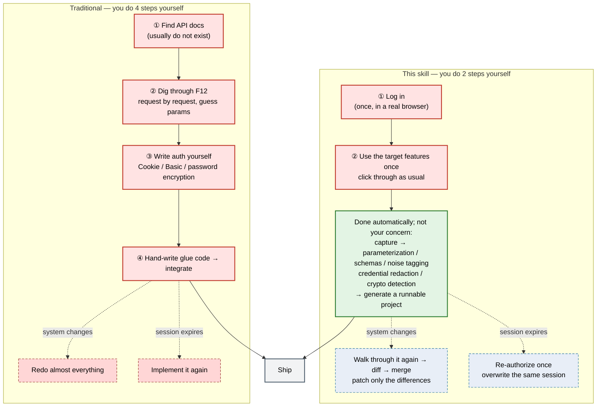

# Technical Reference

> **English** | [简体中文](reference.md)
>
> For developers and operators. For a quick start see [README.en.md](../README.en.md);
> for the agent's operating procedure see [SKILL.md](../SKILL.md).

---

## Traditional development vs using this skill

For integrating a system that has only a web UI and no API, here is where the two paths diverge —
**red boxes are what you do yourself, green boxes are what the tool finishes on its own**:



> **Reading it**: red boxes = what you do by hand (traditional **4** steps → this skill **2** steps,
> and those 2 are just "log in" and "use the site as usual" — no code involved);
> green = fully automatic, not your concern; dashed red = what the traditional path costs you when
> the system changes or the session expires (a redo), dashed blue = what this skill costs (patching
> the differences).
> Both paths end at the same step, "Ship" — the difference is only **how much you do by hand before that**.

### What exactly is saved

| Traditional | With this skill |
|---|---|
| Dig through F12 by hand, copy curl commands | Use the site normally in a browser; every request/response is recorded automatically |
| Guess at docs, trial-and-error on parameters | Parameter structure and request/response schemas are derived from real traffic; structurally identical endpoints merge automatically (`/user/123` + `/user/456` → `/user/{user_id}`) |
| Session state, tokens, and password-encryption logic are hard to reproduce | Login endpoints are recognized (including the password encryption strategy and public-key extraction); the generated MCP ships with `login()`, encrypted credential persistence, and 401 auto re-login (**only when a login endpoint is recognized**; pure-Cookie / SSO sites use interactive authorization, see "Renewal semantics") |
| Even with the endpoints you still hand-write glue code | A registry project is generated directly: multi-host routing, typed parameters, measured auth, write guardrails, smoke test |
| Captured data contains sensitive information and needs manual cleaning | On the **request side**, values in JSON bodies, form-encoded bodies and common credential headers are erased at record time (length/shape metadata is kept, so plaintext and ciphertext stay distinguishable); **URLs and response bodies are not redacted** and still need your attention. Encrypted credential storage applies only to the **generated project** (DPAPI, Windows only, and only when an account/password login endpoint was recognised) — this tool's own login-state file instead stores the account/password **DPAPI-encrypted** in `secrets_enc` (likewise Windows-only, decryptable only by the same user), while the cookies in it remain **plaintext**. |
| Missed endpoints mean starting over | Registry incremental iteration: capture another round → diff → merge → regenerate |

### The essential difference

The traditional path takes **documentation and guesswork** as input. This skill takes
**what you actually did** as input. That determines three things:

- **No documentation needed** — systems without API docs work just as well, including internal
  systems behind CAPTCHAs, SMS verification, or SSO
  (those go through interactive authorization and get **no automatic re-login**);
- **No guessing at parameters** — parameter structure comes from real traffic, not from
  reverse-engineering JavaScript;
- **Cheap to keep up to date** — endpoints are only marked `unseen_since` and are **never
  deleted automatically**, so you merge incrementally instead of rebuilding.

---

## Installation forms

**A. Import as a skill (recommended — this is the path a user takes)** — drag the skill folder
(or the `scry-mcp-gen-agent.zip` import package) into your AI assistant's **Skills** settings
page; or drop it straight into the conversation and let the agent install it.
**A user installs no library and runs no command**; the first-run environment (including the browser
engine) is set up by the agent (see "Environment setup" below).

Inside the skill folder, `SKILL.md`, `runbook/`, `bootstrap.*`, `start_server.py` and `mcp_call.py`
are all files **consumed by the agent**; `docs/reference.en.md` (this file, with the Chinese
original at `docs/reference.md`) is the human-facing
technical documentation. `scry-mcp-gen-agent.zip` is built by `package-agent.py`
(cross-platform) or `package-agent.ps1` (Windows) — the two scripts have identical manifests and
identical output, so either will do; the contents match the skill folder.
**Official packages are attached to GitHub Releases** (from `v0.1.0` onward, each tag carries its own
zip), so users can just download one instead of pulling the repository and packaging it themselves.

**B. Working from source (doing it yourself / secondary development)** — everything below this point
is for that audience. **This project is not published to PyPI, so you must work from source.**

```bash
git clone https://github.com/SH-DaWushi/web-api-extractor.git
cd web-api-extractor
```

Editable install as a Python library:

```bash
pip install -e .
python -m playwright install chromium
```

The entry points are then `scry-mcp-gen` (stdio, see `[project.scripts]` in `pyproject.toml`)
and `python -m scry_mcp_gen serve-http`; the repository-local driver scripts (`mcp_call.py`,
`start_server.py`, …) are not in the package. The runtime dependencies are only
`fastmcp / httpx / playwright`; the test runner (`pytest` / `pytest-asyncio`) is **optional** —
`pip install -e .` does **not** install it, use `pip install -e ".[test]"` (equivalent to
`pip install -r requirements-dev.txt`), otherwise `asyncio_mode=auto` is silently ignored
(see "Tests").

### Editions and licensing

This project ships as **two editions with different terms** — **the `LICENSE` inside the package you
actually received is the one that applies**:

| Edition | Where it comes from | Terms |
|---|---|---|
| Open-source | this repository, the GitHub Releases skill package | the repository's root `LICENSE` (custom, **non-commercial**) |
| Store | the package distributed through a skill store | the `LICENSE` inside that package, which is `LICENSE-STORE` (a custom **store-distribution license**) |

The store edition grants store listing and end-user use (including internal business purposes), retains
attribution and disclaimers, forbids resale, redistribution outside that store, sublicensing and
distributing modified versions (private modification is fine), and does **not** waive the open-source
edition's non-commercial restriction.

The editions differ in more than the license — **what actually goes into a package differs too**. The
authoritative source is `INCLUDE` (open-source) plus the `--store` trimming logic (`STORE_EXCLUDE` /
`STORE_ADD` / `STORE_RENAME`) in `package-agent.py`, mirrored item-for-item by `package-agent.ps1`
(see `tests/test_package_agent.py`):

- **Open-source** packages the top-level items of `INCLUDE`: `pyproject.toml`, `requirements.txt`,
  `requirements-dev.txt`, `README.md` / `README.en.md`, `SKILL.md`, `docs/`, `runbook/`, `LICENSE`,
  `DISCLAIMER.md`, `bootstrap.py` / `bootstrap.ps1` / `bootstrap.sh`, `install-agent.ps1`,
  `start_server.py`, `run_http.py`, `mcp_call.py`, `.vscode/`, `scry_mcp_gen/`, `tests/`.
- **Store** takes that list and **removes**: `tests/` (the whole test suite), `pyproject.toml`,
  `requirements-dev.txt`, `.vscode/`, `bootstrap.sh`, `install-agent.ps1`, and `LICENSE`; it **only
  adds** `LICENSE-STORE`, which is **renamed to `LICENSE` inside the package** (a store package may
  carry only one license file, and it must be the store one).
- **Neither** distribution contains `package-agent.py` / `package-agent.ps1` (the packaging scripts
  themselves) or `.gitattributes` — they are not in `INCLUDE`, so they are repository-only files, not
  something the store edition specifically trimmed.
- **What this means in practice**: the store package has **no `tests/`**, no test dependencies
  (`requirements-dev.txt`) and no packaging metadata (`pyproject.toml`). So **to run the tests from a
  package, use the open-source edition** (or work from the repository source); the store package only
  ships what is needed at runtime.
- **License and disclaimer files**: `DISCLAIMER.md` is **bundled in both editions** (it states no
  license terms, so it holds for both). The license file differs: the open-source package carries the
  repository's root `LICENSE` (non-commercial), while the store package carries exactly one `LICENSE`
  (whose content is `LICENSE-STORE`).

Build with:

- open-source edition: `python package-agent.py` (or its PowerShell equivalent, `package-agent.ps1`)
- store edition: `python package-agent.py --store` (PowerShell: add the `-Store` switch)

> Both licenses are **self-authored usage-boundary statements and have not been reviewed by a lawyer** —
> obtain legal review before relying on either as the sole legal basis for a specific deployment.
> Please also read the disclaimer (scope of use, credential handling warning, no warranty, limitation of
> liability) — **both editions' packages bundle `DISCLAIMER.md`**, and the repository root carries the
> same file.

### Environment setup

```bash
# Recommended: pure-Python bootstrap (the supported Windows path; immune to
# restricted environments, does not depend on PowerShell/bash)
python bootstrap.py                 # venv + runtime deps + Chromium + self-check
python bootstrap.py --with-tests    # also install the test deps (requirements-dev.txt)

# Or the platform scripts (now thin wrappers around bootstrap.py; arguments pass through)
powershell -ExecutionPolicy Bypass -File .\bootstrap.ps1 -WithTests   # Windows (supported)
bash ./bootstrap.sh --with-tests                                      # unsupported platform, see note below
```

> **The venv lives under the data directory**: `<data_root>/venv` (default `~/.scry/venv`),
> **not inside the skill folder** — the skill directory is managed by the host app and gets re-synced
> or replaced on upgrade, so keeping the ~180 MB venv there risks it being deleted along with the
> directory and having to re-download Chromium. If an older deployment still has a legacy `.venv` in
> the skill folder, the bootstrap **reuses it** (and says so) instead of creating a second one.

> **macOS / Linux are not supported and have not been tested.** `bootstrap.sh` is still kept in the
> repository (in the repository root, alongside `bootstrap.ps1`), but it is **provided only as a
> courtesy, unverified** — it is a thin POSIX wrapper around `bootstrap.py`. The supported bootstrap
> paths are `bootstrap.py` / `bootstrap.ps1`; see "Platform matrix" for the full platform story.

If the environment is already set up, just run the check:

```bash
python -m scry_mcp_gen doctor             # deps / Chromium / data dir / port
python -m scry_mcp_gen doctor --install   # check and install whatever is missing
```

Requirements: Python ≥ 3.10, `fastmcp / httpx / playwright` + the Playwright Chromium engine.

---

## Starting the server

```bash
# HTTP transport (recommended): always use start_server.py
python start_server.py              # listens on http://127.0.0.1:8422/mcp
python start_server.py --status     # status (port / PID / log)
python start_server.py --stop       # stop (kills the process tree; verifies PID ownership first)
python start_server.py --port 8423  # use another port
python start_server.py --stop --force   # skip the PID-ownership check (only once you are sure)

# Or stdio (for an MCP client to launch directly):
python -m scry_mcp_gen
```

> `start_server.py` picks its interpreter in the order **data-dir venv → legacy skill-folder `.venv`
> → current interpreter**, taking the first that exists — so after a bootstrap, a plain
> `python start_server.py` still lands on that venv. `--stop` decides success by **whether the port
> actually became free** (not by "is the recorded PID still alive"): it kills the process tree,
> confirms the PID really runs this project's `run_http.py` before force-killing, and names the real
> holder on failure.

> ⚠️ **Do not run `run_http.py` as a background task of the host shell** — the script's own
> docstring says the same. The process stays inside the host shell's job object, so when the host
> reclaims the shell, the service is killed along with the Chromium it launched: the browser window
> **flashes and disappears**, the port stops listening, and the end of the log looks completely
> normal — very easy to misdiagnose as "the target site is broken".
> `start_server.py` uses `DETACHED_PROCESS | CREATE_NEW_PROCESS_GROUP |
> CREATE_BREAKAWAY_FROM_JOB` to fully detach the service, and writes the log and PID to disk.

### Calling the tools

If the host environment has registered this skill's MCP tools, call them directly. Otherwise use the
bundled driver script:

```bash
python mcp_call.py probe_login '{"url":"https://example.com/"}'
# For complex arguments (including Windows paths) pass a file or stdin, to avoid shell quoting issues:
python mcp_call.py start_capture @args.json
echo '{...}' | python mcp_call.py start_capture -
```

`mcp_call.py` caches the session id in `.mcp_session`, so repeated calls reuse the same server
process (session state lives in memory). **Restarting the service mid-way invalidates the cached
session**, but the driver detects this and re-initializes the session, retrying once
(`.mcp_session` self-heals; see `_is_stale` in `mcp_call.py`).

> **Windows argument passing**: use forward slashes in JSON paths (`C:/dir/file.json`) —
> backslashes break JSON escaping.

**Output contract (results go to stdout only, always UTF-8)**: `mcp_call.py` writes the tool
result to stdout as **UTF-8 bytes** (`json.dumps(..., ensure_ascii=False)` plus an explicit
encoding) and writes **diagnostics / progress to stderr only** — the two streams are never mixed.
When parsing fails, **stdout is empty** and the exit code is non-zero:

| Exit code | Meaning |
|---|---|
| `2` | The service returned no session id (initialization failed) |
| `3` | The tool result is **not parsable** (the diagnostic on stderr carries a truncated raw snippet) |
| `4` | **Cannot reach** the service (connection / OS error; it suggests whether `start_server.py` was run) |
| `5` | Any other HTTP error (not a stale session) |

**Why this is required**: a Chinese Windows console defaults to **cp936**. If the platform default
encoding were used, non-ASCII text in the result (user-name paths, messages, URLs) would be written
as cp936 bytes, and a caller reading UTF-8 fails wholesale on the first non-ASCII byte
(`UnicodeDecodeError`); and stderr text in cp936, once merged with `2>&1`, lands *before* the JSON
and makes the whole stream unparsable.

**The script handles the encoding itself — you set nothing** (`harden_output_encoding()`, applied on
import):

- **Non-TTY** (pipe / redirect / file): only **UTF-8 bytes** are written, so what a reader gets is
  deterministically encoded;
- **TTY** (real console): the console **output code page** is switched to UTF-8 (65001) and
  **restored** when the process exits. That is what makes "write UTF-8 bytes" also *display* as
  Chinese: a Chinese Windows console defaults to code page 936, and without this the screen shows
  mojibake whenever the console stream is wrapped as an ordinary file stream
  (`PYTHONLEGACYWINDOWSSTDIO=1`, or any wrapper that does so) — the measured matrix is in
  `harden_stream_encoding` in `mcp_call.py`. **No** `PYTHONIOENCODING`, **no** `chcp 65001`.

**Callers**: read stdout **as bytes and decode with UTF-8**, and do **not** merge stderr into
stdout.

---

## Tool list (21)

| Stage | Tools | Purpose |
|---|---|---|
| Probe | `probe_login` | Determine how a site authenticates (SPA-friendly, probes for the login entry point) |
| Login | `http_login` / `open_browser_login` / `get_login_status` / `confirm_login` / `request_login_confirm_dialog` | Form login / interactive login / poll progress / **user confirms login is complete** / system-dialog fallback confirmation |
| Capture | `start_capture` / `get_capture_status` / `stop_capture` / `resume_capture` / `confirm_login_ready` / `request_capture_confirm_dialog` | Start / inspect / stop / resume capture / confirm logged in and begin recording / same, but let the user answer via a system dialog |
| Sessions | `list_sessions` | List historical sessions |
| Analysis | `analyze_traffic` / `update_endpoint` | Compact summary + auth scheme / annotate endpoint descriptions |
| Crypto | `extract_crypto_logic` | Encryption detection: URL parameter signals + ciphertext shape + JS public key |
| Generate | `generate_mcp_server` | Generate a registry project |
| Iterate | `diff_capture` / `merge_capture` / `regenerate_server` / `export_project` | Read-only diff / confirmed merge (version+1) / regenerate from registry / export the user-mode distribution package |

### Tool argument quick reference (the hand-off key, and arguments that are easy to miss)

- `endpoints[].endpoint_id` returned by `analyze_traffic` is the **hand-off key**: both
  `update_endpoint` and `generate_mcp_server(endpoint_ids=[...])` take it. Omitting `endpoint_ids`
  generates every endpoint. Ids are **assigned once and carried unchanged** (merging/dropping an
  endpoint only leaves a gap; later endpoints do not inherit its number), the registry stores them,
  and `endpoint_ids` is resolved by id rather than by list position. Passing the id of an endpoint
  that will be **skipped** (noise / not independently callable / non-JSON) raises
  `Unknown endpoint_ids` instead of silently generating a different endpoint. Registries written
  before this change have no such field and get a **deterministic** id derived from
  `(method, host, path)`.
- **`include_endpoint_ids`**: the only way to say "I really do want that one" after reviewing
  `not_generated`. Hand-off keys listed there **bypass every skip rule** (noise / not independently
  callable / non-JSON) and are generated anyway; the semantics of `endpoint_ids` are **completely
  unchanged** (it still accepts only generatable keys and still raises `Unknown endpoint_ids` for a
  skipped one). A force-included endpoint is marked `forced_include: true` in its registry entry, the
  generated README gets its own section explaining why it is there, and the returned `forced_include`
  lists the keys that **actually** took effect (a misspelled key is never silently accepted).
- **Business file-download endpoints** (responses that are CSV / PDF / XLSX / ZIP, e.g.
  `GET /api/report.csv`) used to be silently dropped by the "non-JSON response" rule (measured: zero
  endpoints reached the registry, so no tool at all was generated). They are now flagged
  `file_response` and generated like any other endpoint: the tool returns the body **verbatim** (text
  under `text`, binary under `base64`, plus `content_type` / `status` / `content_disposition`) and the
  caller persists it; the README marks it `[FILE]`. The `analyze_traffic` digest carries
  `file_response: true` per endpoint and `stats.file_response` as a count. The predicate is narrow
  (HTML pages and tracking pixels are still filtered out): `Content-Disposition: attachment`, a
  document `Content-Type` (csv / pdf / ms-excel / openxmlformats / zip; `octet-stream` additionally
  needs a filename hint), or a document-extension path **+ GET**.
- `update_endpoint(session_id, endpoint_id, description=None, notes=None, param_provenance=None)`:
  `notes` is free-text commentary, kept separate from `description` (the tool description, which goes
  into the generated project's tool list). `param_provenance` records, **per parameter**, where its
  value comes from (`origin`) and what it affects (`impact`), e.g.
  `{"filter": {"origin": "the UI filter box", "impact": "narrows the returned record set"}}` (the value
  may also be a plain description string). It is merged parameter by parameter — adding it in several
  calls never loses earlier entries, and **a user-written value is not overwritten by a captured one**;
  it ends up in the generated tool's **docstring** so the calling LLM knows what to pass.
- `generate_mcp_server(..., endpoint_ids=None, include_endpoint_ids=None, language="python",
  framework="fastmcp")`: currently only python + fastmcp are supported; any other value errors out.
  The two id lists are **unioned**: `endpoint_ids` narrows to a subset, `include_endpoint_ids` names
  individual endpoints explicitly (see above).
  If `output_dir` **already holds a project it is not refused**: the whole directory is first **copied**
  to a sibling `<dir>.bak-<timestamp>`, then overwritten as usual (a one-shot generation runs
  `init_project` and rebuilds the old registry). The returned `backup_path` / `message` say where the
  backup went — **pass that on to the user verbatim**; nobody should be left believing data was lost.
  Continuing an existing project is still better done with `regenerate_server` or `diff_capture` →
  `merge_capture` (add-only). The return value also carries `param_defaults` /
  `param_defaults_notice`: which parameters reused captured values as defaults (**names and endpoints
  only, no values**).
- `merge_capture(..., endpoint_keys=None, allow_auth_change=False)`: `endpoint_keys` looks like
  `["GET|api.example.com|/pets"]`; **a change of auth method requires explicitly passing
  `allow_auth_change=true`**. Losing a scheme (this capture observed no `Authorization` header at
  all) counts as a change — previously it was silently ignored, so after merging the generated
  tools stopped sending `Authorization` and every tool on a Bearer site returned 401 with nothing
  in any output explaining why; merging also **never** downgrades an existing scheme to empty.
  **Several methods mixed on one host is not a change** — it is only reported in the returned
  `auth_conflicts` / `auth_conflicts_hint` (informational, never blocks the merge), because the
  generated tools now take credentials per endpoint.
  **Without `endpoint_keys` it merges "every endpoint from this capture that will be generated"** —
  not "every endpoint captured": noisy / not-independently-callable / non-JSON page endpoints do not
  become tools (the `file_response` download endpoint is the exception and is generated), so they are
  not merged either. They do not vanish: they are listed one by one in the returned **`not_merged`**
  (endpoint key + `reason` / `reasons`), together with an actionable **`not_merged_hint`** (to keep one
  of them, name it explicitly via `generate_mcp_server(include_endpoint_ids=[…])`). Both keys are
  **always present** (`[]` / empty string when there is nothing to report), so a caller can never
  mistake "added/updated" for "everything was merged"; a non-empty `not_merged` is **not a failure** —
  the merge still succeeded. The merge also fixes the "seen this round" test: an endpoint that is still
  in the capture but was tagged as noise this round is **not** marked `unseen_since` (likewise
  `diff_capture`'s "unseen" only counts endpoints absent from the capture entirely).
- `http_login(url, username, password, login_endpoint=None)`: only when `login_endpoint` is given
  does it log in via JSON POST; otherwise it submits the first form on the landing page.
- `start_capture(url, auth_state_path=None, session_id=None, response_limit_bytes=None)`: `session_id` may be
  chosen by the caller; `response_limit_bytes` is an **optional** per-session size limit (see "Data directory
  size, and what the response limit really means"). Omit it and the default limit (256 KB) applies — behaviour
  is then exactly as before.
  It waits for startup inside the call for **at most 15 seconds** (returning after that does not mean the
  page is ready) — semantics in the "Typical workflow" note.
- The **bulk** `include_noise` switch for keeping noisy endpoints is an internal parameter of
  `project.py` and is **not exposed at the MCP tool layer**; the capability at the tool layer is the
  per-endpoint `include_endpoint_ids` (see above), not "let everything through".

---

## Typical workflow

The numbering matches the 7 steps in [`SKILL.md`](../SKILL.md).

```
1. bootstrap → doctor                            environment setup (once per machine)
2. probe_login(url)                              determine auth requirements
   open_browser_login(url)                       open browser → user completes login
   → ask the user → confirm_login(login_session_id)   completion is user-confirmed, never automatic
3. start_capture(url, auth_state_path)           start capture with the saved session
   ↳ user operates the target features normally   (walk through every feature you want as a tool)
   ↳ stop_capture(session_id)                     finish collecting
4. analyze_traffic(session_id)                   compact summary: noise tagging / param naming / login detection
5. Verify credentials and encryption (mandatory, never skip)   first confirm this capture covered the credential exchange; run the four means only if crypto_found=true
6. generate_mcp_server(session_id, dir, endpoint_ids)   generate the registry project
7. diff_capture → merge_capture → regenerate_server → export_project   continuous iteration
```

**Where the data comes from and where it goes (do not mix these three tools up)** — each step only
reads the file the previous step wrote to disk:

| Tool | Reads | Writes | Note |
|---|---|---|---|
| `start_capture` | — (a real browser) | `<session>/capture.jsonl` + `session.json` | Raw traffic only; it does **not** produce analysis.json |
| `analyze_traffic` | `<session>/capture.jsonl` (**from disk**, not live in-memory traffic) | `<session>/analysis.json` (**overwritten wholesale**) | Idempotent and repeatable; after new capture traffic you **must re-run it**, or the next three tools keep using the previous conclusion |
| `generate_mcp_server` | `<session>/analysis.json` | the target project directory | **Reads analysis.json only** and never re-analyzes; without it, it returns `analysis_not_found` pointing at `analyze_traffic` |
| `diff_capture` / `merge_capture` | `<session>/analysis.json` + the project's `registry.json` | read-only / `registry.json` (version+1) | same `analysis_not_found` precondition, same actionable message |

So there is no ambiguity about "which analysis": **a session has exactly one
`<session>/analysis.json`**, written by `analyze_traffic` and read by the three tools after it;
re-analyzing does not create a second result, it only refreshes that one.

> **`start_capture` returning does not mean the page is ready — and even less that traffic is being
> recorded.** It **waits synchronously for startup inside the call** (start the Playwright / Chromium
> driver, open the browser, create the context, attach CDP, load the first page), but it **waits at
> most 15 seconds** (`_START_UP_WAIT_SECONDS = 15.0` in `server.py`, see the comment above it): if
> startup finishes within 15 s it returns early; if it exceeds 15 s (slow page load) it returns anyway —
> and the `status` it reports is the **intended state, not a confirmation of readiness**, so the browser
> may still be loading (the first `page.goto(..., timeout=30000)` has its own **30-second** ceiling,
> longer than this wait).
>
> **Why operating the page right after `start_capture` can miss traffic**: what actually decides whether
> traffic is recorded is `status == "capturing"` — `on_request` / `on_response` / `on_finished` in
> `capture.py` all check it first and drop anything otherwise; and requests before CDP is attached are
> never seen at all. **Without `auth_state_path`, the session records nothing until
> `confirm_login_ready`**, so in the login flow any traffic from "operate first, confirm later" is lost
> entirely. (An earlier version **auto**-flipped to `capturing` about 6 seconds after `start_capture` —
> a false positive caused by login pages setting their own cookies; that has been removed, and recording
> no longer starts automatically.)
>
> **How to wait**: with `auth_state_path`, wait until the browser window is open and the first page has
> finished loading before letting the user operate. Without it, first wait for the user to confirm login
> and call `confirm_login_ready(session_id)`, then poll `get_capture_status` until
> `status == "capturing"` before operating.

> **Login confirmation is a workflow convention, not something the server enforces**:
> `confirm_login` / `confirm_login_ready` are ordinary tool calls, so the server cannot prove you ever
> asked the user. All it can do is record that a confirmation was requested (a note is taken when
> `open_browser_login` / `start_capture` returns with "ask the user to confirm", or when a confirmation
> dialog was actually shown), and attach an evidence field to the success response — when there is no
> such record it returns `confirmation_evidence="none"` + `confirmation_warning`, a **warning, not a
> refusal**. So "ask the user, then call it once you have an answer" is still a rule the agent must keep
> itself; `auth_evidence` is only corroboration and must never be treated as a green light.

**Continuous iteration (a missed API does not mean starting over)**: for the command sequence and
caveats see [`runbook/06-iterate.md`](../runbook/06-iterate.md); this section only defines the
semantics — `registry.json` is maintained by merge, each merge bumps `version+1`, and endpoints
missed in a round are only marked `unseen_since` (**never deleted automatically**).

> Remember: capture records **real user operations** — whatever you operate is what gets discovered.

---

## Data directory and environment variables

```
~/.scry/
├─ sessions/<id>/          # per capture: capture.jsonl / analysis.json / session.json / scripts/ / owner.json
├─ instances/<token>.json  # identity + heartbeat of a running instance (pid / process start fingerprint / heartbeat_at)
├─ auth_states/<site_key>.json   # session state (cookies plaintext, account/password DPAPI-encrypted; never commit/sync/screenshot); filename rules in "Security design"
└─ audit.log               # tool-call audit log
```

- **`sessions/<id>/owner.json`**: which instance (`instances/<token>.json`) created this session.
- **`instances/`**: one file per running instance, holding its `pid`, its **process start time fingerprint**
  and its last heartbeat. The heartbeat is refreshed every 15 seconds, and also on every tool call.

### Several instances sharing one data root

`SCRY_DATA` may point several simultaneously running instances at the same data root.
In that case **"active" does not mean "orphaned"** — another instance may well be capturing those very
sessions. `recover_orphans` therefore only reclaims sessions whose **owner is provably gone**, deciding in
this order (every step errs towards caution: never reclaim while in doubt, rather than kill a live instance):

1. no `owner.json` (a session created before this mechanism existed) → reclaimed as before, otherwise old
   orphans would become permanent litter after an upgrade;
2. the owner record is unreadable / the instance file is missing → undecidable → **not reclaimed**;
3. the heartbeat is fresh (≤ 90 s) → still alive → not reclaimed;
4. the heartbeat is stale → re-check with the `pid` **plus** its process start time fingerprint: the pid is
   gone, or the pid exists but its start time does not match (both Windows and POSIX recycle pids; trusting
   the pid alone mistakes an unrelated new process for the old instance) → provably dead → reclaimed;
   the fingerprint matches → not reclaimed; no fingerprint available → undecidable → **not reclaimed**.

Sessions reclaimed because their owner was provably dead keep `orphaned_owner` and
`orphaned_owner_state` in their metadata.

### An idle pause never loses data

`SCRY_IDLE_TIMEOUT` (300 s by default) turns a session `paused` when nothing happens
(it does **not** end the session; `resume_capture` continues it). That transition is not a discard point:

- events that were already captured but not yet on disk are written to `capture.jsonl` first; request
  headers that were captured but never paired (`request_extra_info_unpaired`) are written too, and the
  pairing cache is kept (a late request can still pick them up after resuming);
- the transition is recorded in the session metadata (`status` / `pause_reason` / `paused_at` /
  `captured_bytes`, plus a `status_history` entry carrying a `reason`), so both `list_sessions` and
  `get_capture_status` show it, together with a readable hint (how much is on disk, what to do next) —
  it **never happens silently**.

This table is the **complete and authoritative list** of environment variables; the implementation
is in `scry_mcp_gen/config.py` (**exception**: `SCRY_PROBE_TIMEOUT` is implemented
in `probe.py`, not `config.py`).

| Variable | Default | Meaning |
|---|---|---|
| `SCRY_DATA` | `~/.scry` | Data root directory |
| `SCRY_RESPONSE_LIMIT` | `262144` | Response body size limit (bytes); overridable per session with `start_capture(response_limit_bytes=…)` |
| `SCRY_IDLE_TIMEOUT` | `300` | Pause after inactivity (seconds) |
| `SCRY_MAX_SESSIONS` | `3` | Max concurrent capture sessions |
| `SCRY_PROBE_TIMEOUT` | `15000` | Login probe timeout (milliseconds) |
| `SCRY_NOISE_RESPONSE_BYTES` | `1048576` | Cumulative response bytes per endpoint above which it is flagged for review |
| `SCRY_NOISE_SAMPLE_COUNT` | `50` | Sample count per endpoint above which it is flagged for review |
| `SCRY_PROXY_MODE` | `auto` | Proxy mode for the capture browser: `auto` = start direct, retry once over the system proxy on a proxy-shaped failure / `direct` = direct only / `system` = system proxy only |

### Proxy mode of the capture browser (`auto` by default: zero configuration)

The Chromium instance started by `start_capture` **starts direct** (equivalent to
`--no-proxy-server`); if the first page fails in a **proxy-shaped** way (`ERR_EMPTY_RESPONSE`,
`ERR_CONNECTION_TIMED_OUT`, `ERR_PROXY_CONNECTION_FAILED`, …) it **automatically retries once over
the system proxy**, and the `start_capture` response says so (`proxy_fallback` field + an "already
switched to the system proxy and retried" line in `message`). **The user sets no environment
variable at all**: sites reachable directly go direct, sites that need a proxy fall back on their
own.

Why not "direct only" by default: going direct is the **right starting point** (with no proxy
argument Chromium silently follows the system proxy, and a request to a non-loopback host gets eaten
by it, surfacing as a bare `net::ERR_EMPTY_RESPONSE` that is very hard to attribute — measured:
adding `--no-proxy-server` is what made it work), but for a machine that can only reach the outside
through the system proxy it is a death sentence.

The three values:

- **`auto` (default)**: starts `direct`; on a proxy-shaped failure it falls back to `system` **once**.
- **`direct`**: direct only, **no fallback even on failure** (e.g. when the proxy tampers with
  traffic and must be bypassed).
- **`system`**: system proxy only, **no fallback even on failure** (e.g. a network that only allows
  proxy egress).

The boundaries of the fallback are deliberate:

- **Exactly one** retry, never an endless loop; if both fail it **still fails** (a failure is never
  swallowed into a success), and the diagnostic spells out "both modes were tried, here is how each
  failed, here is what to check next";
- the fallback **rebuilds the browser** (`--no-proxy-server` is a process-level argument and cannot
  be changed in place); the old one is torn down cleanly (no half-open window, no leftover
  process), and events from the abandoned attempt are not written to `capture.jsonl`;
- failures that have nothing to do with a proxy (e.g. a missing Chromium kernel) are **not**
  retried and are **not** blamed on a proxy.

To switch: set `SCRY_PROXY_MODE=direct` (or `system`) and **restart the service** — it
applies to newly started capture sessions (an already-open window does not change).

**Failure diagnosis**: when the first page navigation fails and the error code is proxy-like
(`ERR_PROXY_CONNECTION_FAILED` / `ERR_TUNNEL_CONNECTION_FAILED` / `ERR_NO_SUPPORTED_PROXIES` and
friends are near-certain; `ERR_EMPTY_RESPONSE` / `ERR_CONNECTION_RESET` / `ERR_TIMED_OUT` and friends
are **possible** but may also mean the target itself is unreachable), the `start_capture` response
carries a `proxy_hint` and appends an actionable line to `message` (current mode + what to switch
to). Failures that have nothing to do with a proxy (e.g. a missing Chromium kernel) are **not**
blamed on one.

### Data directory size, and what the response limit really means

- **The response limit is not "truncation" — it is an all-or-nothing drop**:
  `SCRY_RESPONSE_LIMIT` (default 256 KB) is measured on the **decoded** byte count; an
  over-limit response body is not recorded at all, leaving only `size` / `body_truncated` /
  `body_dropped` metadata. **Consequence**: that endpoint gets no `response_schema`, so the generated
  tool has no structured response. **The drop is not silent**: session metadata and the
  `analyze_traffic` summary both report `dropped_response_bodies` (a count) and
  `dropped_response_bodies_hint` (an actionable sentence for the user), and the endpoint entry carries
  `response_body_dropped: true` — so nobody infers wrong parameters from incomplete data.
  **The fix is a tool call, not "go set an environment variable"**: the hint spells out the next step —
  call `start_capture` again with `response_limit_bytes=<suggested value>` (e.g. 4 MB = `4194304`), then
  re-run `analyze_traffic`. `response_limit_bytes` is an **optional** parameter of `start_capture` that
  applies to that session only; omit it and `SCRY_RESPONSE_LIMIT` (default 256 KB) applies,
  exactly as before. The effective value is recorded in the session metadata (`response_limit_bytes`), so
  the hint quoted by a later `analyze_traffic` refers to the limit that was **actually in force** for that
  capture, not to the global default. Legal range: `1 ~ 67108864` (64 MB). **Why 64 MB**: this value
  decides whether each response body / request body / WebSocket frame is written to disk at all, and
  `capture.jsonl` only appends — no rotation — so an arbitrarily large value lets a **single** response
  fill the disk. 64 MB is 256× the default and already covers any JSON / document response seen in
  practice. An illegal value (0 / negative / non-integer / over 64 MB) **does not start a capture**: it
  returns `error="invalid_response_limit_bytes"` with a `message` stating the legal range and naming a
  legal value you can copy verbatim.
- **`capture.jsonl` only appends — no rotation, no retention period**: responses for static assets
  (images / JS / CSS) are written too, so long sessions keep growing and need manual cleanup. Script
  responses are additionally saved under `sessions/<id>/scripts/` (first 2 MB each; crypto detection
  extracts PEM public keys from there).
- **Analysis streams line by line**: `analyze_capture` scans `capture.jsonl` line by line to build its
  index and does **not** read the whole file into one big string first (guarded by a regression test);
  memory grows only with the records that are actually used.

### Summary size (lossy but explainable)

The `analyze_traffic` summary is fed to an LLM, not read as a full report. At small scale it grows
roughly linearly (about 160–210 bytes per endpoint, varying with how many fields each endpoint carries),
but that is a **range, not a constant**: measured on one synthetic corpus with 2 *distinct* requests per
endpoint (enough evidence), 20 endpoints ≈ 4.2 KB, 50 ≈ 9.0 KB, 300 ≈ 25 KB; with only one request per
endpoint (so every parameter lands in `baked_param_defaults` / `needs_more_samples`), 300 endpoints
≈ 43 KB. **Absolute figures move with the shape of the corpus — do not treat them as constants.** What
actually bounds the summary is the set of **caps** below (`endpoints` 150; `not_generated` /
`needs_more_samples` / `baked_param_defaults` 100 each): they make the summary **stop growing on long
captures** (the 300-endpoint example above is already at the caps: 150 endpoints listed, 100 in each of
the other two lists). Over a cap, only the first N are listed, and:

- `truncated`: how many entries **each list omitted** (`{}` when there is nothing to report);
- `truncated_hint`: a sentence for the user — how many were omitted, that the full list is **all**
  present in the `analysis.json` at `full_result_path`, and that **generation is unaffected** (without
  `endpoint_ids`, every **generatable** endpoint is still generated; flagged-skipped ones are still
  skipped).

Nothing omitted is lost; it just is not put into the LLM context.

### capture.jsonl event types and session scoping

Each line of `capture.jsonl` is one JSON event:

| Type | Content |
|---|---|
| `request` | Request line: URL / method / **redacted** headers and body, plus `postData_size` / `body_dropped` / `redaction_meta` (shape metadata) |
| `response` | Status / **redacted** headers / `mimeType` / `resourceType` |
| `response_body` | The body; over the size limit (`SCRY_RESPONSE_LIMIT`, overridable per session via `start_capture(response_limit_bytes=…)`) → `body: null` + `body_truncated` + `body_dropped` (**dropped entirely**); when unavailable only `body_unavailable_reason` is present |
| `headers_patch` | An in-place patch when `requestWillBeSentExtraInfo` arrives late (the authoritative source for browser-synthesized headers such as Cookie / `Sec-*`) |
| `websocket` | A WebSocket was created (`webSocketCreated`) |
| `websocket_frame` | **WebSocket frame contents** (`webSocketFrameSent` / `webSocketFrameReceived`): `direction` / `opcode` / `payload` (goes through `redact_payload`, the **same redaction as request bodies**: credentials masked, shape metadata kept) / `payload_size` / `payload_dropped` / `token_paths` / `redaction_meta`. The size semantics are **identical to response bodies**: over the limit → `payload: null` + `payload_dropped: true` (binary frames measured on the decoded byte count). Frame events carry no URL of their own; `url` comes from the remembered `webSocketCreated` |
| `websocket_frame_error` | A frame send/receive failure (`error_message`) — so it is not just "the frames suddenly stopped" |
| `loading_failed` | The request failed |
| `request_extra_info_unpaired` | ExtraInfo that never paired with a `requestWillBeSent` (also flushed on pause / stop) |

**Session scoping (OOPIF)**: a cross-process iframe lives in **another target** and the main page
session never sees its Network events, so a separate CDP child session is attached for it
(`BrowserContext.new_cdp_session(frame)`). **Child-session** events additionally carry
`cdp_session` (`sub1` / `sub2` …) and `source_target` (`{kind, frame, url}`); **main-session events
carry neither**.

`requestId` naming: the **main session is unchanged, with no prefix** (so existing pairing, redirect
hops and script filenames stay byte-for-byte identical); **child sessions are uniformly prefixed
`sub<n>:`** — a CDP requestId is unique only within its own session, and without the prefix two
targets' same-named requests would be crossed (ExtraInfo patched onto the wrong request, a body
attached to the wrong one). In the saved script filename the `:` becomes `_`.

**Known boundaries** (stated plainly; these are not bugs):

- **The first ~50–60 ms of an iframe's lifecycle can still be missed**: the earliest moment a child
  session can be attached is of that order (measured on a real machine: `frameattached` /
  `framenavigated` at about **+31 ms**, `Target.attachedToTarget` at about **+62 ms**), and the
  implementation only does a **bounded retry** (25 × 20 ms) to get in before those sub-requests;
- **The iframe's own navigation / document request** is issued by the parent frame and travels the
  **parent session**, so it can only ever appear there (and is lost with the window above if it
  happens before the child session attaches);
- **Requests issued inside a Worker / Service Worker are still not covered**: Playwright exposes no
  public API to attach a CDP session to a worker target, so those requests are not recorded.

---

## Security design

- **Redaction preserves shape**: credential values become `***`, but length/shape metadata is kept
  (`len` / `shape` = `base64` / `hex` / `plain`) — downstream code can tell ciphertext from plaintext
  without seeing the value. `shape` is a **strict classification**: first strict hex (all
  `[0-9a-fA-F]`, even length, ≥ 32 characters), then "base64 that looks like ciphertext" (valid
  alphabet, decodable, ≥ 16 bytes decoded, and not a low-entropy degenerate blob), and everything
  else is `plain` — plain ASCII such as `password123` is now `plain`, not misreported as `base64`.
  The ciphertext test is `shape ∈ {base64, hex}` and `len >= 128`: that is a **length floor**, not an
  equality — different algorithms and key sizes produce different lengths (do not rule out real
  ciphertext by matching some fixed length), but the decision does use length thresholds; it is not
  length-independent;
- **"Credential-looking field names" are always masked, with no value-length threshold**: a field name
  is matched against credential synonyms (`password` / `passwd` / `pwd` / `pass` / `pin` / `otp` /
  `secret` / `token` / `access_token` / `refresh_token` / `api_key` / `apikey` / `client_secret` /
  `sms_code` / `verification_code` / `auth_code` / `captcha` …, and compound forms such as
  `login_password` / `oldPwd` / `smsCode`); only the name matters and the value is **no longer
  required to be ≥ 16 characters**;
- **Form bodies fail closed**: a form-encoded body is examined field by field; when a body contains a
  **valueless control segment** (e.g. `&submit`), the key name and order are preserved and the value
  slot becomes `***` — a single valueless segment no longer causes the entire request body (plaintext
  password included) to be written verbatim into `capture.jsonl`;
- **Headers**: `authorization` keeps its scheme (the analyzer uses it to generate the auth code) and
  `cookie` keeps the cookie names; a scheme-less `Authorization: <bare token>` is **fully masked**,
  and headers whose names contain `token` / `api-key` / `secret` (`x-auth-token` / `x-api-key` /
  `x-access-token`, …) are masked whole;
- **The exact scope of redaction (do not assume)**: only **request**-side JSON bodies, form-encoded
  bodies and the headers above are cleaned. The following are **not redacted**:
  - **URLs are recorded verbatim** — a token in the query string stays in `capture.jsonl` and
    `analysis.json`;
  - **Response bodies are not redacted at all** (written verbatim, only size-checked);
  - **Request bodies that are neither JSON nor form-encoded are not redacted**
    (`multipart/form-data`, XML, and some plain text are preserved as-is);
- **Generated sub-projects never store plaintext credentials**: no `.env` entry is needed (it is only
  a **compatibility channel** for old configs — it still works, but stays plaintext on disk and the
  service suggests deleting those two lines after a successful login); just call `login()` once —
  with no arguments it opens a **native window** on this machine and asks once for account + a
  **masked** password, so the password never enters the conversation, the logs, or a plaintext file.
  After a successful `login()`, credentials and tokens are persisted with **DPAPI encryption**
  (`cred_cache.bin` / `token_cache.bin`, decryptable only by the same Windows user;
  **on non-Windows this degrades to in-memory only** and does not survive a restart), with 401 auto
  re-login (only when a login endpoint was recognized). **After moving to another machine, or under a
  different Windows user, the ciphertext can no longer be decrypted**: the only way out is to
  **delete `cred_cache.bin` from the project and `login()` again** — `auth_status()` reports this
  state (`credentials_cache_state: missing` / `ok` / `unreadable`) together with the next step, and
  the 401 error carries the same sentence. **Sharing the generated service with a colleague does not
  carry the credentials** (the encrypted file is only decryptable on this machine, by this user), so
  the other person just runs `login()` once themselves;
- **This tool's own session state: plaintext cookies, encrypted credentials**: in
  `auth_states/<site_key>.json`, the cookies saved by `open_browser_login` are **plaintext** (that is
  the Playwright `storage_state` format and is functionally required); `http_login`, by contrast,
  encrypts the **username and password** with DPAPI (user scope) and stores them base64-encoded in a
  `secrets_enc` field — **no plaintext is written any more**. Only the same Windows user on the same
  machine can decrypt it; if the file is copied elsewhere the password is unreadable (without an
  error). If DPAPI is unavailable or encryption fails it **never falls back to plaintext**: the
  credentials stay in the service process memory for this session only, and `http_login` returns
  `secrets_persisted: false` with `warning: "secrets_not_persisted"`. A legacy plaintext `secrets`
  object is still readable and is migrated to `secrets_enc` **when it is read**
  (`read_auth_state_secrets()` is positioned as a **migration / inspection tool**: production paths
  deliberately do not call it — capture and analyze only need cookies, and the generated project plus
  its auto re-login use the project's own `cred_cache.bin`; with no real call site we do not invent
  one, so an untouched legacy file stays plaintext on disk); `open_browser_login` rewrites the whole
  file with Playwright's `storage_state`, but it **reads the old `secrets_enc` first and merges it back
  after writing**, so the encrypted credentials are no longer dropped. The filename is derived from the target
  site: take the netloc and replace `.` and `:` with `_` (`https://oa.example.com/` →
  `oa_example_com.json`). It should only ever live in the local data directory (`config.py` writes a
  `*`-rule `.gitignore` into that directory) — **never commit, sync, screenshot or share it**. When
  reusing it for a sub-project, the cookies are what is actually needed, not the password;
- **Audit discipline**: logs record only redacted accounts and encryption strategies, never passwords;
- **Mandatory verification rule** (step 5): plaintext and ciphertext are indistinguishable in a
  capture, so never assume. This step is **never skippable**, but *what* you verify depends on what
  this capture actually contains: first confirm that **this run's capture really covered the
  credential exchange** (can `auth_schemes` / per-endpoint `auth_required` in the digest show any
  credential signal?), and run the four means only when `crypto_found=true`. When the capture did
  cover the credential exchange and `crypto_found=false`, the four crypto means may be skipped —
  and even then the `false` only means "no verifiable ciphertext in this run", **not** "this site
  sends plaintext". The redaction sidecar keeps `len`/`shape` only for values that were **masked**,
  so a capture with no credentials has nothing to judge and the `false` is vacuous (see
  `runbook/04-crypto.md`).

---

## Built-in analyzer capabilities

- **Noise tagging** (`noise: true`, nothing is deleted): analytics/heartbeat/breadcrumb/menu-config
  endpoints and third-party tracking hosts; skipped by default at generation time. Host comparison
  **ignores the port**, so a tracking host on a non-default port (`aegis.qq.com:8443`) is still caught;
- **Independent-callability**: only genuine OData bound functions (a namespace-qualified name, or the
  `name(guid)/function` shape) are flagged `not_independently_callable` — ordinary export endpoints
  with a file extension (`/api/report.csv`, `/export/report.pdf`, `/api/files/readme.txt`) are no
  longer misjudged;
- **Business file downloads** (`file_response: true`): endpoints whose response is CSV / PDF / XLSX /
  ZIP are flagged separately instead of being dropped as "non-JSON". The predicate needs one of three
  pieces of evidence (`Content-Disposition: attachment`, a document `Content-Type`, or a
  document-extension path + GET), so HTML pages, tracking pixels and nameless `octet-stream` are still
  filtered out;
- **Skipped endpoints are visible**: endpoints that will be skipped (noise / not independently
  callable / non-JSON) are listed by `analyze_traffic`'s `not_generated` with a `reason` (`reasons`
  carries every match; `detail` carries the not-independently-callable cause). The endpoint itself is
  **only flagged, never deleted** in `analysis.json`; an endpoint up for review carries
  `review_suggested` on itself and does **not** disappear — the summary adds a plain-language
  `review_suggested_hint` (large response / high frequency) so the user is not left with a bare
  boolean;
- **A flag has to be set before anything is skipped**: skipping is decided purely by the three flags
  `noise` / `not_independently_callable` / `non_json_response`, so an endpoint with **none** of them
  is **never** skipped. Noise tagging is **pattern matching** (telemetry/analytics hosts plus path
  patterns such as `/system/stat/`, `/tracking/`, `/_static/`), **not** automatic size-based noise
  detection: a large static resource whose path is not in the rules and whose response is JSON is
  kept as-is and gets a generated tool. So "the analysis stage filters out the useless endpoints for
  me" does not hold — what was actually skipped is whatever `not_generated` says; to force an
  already-flagged endpoint in, use `generate_mcp_server(include_endpoint_ids=[...])`;
- **Named parameterization**: even single-sample numeric segments are parameterized
  (`/user/127733/info` → `/user/{user_id}/info`), with structurally identical endpoints merged
  automatically;
- **Login endpoint detection**: recognizes "username + password for a token" endpoints (including
  the password encryption strategy and PEM public-key extraction);
- **Login query-parameter provenance (auto-fetched when possible)**: for each query
  parameter of the login endpoint it decides, **in capture time order** (not dictionary order —
  `_index_capture` has already lost the cross-requestId ordering, so the implementation scans
  `capture.jsonl` in file order separately), whether the value looks like it "came from some earlier
  response". The **full per-parameter verdict** goes to `auth_login["query_param_provenance"]`.
  `class` has just two values: `suspected_response` (a **unique** source was identified, reported as
  `{method, host, path}` plus a possible response field path) or `unknown` (redaction sentinel /
  length < 8 / common short value / ambiguity from multiple hits / circular dependency — the source
  being the login endpoint itself or the verify endpoint, or carrying the same auth header as the
  login request / ordering impossible / the preceding body dropped, unavailable or non-JSON).
  When a **unique** source is identified **and all five ordering gates hold** (unique source · public,
  unauthenticated GET · the source endpoint itself takes no parameters · it is neither the login nor
  the verify endpoint · it is earlier than the login and its body is complete JSON), the record gains a
  `fetch` **plan** and the generator emits "fetch first, then use" code: the generated server calls
  that endpoint itself before logging in, picks the field out of the response and uses it — **the user
  fills in nothing** (for someone who does not understand HTTP, "the value seems to come from some
  response" is not actionable). If **any** gate fails, **no fetch code is emitted and no captured value
  is baked**; the parameter goes through the **runtime value chain** instead: caller argument → `.env` →
  **a native pop-up on this machine** (masked input when the name looks like a password / token / key;
  the value never enters the conversation or the logs) → and only if all of those come up empty does it
  **fail loudly, naming the missing parameter** (the `.env` channel stays, for 401 auto-relogin). These
  parameters are **not required** (keyword-only with a `None` default): the call must be able to enter
  the function body — otherwise argument binding raises
  `TypeError: login() missing 1 required keyword-only argument` and the "pop-up for account/password,
  secret never enters the conversation" path is unreachable. The fetch path
  **never goes through `_request`** (which auto-relogins on 401 → recursion) but uses its own httpx
  call; if the value cannot be fetched at runtime it **fails loudly and suggests re-capturing** — no
  silent failure, no logging in anyway. Neither path bakes a captured value.
  (That is the value chain for **login query parameters**; interactive browser login is a separate
  matter — only sites where **POST login is impossible** (captcha / MFA / SSO / front-end encryption
  that cannot be reproduced) get interactive login emitted instead. See "Login mode: can we log in
  with a constructed request?" below.)
  The `analyze_traffic` **summary** carries only the **actionable** leads (`class` is
  `suspected_response` **and** a source endpoint was actually identified) in
  `auth_login_query_leads`, where `auto_fill` gives the fetch plan (`{from, field}`) or `null` (the
  automatic-fetch gates did not all hold); all the `unknown` entries are collapsed into a single
  `auth_login_query_unknown_count` — because "unknown" is the **normal** case (a login page always
  loads HTML/JS/images first), so listing them one by one would be one entry per login query parameter,
  pointing at no action and just adding noise. Both keys are **always present** (an empty list / `0`
  when there is nothing to report), in the same style as `needs_more_samples`. The **analyzer-side
  metadata** (per-value verdicts, reason codes, notes) never reaches the artifacts: the generator drops
  `query_param_provenance` before baking `auth_login` into `_AUTH_LOGIN_CFG` and emits only the
  **fetch plan** (source URL + field path), which is the feature itself, not metadata (registry.json
  and analysis.json still keep the whole record).
- **Site profiles**: the optional `scry_mcp_gen/site_profiles/` lets known sites apply semantic
  tool naming and Chinese descriptions; the repository ships no profiles, and other sites fall back
  to generic derivation.

## Capabilities of the generated sub-MCP

- **Multi-host routing + typed signatures** (query/path samples → `page: int = 1`). Whether a captured
  value may be baked in as a default follows "**a benign value keeps its default**"; either of two
  routes suffices: **`fixed`** (≥ 2 *distinct* requests captured, all carrying it with an identical
  value) → baked; or **no evidence at all** (projects generated before the evidence rework, hand-written
  registries) → baked as long as the **observed value is unique** and the name/value gates pass — a
  value that changes would show at least two values, so seeing only one means only one was seen.
  Three cases are explicitly **not** baked: `variable` (the value changes) is exposed as a
  **required input**; `occasional` (absent from some requests) is optional with no default; and
  **parameters whose value switches the response shape** are never baked either — those that were
  **measured** (`behaviour_switch is True`) become required, while those merely *named* or *valued* like
  a switch with no measured evidence become optional with no default (`| None = None`; omitting it
  **leaves the key out** of the request and the server uses its own default). See the section
  "Parameters whose value switches the response shape" below. The name and value
  gates: length ≤ 24, pure ASCII, no commas,
  a parameter name that is not identity/time-like, **and a value that does not look like concrete
  data**. Names are judged by **word splitting** (`id` / `tenant` / `email` / `phone` / `recipient` /
  `memberId` all count as identity-like), and a value resembling an email / phone number / long digit
  string / UUID / long token is never baked, nor are the redaction sentinel `***` or an empty value —
  caught from both ends, so the real user ID, email, phone number and timestamps of whoever was
  captured cannot get in. Not baking is not "the tool stops working": **the difference is whether the
  signature has a default**, and a signature like `page: int | None = None` ("has a parameter, no
  default") makes the caller come back and ask the user — who has no idea what `page` is. Login query
  parameters whose **source is known** (see the previous section) are **never baked as a snapshot**:
  knowing the value comes from elsewhere is itself knowledge of variability, so if it cannot be fetched
  it goes through the runtime value chain (caller argument → `.env` → pop-up prompt → loud error naming
  the parameter, **not required**). **Parameters that reused a captured value as their default are
  reported honestly** (`baked_param_defaults` / `baked_param_notice` in the `analyze_traffic` summary,
  `param_defaults` in the generation result, and a section in the generated README) — **names and
  endpoints only, never the values** (putting values into the summary would dump capture data into the
  LLM context: noise plus one more leak surface); the wording is aimed at the user: "these parameters
  used the values from the capture as defaults — check them before sharing this MCP";
- **Captured text is only ever a string / a validated identifier**: path, host, method, parameter
  names, descriptions and site name are escaped into literals or reduced to valid identifiers instead
  of being concatenated into source (otherwise a single quote or `{...}` could inject executable code
  into the generated project). Two observable consequences: a parameter name that is a Python keyword
  (`class`) or that collides with the generator's own injected `confirm` / `payload` is **renamed and
  kept** (`class_` / `confirm_2` / `payload_2`) rather than dropped or producing a file that will not
  compile; and query/form **wire keys keep their original spelling** (`$filter`, `a.b`, non-ASCII
  keys are sent as-is, not rewritten to `filter` / `a_b`);
- **The smoke script does not bake real captured values**: the generated `smoke_test.py` keeps only the
  query parameters that **pass the same gates as above** (safe name and value), so the token / uid /
  email of whoever was captured is not written into it (previously the first sample of every query
  parameter was embedded verbatim in the distribution package);
- **The smoke endpoint is chosen for "least side effects, most likely to succeed"**: only **GET** is
  eligible (never POST/PUT/DELETE), then the best of those that need no auth, have no path parameters,
  have no must-pass "query-is-the-content" parameter, are not file/stream downloads, and are not
  flagged as large/high-frequency. The `smoke_test.py` docstring states **which endpoint was chosen,
  why**, and any caveat it could not satisfy (e.g. "this endpoint needs auth: configure credentials
  first or the smoke call returns 401"). When the endpoint does have a "query-is-the-content" required
  parameter, the script and the generated tool use **the same safe default** (no captured value baked);
- **Site name / env prefix stay readable for IP hosts**: the generated project name and env prefix
  come from the host in the session id. A normal domain uses its first label (`oa.example.com` → `oa`,
  env prefix `OA_`); an IPv4 host **keeps all four octets** with dots turned into dashes
  (`10.0.0.5` → `10-0-0-5`, env prefix `10_0_0_5`) instead of collapsing to `10`,
  which is both unreadable and collides across devices on the same subnet;
- **Auth generated from the method actually observed, per endpoint** (Basic / Bearer / Cookie
  handled separately): on one real server some endpoints can use `Authorization: Bearer` while
  others accept **only cookies** (and the server will not say which cookie is missing). The
  analyzer therefore records, for every endpoint, the auth carrier it observed itself
  (`auth_hint`: `Bearer` / `Basic` / `cookie`, possibly several at once), and the generated tools
  send credentials per endpoint — a cookie-only endpoint is no longer handed an `Authorization`
  header, and the full cookie jar is never dropped. The cookie name list is the **union** across
  all traffic for that host (previously the last group carrying an `Authorization` header
  overwrote the earlier groups, silently discarding unmarked names such as `NITRO_SK`).
  A pure-Cookie site is never misreported as a "public endpoint", and when one host mixes several
  methods the README says so and states that the user needs to do nothing (regression-guarded);
- **Write guardrails**: non-GET tools require an explicit `confirm=true` and write to audit.log;
  the tool description states the **real consequence** (it really changes data on the server and
  may not be undoable), and the generated README has a dedicated **write-operation list** naming
  every tool that modifies data. `confirm` guards against a single mis-tap but cannot stop a
  caller from retrying, so the user must be able to see at a glance which tools touch data;
- **Login tools** (**only when an account/password login endpoint is recognized**):
  `login()` / `auth_status()` — credentials and tokens persisted with **DPAPI encryption**
  (**Windows only**; other platforms degrade to in-memory), restored automatically after a restart,
  with **401 auto re-login and one retry**; passwords are transmitted using the encryption strategy
  measured on the frontend (e.g. RSA-OAEP with the frontend's JS public key);
  **a no-argument `login()` opens a native window on this machine and asks the user once**
  (account + masked password; the password never enters the conversation, the logs, or the return
  value; if no window can be shown it returns `missing_credentials`, and the Agent asks once in the
  conversation and then calls it with arguments) — that is the "type it once" flow, with no config
  file needed. If the login endpoint has further **query parameters whose value source could not be
  confirmed** (e.g. `tenant`), they are **not required**: `login()` resolves them via
  caller argument → `.env` → a native pop-up prompt, and only a cancelled prompt returns
  `missing_login_query_params`, naming the missing ones in `missing_params` (masked input when the
  name looks like a password / token / key; the value never enters the conversation);
  `auth_status()` additionally reports `credentials_cache_state`
  (`missing` / `ok` / `unreadable`) plus the "after moving machines, delete `cred_cache.bin` and log
  in again" next step;
- **File / stream response tools** (marked `[FILE]`): when an endpoint's response is not JSON
  (CSV / PDF / XLSX / ZIP …) the tool does **not pretend to have a schema** — it returns the body
  verbatim, text under `text` and binary under `base64`, plus `content_type` / `status` /
  `content_disposition`. **The service never writes to disk**; the caller persists it. This channel
  **shares the same auth and 401 auto re-login** as every other tool (it is not a second network
  implementation);
- **Read-only diagnostics**: `tool_catalog` (tool list + registry_version) / `error_log_tail`.

### Parameters whose value switches the response shape (`count` / `pagesize` / `bulkbindings` …)

**Such parameters are never baked from the capture, and the tool docstring says why. Whether they are
"required" or "optional with no default" depends on whether there is measured evidence — see "The two
tiers" below.**

The incident shape (most typical of device-management APIs such as Citrix ADC / NITRO): the capture
carried `count=yes`, `pagesize=25` and `bulkbindings=yes`, so the generated signature came out as
`list_vserver(pageno: int, count: str = 'yes', pagesize: int = 25, bulkbindings: str = 'yes')`.
The consequence is a **silent wrong business conclusion**: under NITRO semantics `count=yes` returns
**only `{"__count": N}`** and no object list, so an LLM receiving `{"__count": 0}` tells the user
"there are no objects on the device" — when there may be dozens. HTTP 200, valid JSON, no error, so the
user cannot notice. `pagesize=25` is the same story: exactly 25 rows forever, and the user assumes
"that is all of them". And because the user **does not know HTTP and does not know these parameters
exist**, the call almost always takes the default — the blast radius is large.

The criteria (`analyzer.is_switch_risk_param`; the same function serves both analysis and generation):

- the **name** looks like a switch: `count` / `filter` / `pageno` / `pagesize` / `page` / `top` /
  `skip` / `limit` / `offset` / `sort` / `order` / `scope` / `view` / `format` / `expand` /
  `fields` / `all` / `detail` / `verbose` / `raw` / `stats` / `search` / `query` / `csv` /
  `export` / `download` … (full list in `analyzer._SWITCH_PARAM_NAMES`); or
- the **value** looks like a switch: `yes` / `no` / `true` / `false` / `on` / `off`, whatever the
  parameter is called.

A match is **never baked** (the captured value never enters the signature). But "required" versus
"optional with no default" depends on which of **two tiers** it is in:

- **Measured tier** — `behaviour_switch is True` (the contrast capture really did show the response
  structure changing) → **required**. Neither the captured value nor a `| None = None` is baked:
  hard-coding that value gives **silently wrong** data, while omitting it makes the server fall back to
  its own default, which is just as much not the shape the caller wanted. The docstring explains it in
  plain language for a non-technical user: "this parameter's value changes what comes back (the same
  endpoint may return a list, or only a count, or just the first few rows). **Required**: the value from
  the capture only represents that one time; hard-coding it may get you incomplete data, so no default
  is written for you this time — please pass a value explicitly."
- **Name/value tier** — the name merely looks like a switch (`count` / `page` / `sort` / `format` /
  `view` / `search` / `query` / `filter` …), or the value is `yes` / `no` / `true` / `false` / `on` /
  `off`, but there is **no measured evidence at all** → **optional, no default** (`| None = None`). The
  name list is broad (see `_SWITCH_PARAM_NAMES` above) and ordinary CRUD projects are full of such
  parameters, yet most of them **do not** switch the response shape; forcing them all to be required
  just sends the caller back to the user asking "what should `page` be?", and the user does not know.
  The property that carries this tier is "**unset means unsent**": when the caller omits it, the key
  **does not appear at all** in the request (`_clean` drops `None`) and the server uses its own default
  — which is exactly the steady state of the capture. The docstring says: "**Optional**: if you leave
  it out, the server uses its own default; if what comes back looks incomplete, try calling again with
  another value."
- `occasional` (some captured requests did not carry it) is the **same in both tiers**: optional with
  no default — the fact is that the call works without it, so there is no case for forcing the caller
  to fill it in.

This criterion **does not look at whether evidence exists**: with only **one** captured request,
`classify_request_params` classifies nothing (fewer than 2 distinct requests mean no evidence), and the
first capture often has exactly one request — keying off evidence would miss the most common case.
That is also why "no evidence" does not mean "does not switch the response shape" — it only means
"**never measured**", which is why that tier degrades to "optional, no default" rather than "required".

**Current limitation (unresolved, stated honestly)**: the criterion above only answers "this parameter's
value **does** switch the response shape"; it does **not** answer "which value returns the complete
data", so baking *that* value is not possible today. The evidence is not sufficient: `behaviour_switch`
is a tri-state boolean (`True` / `False` / `None`) and `detect_behaviour_switch` only compares whether
the two **sets of structure signatures** ("carrying it with this value" vs "not carrying it / carrying
another value") are equal — the per-value → structure mapping is **never persisted**, so the generator
has nothing to look up. Getting there requires the analysis phase to emit "each observed value → the
response structure observed with it" into the parameter evidence. Until then this repository **does not
guess** which value is right (guessing would swap "silently wrong data" for "another wrong value baked
in") and stops at "do not bake + documented, and required only when it was actually measured".

### Login mode: can we log in with a constructed request?

The verdict has **two layers, and the measured one wins** (`analyzer.login_post_verdict` →
`auth_login["post_login"]`):

1. **Layer 1 (static prediction).** It looks only at the login request's **own** field names and value
   shapes and produces `signals`: `captcha_field` / `mfa_field` / `signed_params` (signature,
   timestamp, nonce) / `encrypted_password` (front-end-encrypted credentials whose **reproducible
   public key is missing**). Only the **strong** signals (captcha / MFA / encrypted password) predict
   "cannot POST" — `signed_params` alone does **not** kill it (plenty of sites never validate them,
   and swapping a working automatic login for "pop up a browser" would be a regression). Encryption
   whose PEM public key **was** recovered (the `encrypt=2` family) does not kill it either: the
   generated code already reproduces that encryption (`_encrypt_password`).
2. **Layer 2 (measured, decisive).** `http_login` **really POSTs once**; if that fails it POSTs again
   with a corrected shape (JSON ⇄ form, parameters carried differently; at most two attempts, never
   repeated so as not to lock the account) and records the outcome in
   `<data dir>/auth_states/<site_key>.login_mode.json`:

   | `verdict` in the sidecar | Meaning |
   |---|---|
   | `post_ok` | A POST really went out and the response carried a token (including nested, e.g. `data.token`) or a **newly set** credential cookie |
   | `interactive` | Both attempts failed (`reason` is a reason code such as `interactive_required` / `rejected_credentials`) |
   | `no_evidence` | The tool counts it as "success" by its legacy rule (usually the login page's own JSESSIONID) but there is no credential evidence → **no verdict**; fall back to the static prediction |

   The sidecar holds **only** the verdict facts (`host` / `verdict` / `attempts` / `reason` /
   `statuses` / `checked_at`) — never the account, password, cookies or the response body. It lives in
   `auth_states/` but is **not** an auth-state file: on failure there is no auth state to write, and
   an auth_state that "looks" valid while being unauthenticated would be a false green light when
   reused via `start_capture` (that is deliberate). `analyze_traffic` merges the measured verdict into
   `auth_login["post_login"]` (`basis: "measured"`), and **the measured verdict overrides the static
   prediction**. An unreadable/missing sidecar (no auth_state was passed, corrupt file, another host)
   only means "fall back to the static prediction" — analysis never fails because of it.

**Generator branch**: the artifacts change only when `verdict == "interactive"`. When the key is
**absent** (old registry / old `analysis.json`) or the verdict is `post_ok` / `no_evidence`, the output
is **byte-identical** to before (`post_login` is analyzer-side metadata and never enters
`_AUTH_LOGIN_CFG`). When interactive:

- `requirements.txt` gains **`playwright==1.63.0`** (**pinned**: the browser kernel is cached per
  playwright version — `1.63.0 ⇄ chromium-1243`, already cached on this machine, i.e. zero download;
  a version range would let a new release pull a new revision and force a full browser download);
- `login()` / `_do_login()` / `auth_status()` are **not emitted** (that code cannot work on such
  sites). Instead: `login_interactive()` (opens a **real browser window**, returns immediately) /
  `get_login_status()` (read-only polling + the `auth_evidence` side signal) / `confirm_login()` (saves
  the login state **only after the user confirms in the conversation**);
- **Completion is never judged automatically**: the state flips only through `confirm_login()` (the
  skill side recorded that incident — see the comment around line 420 of `auth.py`);
- The login state is stored in the project's `auth_state.json` and the tools attach those cookies
  automatically (`_cookies_from_auth_state`) — no manual copy/paste into `.env`. `.env.example` no
  longer lists `_ACCOUNT` / `_PASSWORD` (login does not go through them);
- At MCP initialisation playwright is **installed best-effort** in a daemon thread
  (`pip install playwright==1.63.0`), plus a one-off `playwright install chromium` if the kernel is
  missing; failure only writes `error.log` and **never keeps the server from starting**;
- The 401 hint points at `login_interactive()` and **no longer claims** automatic re-login.

### Renewal semantics (when automatic re-login exists at all)

`login()` and 401 auto re-login are generated **only when an account/password login endpoint is
recognized *and* the site is judged "loggable with a constructed request"** (see the section above).
Therefore:

- **Sites with form / JSON login** (`post_ok`) — they have `login()`, and an expired token recovers
  automatically;
- **Pure-Cookie / SSO / CAPTCHA sites** (`interactive`) — **no automatic re-login**. The artifacts
  bring `login_interactive()` / `confirm_login()`: when the session expires, log in once in the real
  browser window it opens (endpoints and the tool set are unaffected; no need to rebuild the project).
  On the skill side you can still re-run `open_browser_login` against the same auth_state — the two
  routes are equivalent.

**Role separation**: the **IT admin role** (the one who installs this tool) can diff/merge/regenerate;
the **user role** (whoever only gets the distribution package) runs a server.py that has **no ability
to modify the tool set** (no registry writes, no regeneration code), so an AI agent can only call the
business tools in it and read diagnostics. Note: the business *write* tools **are still present** in
the distribution package (with the `confirm=true` guardrail) — what is stripped is the ability to
change the tool set, not the ability to write business data.

---

## Capability boundaries (what it cannot do)

Ordered by "most likely to be mistaken for supported". These are design boundaries, not a bug list —
when you hit one, use a different approach.

| Cannot | Why | Code |
|---|---|---|
| **File upload** | A `multipart/form-data` upload body is **neither parsed into parameters nor redacted**; attachment contents are not analyzed | `analyzer.py`, `bodies.py` (handles only JSON and urlencoded), `redaction.py` |
| **Real-time push** | WebSocket **frame contents ARE recorded** (`websocket_frame`, with the same redaction and the same "drop the whole body over the limit" semantics as request bodies, and a `websocket_frame_error` when a frame fails), but they are **not** turned into endpoints or generated tools; SSE / streaming responses still get no special handling | `capture.py` (`webSocketCreated` / `webSocketFrameSent` / `webSocketFrameReceived` / `webSocketFrameError`) |
| **File download (automatic / streaming to disk)** | Business file downloads (CSV / PDF / XLSX / ZIP etc.) **are recognised and generated as `[FILE]` tools**: the tool returns the body verbatim (text in `text`, binary in `base64`, with `content_type` / `status` / `content_disposition`), and **writing it to disk is left to the caller** (detection is described under "business file downloads" above). What is still not supported is streaming a download to disk automatically; `multipart` uploads are likewise unsupported (see the row above) | `analyzer.py` (`is_business_file_download`), `project.py` (`FILE_RESPONSE_EXEMPT_FLAGS`), `generator.py` (`[FILE]` tools) |
| **GraphQL semantics** | Treated as an ordinary POST endpoint; queries / mutations are not expanded | No implementation |
| **protobuf / binary responses** | Not decoded (base64 is used only to compute length), so no structured fields | `capture.py`, `analyzer.py` |
| **Schemas for very large responses** | A response over the size limit (default 256 KB; raise it with `start_capture(response_limit_bytes=…)`, up to 64 MB) is **dropped entirely**; that endpoint has no `response_schema` (see "Data directory size…") | `capture.py` |
| **Automatic renewal for pure-Cookie / SSO / CAPTCHA sites** | **No automatic re-login** (a constructed request cannot pass a captcha / second factor); expiry requires re-authorizing once. For such sites the **generated artifacts bring interactive login** (`login_interactive()` opens a real browser window + user confirmation), so the user does not have to go back to the agent and re-run the skill — but it is still **not** automatic (see "Renewal semantics" / "Login mode") | `generator.py` (`_interactive_login_required` / `_render_interactive_login_tools`), `auth.py` (`record_login_mode`), `analyzer.py` (`login_post_verdict`) |
| **Machines without a desktop** | Capture and interactive login must open a real browser window; only login probing is headless | `capture.py`, `auth.py`, `probe.py` |
| **Requests inside a Worker / Service Worker** | No public API can attach a CDP session to a worker target, so these requests are not recorded | `capture.py` (sessions are attached only for the page and for OOPIF frames) |
| **The first tens of milliseconds of an iframe** | Attaching the child session has a window (earliest around **+62 ms** measured, only a bounded 25 × 20 ms retry), so requests inside that window can still be missed | `capture.py` (`_OOPIF_ATTACH_ATTEMPTS` / `_OOPIF_ATTACH_INTERVAL`) |
| **Encrypted persistence on non-Windows** | DPAPI is unavailable → credentials/tokens stay in memory and do not survive a restart (a silent degradation) | `generator.py` |

Two more points, stated plainly:

- **Only the features you actually operated will be discovered** — endpoints you never clicked are
  not guessed;
- **No reverse-engineering or bypassing of CAPTCHAs or login encryption is provided** — when you hit
  one, you go through interactive authorization (see `runbook/01-authentication.md`).

---

## Platform matrix

**This project supports Windows only.** Capture and interactive login require a **desktop
environment** (`headful`, i.e. a real desktop browser window must be able to open); only `probe_login`
is headless. Encrypted credential persistence depends on Windows DPAPI. **macOS and Linux are not
supported and untested** — the concrete reasons are:

- **Credential encryption**: DPAPI is a Windows-only API; there is no equivalent elsewhere, so
  credentials / tokens can only live in memory and are lost on restart.
- **Interactive capture and login**: they must open a real desktop browser window, which headless or
  desktop-less environments cannot do.
- **Process detachment and entry points**: `start_server.py`'s detach flags
  (`DETACHED_PROCESS | CREATE_NEW_PROCESS_GROUP | CREATE_BREAKAWAY_FROM_JOB`) and the PowerShell
  entry point (`bootstrap.ps1`) are Windows-specific.

| Capability | Windows | macOS | Linux |
|---|---|---|---|
| Capture (headful) | ✅ | ❌ not supported | ❌ not supported |
| Interactive login (headful) | ✅ | ❌ not supported | ❌ not supported |
| Login probing (headless) | ✅ | ❌ untested | ❌ untested |
| Encrypted credential / token persistence | ✅ DPAPI | ❌ not supported | ❌ not supported |
| 401 auto re-login | ✅ | ❌ not supported | ❌ not supported |
| Process detachment for `bootstrap.ps1` / `start_server.py` | ✅ | ❌ Windows-specific | ❌ Windows-specific |
| **Support level** | **Full (the only supported platform)** | Not supported | Not supported |

`pyproject.toml`'s platform classifier and the README badge both declare Windows only, consistent
with the table above. `bootstrap.sh` remains in the repository but is **courtesy-only and
unverified**: a thin POSIX wrapper around `bootstrap.py`. macOS / Linux are not supported — the
supported bootstrap paths are `bootstrap.py` / `bootstrap.ps1`.

---

## Project structure

```
web-api-extractor/
├─ SKILL.md                     # Agent runbook index (follow step by step)
├─ README.md / README.en.md     # Human entry point: what this is, how to get started
├─ docs/reference.md            # Technical reference (Chinese)
├─ docs/reference.en.md         # This file
├─ runbook/                     # SKILL's per-step modules, loaded on demand
│                               #   00 env / 01 auth / 02 capture / 03 analyze / 04 crypto
│                               #   05 generate / 06 iterate / 90 reference / 99 troubleshooting
├─ bootstrap.py / .ps1 / .sh    # Environment bootstrap (pure-Python immune to restricted envs; .sh unsupported, unverified)
├─ start_server.py              # The recommended way to start the HTTP service (escapes the shell job object)
├─ run_http.py                  # Equivalent HTTP launcher (do not run it as a background task)
├─ mcp_call.py                  # MCP tool driver (@file / stdin arguments, 404 self-healing)
├─ install-agent.ps1            # Install deps + Chromium (for agent import)
├─ package-agent.py / .ps1      # Package into a distributable zip (identical manifests, identical output)
├─ pyproject.toml               # Packaging metadata (incl. license / readme / classifiers)
├─ requirements.txt             # Runtime dependencies (fastmcp / httpx / playwright)
├─ requirements-dev.txt         # Test dependencies (-r requirements.txt + pytest / pytest-asyncio)
├─ LICENSE                      # Custom terms of use (not SPDX / OSI)
├─ .gitignore / .gitattributes  # Ignore runtime artifacts; pin line endings (*.sh must be LF)
├─ .vscode/mcp.json             # Registers this server as a stdio MCP server (no absolute local paths)
├─ tests/                       # pytest suite (37 files)
└─ scry_mcp_gen/
   ├─ __main__.py               # CLI: doctor | serve-http | (default) stdio
   ├─ server.py                 # MCP server and tool registration
   ├─ auth.py                   # Login flows (user-confirmed completion, never automatic) + measured login mode on disk
   ├─ capture.py                # Playwright/CDP capture
   ├─ analyzer.py               # Parameterization / noise tagging / login detection / "can we POST?" two-layer verdict
   ├─ crypto_analyzer.py        # Encryption detection + PEM public-key extraction
   ├─ generator.py              # Registry-driven project generation (incl. interactive-login artifacts)
   ├─ project.py                # Registry single source of truth (diff / merge / export)
   ├─ redaction.py / bodies.py  # Redaction (preserving shape metadata) / request body parsing
   ├─ dialog.py                 # Native OS confirmation dialog (shared by login and capture)
   ├─ doctor.py                 # Environment self-check
   ├─ domain.py / probe.py / proxy_env.py
   ├─ audit.py / storage.py / config.py
   └─ site_profiles/            # Site profiles (optional, none ship in the repository)
```

---

## Tests

```bash
# pytest config lives in pyproject.toml (testpaths + asyncio_mode=auto)
uv run --with pytest --with pytest-asyncio --with httpx --with playwright \
       --with fastmcp python -m pytest tests -q

# Or if the environment is already set up:
python -m pytest tests -q
```

Three things to note:

- **Test and runtime dependencies are split**: `requirements.txt` holds only runtime dependencies
  (`fastmcp` / `httpx` / `playwright`), while `pytest` / `pytest-asyncio` live in
  `requirements-dev.txt` (i.e. `pyproject.toml`'s `[project.optional-dependencies].test`). **The
  bootstrap installs runtime dependencies only by default**; to run the tests, opt in explicitly with
  `python bootstrap.py --with-tests`, `pip install -r requirements-dev.txt`, or
  `pip install -e ".[test]"`. Without a test runner, `asyncio_mode=auto` is silently ignored and every
  async test fails.
- The suite is unit-level and **never launches a browser**.
- **What the tests do not cover** (stated plainly — do not read "untested" as "fine"):
  - the **session and capture** tools in `server.py` (probe / login / capture / analyze /
    update_endpoint / extract_crypto) still have no tests — they need a real browser; **the 4
    project tools and doctor are covered** (`tests/test_iterate_tools.py`, `tests/test_doctor.py`,
    which point the data directory at a temporary directory before importing `server.py` so the
    local `~/.scry` is untouched);
  - the iteration chain (`runbook/06-iterate.md`), user-mode isolation, and `locked` rejection are
    covered by `tests/test_iterate_chain.py` (previously uncovered; added in this round);
  - `test_proxy_env.py` has one POSIX-only case that is skipped on Windows (expected).
  - the capture browser's **proxy mode** (`auto` by default: start direct, fall back to the system
    proxy once on a proxy-shaped failure / explicit `direct` and `system` do not fall back / the
    diagnosis when both fail / a clear error for an invalid setting) is covered by
    `tests/test_capture_proxy.py`: launch arguments and the fallback sequence are read off a **fake
    playwright**, so the suite still **never launches a browser**.
  - `mcp_call.py`'s **output encoding** is covered by `tests/test_mcp_call_driver.py`: the non-TTY
    case runs a real subprocess pipe and asserts **strict UTF-8 decoding**; the real-console cases
    call `AllocConsole()` to create a hidden real console, point a child process's stdout at
    `CONOUT$`, run the actual output path, and read back the **characters in the screen buffer**
    (asserting what a human would see is Chinese). Those skip on non-Windows.
