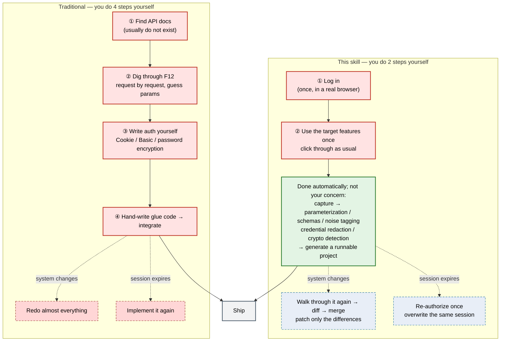

# Technical Reference

> **English** | [简体中文](reference.md)
>
> For developers and operators. For a quick start see [README.en.md](../README.en.md);
> for the agent's operating procedure see [SKILL.md](../SKILL.md).

---

## Traditional development vs using this skill

For integrating a system that has only a web UI and no API, here is where the two paths diverge —
**red boxes are what you do yourself, green boxes are what the tool finishes on its own**:



> **Reading it**: red boxes = what you do by hand (traditional **4** steps → this skill **2** steps,
> and those 2 are just "log in" and "use the site as usual" — no code involved);
> green = fully automatic, not your concern; dashed red = what the traditional path costs you when
> the system changes or the session expires (a redo), dashed blue = what this skill costs (patching
> the differences).
> Both paths end at the same step, "Ship" — the difference is only **how much you do by hand before that**.

### What exactly is saved

| Traditional | With this skill |
|---|---|
| Dig through F12 by hand, copy curl commands | Use the site normally in a browser; every request/response is recorded automatically |
| Guess at docs, trial-and-error on parameters | Parameter structure and request/response schemas are derived from real traffic; structurally identical endpoints merge automatically (`/user/123` + `/user/456` → `/user/{user_id}`) |
| Session state, tokens, and password-encryption logic are hard to reproduce | Login endpoints are recognized (including the password encryption strategy and public-key extraction); the generated MCP ships with `login()`, encrypted credential persistence, and 401 auto re-login (**only when a login endpoint is recognized**; pure-Cookie / SSO sites use interactive authorization, see "Renewal semantics") |
| Even with the endpoints you still hand-write glue code | A registry project is generated directly: multi-host routing, typed parameters, measured auth, write guardrails, smoke test |
| Captured data contains sensitive information and needs manual cleaning | Redaction happens at record time (values erased, but length/shape metadata kept so plaintext and ciphertext remain distinguishable); credentials/tokens use OS-level encrypted storage |
| Missed endpoints mean starting over | Registry incremental iteration: capture another round → diff → merge → regenerate |

### The essential difference

The traditional path takes **documentation and guesswork** as input. This skill takes
**what you actually did** as input. That determines three things:

- **No documentation needed** — systems without API docs work just as well, including internal
  systems behind CAPTCHAs, SMS verification, or SSO
  (those go through interactive authorization and get **no automatic re-login**);
- **No guessing at parameters** — parameter structure comes from real traffic, not from
  reverse-engineering JavaScript;
- **Cheap to keep up to date** — endpoints are only marked `unseen_since` and are **never
  deleted automatically**, so you merge incrementally instead of rebuilding.

---

## Installation forms

**A. Import as a skill (recommended — this is the path a user takes)** — drag the skill folder
(or the `web-api-extractor-agent.zip` import package) into your AI assistant's **Skills** settings
page; or drop it straight into the conversation and let the agent install it.
**A user installs no library and runs no command**; the first-run environment (including the browser
engine) is set up by the agent (see "Environment setup" below).

Inside the skill folder, `SKILL.md`, `runbook/`, `bootstrap.*`, `start_server.py` and `mcp_call.py`
are all files **consumed by the agent**; `docs/reference.md` (this file) is the human-facing
technical documentation. `web-api-extractor-agent.zip` is built by `package-agent.py`
(cross-platform) or `package-agent.ps1` (Windows) — the two scripts have identical manifests and
identical output, so either will do; the contents match the skill folder.
**Official packages are attached to GitHub Releases** (from `v0.1.0` onward, each tag carries its own
zip), so users can just download one instead of pulling the repository and packaging it themselves.

**B. Working from source (doing it yourself / secondary development)** — everything below this point
is for that audience. **This project is not published to PyPI, so you must work from source.**

```bash
git clone https://github.com/SH-DaWushi/web-api-extractor.git
cd web-api-extractor
```

Editable install as a Python library:

```bash
pip install -e .
python -m playwright install chromium
```

The entry points are then `web-api-extractor` (stdio, see `[project.scripts]` in `pyproject.toml`)
and `python -m webapi_extractor serve-http`; the repository-local driver scripts (`mcp_call.py`,
`start_server.py`, …) are not in the package. Note that `pip install -e .` does **not** install a
test runner — running the tests needs `pytest` / `pytest-asyncio` installed separately, otherwise
`asyncio_mode=auto` is silently ignored (see "Tests").

### Environment setup

```bash
# Recommended: pure-Python bootstrap (immune to restricted environments,
# does not depend on PowerShell/bash)
python bootstrap.py

# Or the platform scripts (create an isolated .venv, install deps + Chromium, self-check)
powershell -ExecutionPolicy Bypass -File .\bootstrap.ps1   # Windows
bash ./bootstrap.sh                                        # macOS / Linux
```

> `bootstrap.sh` and the macOS / Linux commands are "best effort" and have not been fully verified;
> see "Platform matrix" for the fully supported platforms.

If the environment is already set up, just run the check:

```bash
python -m webapi_extractor doctor             # deps / Chromium / data dir / port
python -m webapi_extractor doctor --install   # check and install whatever is missing
```

Requirements: Python ≥ 3.10, `fastmcp / httpx / playwright` + the Playwright Chromium engine.

---

## Starting the server

```bash
# HTTP transport (recommended): always use start_server.py
python start_server.py              # listens on http://127.0.0.1:8422/mcp
python start_server.py --status     # status (port / PID / log)
python start_server.py --stop       # stop
python start_server.py --port 8423  # use another port

# Or stdio (for an MCP client to launch directly):
python -m webapi_extractor
```

> ⚠️ **Do not run `run_http.py` as a background task of the host shell** — the script's own
> docstring says the same. The process stays inside the host shell's job object, so when the host
> reclaims the shell, the service is killed along with the Chromium it launched: the browser window
> **flashes and disappears**, the port stops listening, and the end of the log looks completely
> normal — very easy to misdiagnose as "the target site is broken".
> `start_server.py` uses `DETACHED_PROCESS | CREATE_NEW_PROCESS_GROUP |
> CREATE_BREAKAWAY_FROM_JOB` to fully detach the service, and writes the log and PID to disk.

### Calling the tools

If the host environment has registered this skill's MCP tools, call them directly. Otherwise use the
bundled driver script:

```bash
python mcp_call.py probe_login '{"url":"https://example.com/"}'
# For complex arguments (including Windows paths) pass a file or stdin, to avoid shell quoting issues:
python mcp_call.py start_capture @args.json
echo '{...}' | python mcp_call.py start_capture -
```

`mcp_call.py` caches the session id in `.mcp_session`, so repeated calls reuse the same server
process (session state lives in memory). **Restarting the service mid-way invalidates the cached
session**, but the driver detects this and re-initializes the session, retrying once
(`.mcp_session` self-heals; see `_is_stale` in `mcp_call.py`).

> **Windows argument passing**: use forward slashes in JSON paths (`C:/dir/file.json`) —
> backslashes break JSON escaping.

---

## Tool list (21)

| Stage | Tools | Purpose |
|---|---|---|
| Probe | `probe_login` | Determine how a site authenticates (SPA-friendly, probes for the login entry point) |
| Login | `http_login` / `open_browser_login` / `get_login_status` / `confirm_login` / `request_login_confirm_dialog` | Form login / interactive login / poll progress / **user confirms login is complete** / system-dialog fallback confirmation |
| Capture | `start_capture` / `get_capture_status` / `stop_capture` / `resume_capture` / `confirm_login_ready` / `request_capture_confirm_dialog` | Start / inspect / stop / resume capture / confirm logged in and begin recording / same, but let the user answer via a system dialog |
| Sessions | `list_sessions` | List historical sessions |
| Analysis | `analyze_traffic` / `update_endpoint` | Compact summary + auth scheme / annotate endpoint descriptions |
| Crypto | `extract_crypto_logic` | Encryption detection: URL parameter signals + ciphertext shape + JS public key |
| Generate | `generate_mcp_server` | Generate a registry project |
| Iterate | `diff_capture` / `merge_capture` / `regenerate_server` / `export_project` | Read-only diff / confirmed merge (version+1) / regenerate from registry / export the user-mode distribution package |

### Tool argument quick reference (the hand-off key, and arguments that are easy to miss)

- `endpoints[].endpoint_id` returned by `analyze_traffic` is the **hand-off key**: both
  `update_endpoint` and `generate_mcp_server(endpoint_ids=[...])` take it. Omitting `endpoint_ids`
  generates every endpoint.
- `update_endpoint(session_id, endpoint_id, description=None, notes=None)`: `notes` is free-text
  commentary, kept separate from `description` (the tool description, which goes into the generated
  project's tool list).
- `generate_mcp_server(..., endpoint_ids=None, language="python", framework="fastmcp")`:
  currently only python + fastmcp are supported; any other value errors out.
- `merge_capture(..., endpoint_keys=None, allow_auth_change=False)`: `endpoint_keys` looks like
  `["GET|api.example.com|/pets"]`; **a change of auth scheme requires explicitly passing
  `allow_auth_change=true`**.
- `http_login(url, username, password, login_endpoint=None)`: only when `login_endpoint` is given
  does it log in via JSON POST; otherwise it submits the first form on the landing page.
- `start_capture(url, auth_state_path=None, session_id=None)`: `session_id` may be chosen by the caller.
- The `include_noise` switch for keeping noisy endpoints is an internal parameter of
  `project.py` and is **not exposed at the MCP tool layer**.

---

## Typical workflow

The numbering matches the 7 steps in [`SKILL.md`](../SKILL.md).

```
1. bootstrap → doctor                            environment setup (once per machine)
2. probe_login(url)                              determine auth requirements
   open_browser_login(url)                       open browser → user completes login
   → ask the user → confirm_login(login_session_id)   completion is user-confirmed, never automatic
3. start_capture(url, auth_state_path)           start capture with the saved session
   ↳ user operates the target features normally   (walk through every feature you want as a tool)
   ↳ stop_capture(session_id)                     finish collecting
4. analyze_traffic(session_id)                   compact summary: noise tagging / param naming / login detection
5. Verify credentials and encryption (mandatory, never skip)   credential values are always ***; never assume plaintext
6. generate_mcp_server(session_id, dir, endpoint_ids)   generate the registry project
7. diff_capture → merge_capture → regenerate_server → export_project   continuous iteration
```

**Continuous iteration (a missed API does not mean starting over)**: for the command sequence and
caveats see [`runbook/06-iterate.md`](../runbook/06-iterate.md); this section only defines the
semantics — `registry.json` is maintained by merge, each merge bumps `version+1`, and endpoints
missed in a round are only marked `unseen_since` (**never deleted automatically**).

> Remember: capture records **real user operations** — whatever you operate is what gets discovered.

---

## Data directory and environment variables

```
~/.webapiextractor/
├─ sessions/<id>/          # per capture: capture.jsonl / analysis.json / session.json / scripts/
├─ auth_states/<site_key>.json   # session state (**plaintext**, never commit/sync/screenshot); filename rules in "Security design"
└─ audit.log               # tool-call audit log
```

This table is the **complete and authoritative list** of environment variables; the implementation
is in `webapi_extractor/config.py` (**exception**: `WEB_API_EXTRACTOR_PROBE_TIMEOUT` is implemented
in `probe.py`, not `config.py`).

| Variable | Default | Meaning |
|---|---|---|
| `WEB_API_EXTRACTOR_DATA` | `~/.webapiextractor` | Data root directory |
| `WEB_API_EXTRACTOR_RESPONSE_LIMIT` | `262144` | Response body size limit (bytes) |
| `WEB_API_EXTRACTOR_IDLE_TIMEOUT` | `300` | Pause after inactivity (seconds) |
| `WEB_API_EXTRACTOR_MAX_SESSIONS` | `3` | Max concurrent capture sessions |
| `WEB_API_EXTRACTOR_PROBE_TIMEOUT` | `15000` | Login probe timeout (milliseconds) |
| `WEB_API_EXTRACTOR_NOISE_RESPONSE_BYTES` | `1048576` | Cumulative response bytes per endpoint above which it is flagged for review |
| `WEB_API_EXTRACTOR_NOISE_SAMPLE_COUNT` | `50` | Sample count per endpoint above which it is flagged for review |

### Data directory size, and what the response limit really means

- **The response limit is not "truncation" — it is an all-or-nothing drop**:
  `WEB_API_EXTRACTOR_RESPONSE_LIMIT` (default 256 KB) is measured on the **decoded** byte count; an
  over-limit response body is not recorded at all, leaving only `size` / `body_truncated` /
  `body_dropped` metadata. **Consequence**: that endpoint gets no `response_schema`, so the generated
  tool has no structured response. Raise the variable and capture another round when you need it.
- **`capture.jsonl` only appends — no rotation, no retention period**: responses for static assets
  (images / JS / CSS) are written too, so long sessions keep growing and need manual cleanup. Script
  responses are additionally saved under `sessions/<id>/scripts/` (first 2 MB each; crypto detection
  extracts PEM public keys from there).
- **Analysis reads the whole file into memory**: `analyze_traffic` loads the entire `capture.jsonl`,
  so very large files consume significant memory.

---

## Security design

- **Redaction preserves shape**: credential values become `***`, but length/shape metadata is kept
  (`len` / `shape` = `base64` / `hex` / `plain`) — downstream code can tell ciphertext from plaintext
  without seeing the value. The ciphertext test is `shape ∈ {base64, hex}` and `len >= 128`, and
  **does not rely on any fixed length constant** (different algorithms and key sizes produce
  different lengths);
- **The exact scope of redaction (do not assume)**: only **request**-side JSON bodies and
  form-encoded bodies are cleaned (and `authorization` keeps its scheme while `cookie` keeps the
  cookie names). The following are **not redacted**:
  - **URLs are recorded verbatim** — a token in the query string stays in `capture.jsonl` and
    `analysis.json`;
  - **Response bodies are not redacted at all** (written verbatim, only size-checked);
  - **Request bodies that are neither JSON nor form-encoded are not redacted**
    (`multipart/form-data`, XML, and some plain text are preserved as-is);
- **Generated sub-projects never store plaintext credentials**: leaving `.env` empty is enough;
  after a successful `login()`, credentials and tokens are persisted with **DPAPI encryption**
  (`cred_cache.bin` / `token_cache.bin`, decryptable only by the same Windows user;
  **on non-Windows this degrades to in-memory only** and does not survive a restart), with 401 auto
  re-login (only when a login endpoint was recognized);
- **This tool's own session state is plaintext**: in `auth_states/<site_key>.json`, the cookies saved
  by `open_browser_login` are plaintext, and `http_login` by default also writes the **username and
  password** into its `secrets` field. The filename is derived from the target site: take the netloc
  and replace `.` and `:` with `_` (`https://oa.example.com/` → `oa_example_com.json`). It should only
  ever live in the local data directory (`config.py` writes a `*`-rule `.gitignore` into that
  directory) — **never commit, sync, screenshot or share it**. When reusing it for a sub-project, the
  cookies are what is actually needed, not the password;
- **Audit discipline**: logs record only redacted accounts and encryption strategies, never passwords;
- **Mandatory verification rule** (step 5): plaintext and ciphertext are indistinguishable in a
  capture, so never assume — verify via the four means before implementing.

---

## Built-in analyzer capabilities

- **Noise tagging** (`noise: true`, nothing is deleted): analytics/heartbeat/breadcrumb/menu-config
  endpoints and third-party tracking hosts; skipped by default at generation time;
- **Named parameterization**: even single-sample numeric segments are parameterized
  (`/user/127733/info` → `/user/{user_id}/info`), with structurally identical endpoints merged
  automatically;
- **Login endpoint detection**: recognizes "username + password for a token" endpoints (including
  the password encryption strategy and PEM public-key extraction);
- **Site profiles**: the optional `webapi_extractor/site_profiles/` lets known sites apply semantic
  tool naming and Chinese descriptions; the repository ships no profiles, and other sites fall back
  to generic derivation.

## Capabilities of the generated sub-MCP

- **Multi-host routing + typed signatures** (query/path samples → `page: int = 1`). There are **6**
  default-value gates and all must hold: at least 2 samples, unique sampled values, length ≤ 24,
  pure ASCII, no commas, and a parameter name that is not identity/time-like
  (user / account / time / date / token / session, etc.) — the point being to keep real user IDs and
  timestamps from the capture out of the code;
- **Auth generated from the scheme actually observed** (Basic / Bearer / Cookie handled separately);
  a pure-Cookie site is never misreported as a "public endpoint" (guarded by a regression test);
- **Login tools** (**only when an account/password login endpoint is recognized**):
  `login()` / `auth_status()` — credentials and tokens persisted with **DPAPI encryption**
  (**Windows only**; other platforms degrade to in-memory), restored automatically after a restart,
  with **401 auto re-login and one retry**; passwords are transmitted using the encryption strategy
  measured on the frontend (e.g. RSA-OAEP with the frontend's JS public key);
- **Write guardrails**: non-GET tools require an explicit `confirm=true` and write to audit.log;
- **Read-only diagnostics**: `tool_catalog` (tool list + registry_version) / `error_log_tail`.

### Renewal semantics (when automatic re-login exists at all)

`login()` and 401 auto re-login are generated **only when an account/password login endpoint is
recognized** (an `auth_login` entry in the registry). Therefore:

- **Sites with form / JSON login** — they have `login()`, and an expired token recovers automatically;
- **Pure-Cookie / SSO / CAPTCHA sites** — **no automatic re-login**. Once the session expires you can
  only re-run `open_browser_login` to overwrite the same auth_state (endpoints and the tool set are
  unaffected; no need to rebuild the project).

**Role separation**: the **IT admin role** (the one who installs this tool) can diff/merge/regenerate;
the **user role** (whoever only gets the distribution package) runs a server.py that has **no ability
to modify the tool set** (no registry writes, no regeneration code), so an AI agent can only call the
business tools in it and read diagnostics. Note: the business *write* tools **are still present** in
the distribution package (with the `confirm=true` guardrail) — what is stripped is the ability to
change the tool set, not the ability to write business data.

---

## Capability boundaries (what it cannot do)

Ordered by "most likely to be mistaken for supported". These are design boundaries, not a bug list —
when you hit one, use a different approach.

| Cannot | Why | Code |
|---|---|---|
| **File upload** | A `multipart/form-data` upload body is **neither parsed into parameters nor redacted**; attachment contents are not analyzed | `analyzer.py`, `bodies.py` (handles only JSON and urlencoded), `redaction.py` |
| **Real-time push** | WebSockets are recorded only as "a connection was established"; **frame contents are not captured**, and SSE / streaming responses get no special handling | `capture.py` (subscribes only to `Network.webSocketCreated`) |
| **File download** | No `Content-Disposition` / attachment handling; downloads are treated like ordinary responses | No implementation |
| **GraphQL semantics** | Treated as an ordinary POST endpoint; queries / mutations are not expanded | No implementation |
| **protobuf / binary responses** | Not decoded (base64 is used only to compute length), so no structured fields | `capture.py`, `analyzer.py` |
| **Schemas for large responses** | A response over the size limit is **dropped entirely**; that endpoint has no `response_schema` (see "Data directory size…") | `capture.py` |
| **Automatic renewal for pure-Cookie / SSO sites** | No automatic re-login; expiry requires re-authorizing (see "Renewal semantics") | `generator.py` (`if auth_login:`) |
| **Machines without a desktop** | Capture and interactive login must open a real browser window; only login probing is headless | `capture.py`, `auth.py`, `probe.py` |
| **Encrypted persistence on non-Windows** | DPAPI is unavailable → credentials/tokens stay in memory and do not survive a restart (a silent degradation) | `generator.py` |

Two more points, stated plainly:

- **Only the features you actually operated will be discovered** — endpoints you never clicked are
  not guessed;
- **No reverse-engineering or bypassing of CAPTCHAs or login encryption is provided** — when you hit
  one, you go through interactive authorization (see `runbook/01-authentication.md`).

---

## Platform matrix

Capture and interactive login require a **desktop environment** (`headful`); only `probe_login` is
headless. Encrypted credential persistence depends on Windows DPAPI.

| Capability | Windows | macOS | Linux |
|---|---|---|---|
| Capture (headful) | ✅ | ✅ needs a desktop | ✅ needs a desktop |
| Interactive login (headful) | ✅ | ✅ needs a desktop | ✅ needs a desktop |
| Login probing (headless) | ✅ | ✅ | ✅ |
| Encrypted credential / token persistence | ✅ DPAPI | ❌ memory only, lost on restart | ❌ memory only, lost on restart |
| 401 auto re-login | ✅ | current process only | current process only |
| Process detachment for `bootstrap.ps1` / `start_server.py` | ✅ | best effort | best effort |
| **Support level** | **Full** | Experimental | Experimental |

`pyproject.toml`'s platform classifier and the README badge both declare Windows only, consistent
with the table above; `bootstrap.sh` and the macOS / Linux commands in the docs are "best effort"
and have not been fully verified.

---

## Project structure

```
web-api-extractor/
├─ SKILL.md                     # Agent runbook index (follow step by step)
├─ README.md / README.en.md     # Human entry point: what this is, how to get started
├─ docs/reference.md            # Technical reference (Chinese)
├─ docs/reference.en.md         # This file
├─ runbook/                     # SKILL's per-step modules, loaded on demand
│                               #   00 env / 01 auth / 02 capture / 03 analyze / 04 crypto
│                               #   05 generate / 06 iterate / 90 reference / 99 troubleshooting
├─ bootstrap.py / .ps1 / .sh    # Environment bootstrap (pure-Python version is immune to restricted envs)
├─ start_server.py              # The recommended way to start the HTTP service (escapes the shell job object)
├─ run_http.py                  # Equivalent HTTP launcher (do not run it as a background task)
├─ mcp_call.py                  # MCP tool driver (@file / stdin arguments, 404 self-healing)
├─ install-agent.ps1            # Install deps + Chromium (for agent import)
├─ package-agent.py / .ps1      # Package into a distributable zip (identical manifests, identical output)
├─ pyproject.toml               # Packaging metadata (incl. license / readme / classifiers)
├─ requirements.txt             # Runtime + test dependencies
├─ LICENSE                      # Custom terms of use (not SPDX / OSI)
├─ .gitignore / .gitattributes  # Ignore runtime artifacts; pin line endings (*.sh must be LF)
├─ .vscode/mcp.json             # Registers this server as a stdio MCP server (no absolute local paths)
├─ tests/                       # pytest suite (25 files)
└─ webapi_extractor/
   ├─ __main__.py               # CLI: doctor | serve-http | (default) stdio
   ├─ server.py                 # MCP server and tool registration
   ├─ auth.py                   # Login flows (user-confirmed completion, never automatic)
   ├─ capture.py                # Playwright/CDP capture
   ├─ analyzer.py               # Parameterization / noise tagging / login detection
   ├─ crypto_analyzer.py        # Encryption detection + PEM public-key extraction
   ├─ generator.py              # Registry-driven project generation
   ├─ project.py                # Registry single source of truth (diff / merge / export)
   ├─ redaction.py / bodies.py  # Redaction (preserving shape metadata) / request body parsing
   ├─ dialog.py                 # Native OS confirmation dialog (shared by login and capture)
   ├─ doctor.py                 # Environment self-check
   ├─ domain.py / probe.py / proxy_env.py
   ├─ audit.py / storage.py / config.py
   └─ site_profiles/            # Site profiles (optional, none ship in the repository)
```

---

## Tests

```bash
# pytest config lives in pyproject.toml (testpaths + asyncio_mode=auto)
uv run --with pytest --with pytest-asyncio --with httpx --with playwright \
       --with fastmcp python -m pytest tests -q

# Or if the environment is already set up:
python -m pytest tests -q
```

Three things to note:

- `requirements.txt` includes `pytest` / `pytest-asyncio` (the bootstrap installs them), so an
  environment set up via bootstrap can run the suite directly; `pip install -e .` does **not**
  install a test runner — install one yourself, otherwise `asyncio_mode=auto` is silently ignored
  and every async test fails.
- The suite is unit-level and **never launches a browser**.
- **What the tests do not cover** (stated plainly — do not read "untested" as "fine"):
  - the **session and capture** tools in `server.py` (probe / login / capture / analyze /
    update_endpoint / extract_crypto) still have no tests — they need a real browser; **the 4
    project tools and doctor are covered** (`tests/test_iterate_tools.py`, `tests/test_doctor.py`,
    which point the data directory at a temporary directory before importing `server.py` so the
    local `~/.webapiextractor` is untouched);
  - the iteration chain (`runbook/06-iterate.md`), user-mode isolation, and `locked` rejection are
    covered by `tests/test_iterate_chain.py` (previously uncovered; added in this round);
  - `test_proxy_env.py` has one POSIX-only case that is skipped on Windows (expected).
