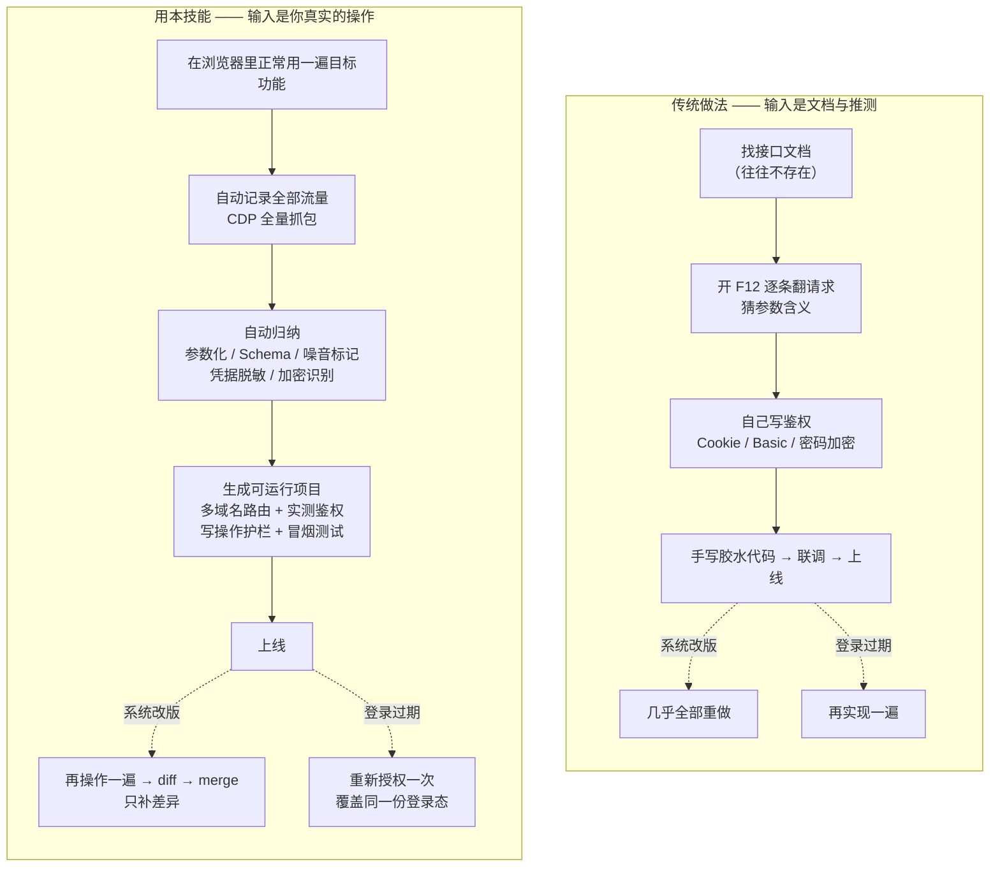

# 技术参考

> 面向开发与运维。想快速上手请看 [README.md](../README.md)；Agent 的操作流程见 [SKILL.md](../SKILL.md)。

---

## 传统开发 vs 用本技能

对接一个「只有网页界面、没有 API」的系统，两条路的差别在这里：



### 具体省在哪

| 传统做法 | 用本技能 |
|---|---|
| 对着 F12 手工翻请求、复制 curl | 打开浏览器正常使用网站，后台自动记录全部请求/响应 |
| 接口文档靠猜，参数靠试 | 从真实流量归纳参数结构、请求/响应 Schema；同构接口自动合并（`/user/123` + `/user/456` → `/user/{user_id}`） |
| 登录态、token、密码加密逻辑难复刻 | 识别账号密码登录接口（含密码加密策略与公钥提取），生成的 MCP 自带 `login()`，凭据加密持久化、401 自动重登录 |
| 拿到接口还要手写胶水代码 | 直接生成 registry 项目：多域名路由 + 类型化参数 + 实测鉴权 + 写操作护栏 + 冒烟测试 |
| 抓包数据含敏感信息，得人工清洗 | 记录即时脱敏（值抹掉但保留长度/形态元数据，明密文仍可区分）；凭据/Token 走系统级加密存储 |
| 初次漏抓的 API 要推倒重来 | registry 增量迭代：再抓一轮 → diff → merge → regenerate |

### 本质差别

传统路径的输入是**文档与推测**，本技能的输入是**你真实的操作**。这决定了三件事：

- **不需要文档** —— 没有 API 文档的系统一样能做，包括带验证码、短信验证、SSO 的内部系统；
- **不需要猜参数** —— 参数结构来自真实流量，而不是从 JS 里反推；
- **改版成本低** —— 端点只标 `unseen_since`、**永不自动删除**，所以增量合并即可，不必推倒重建。

---

## 安装形态

两种形态，选一种。

**A. 作为 Skill / 完整工作流（推荐）** —— 克隆本仓库后按 README 的 1–3 步走。
`SKILL.md`、`runbook/`、`bootstrap.*`、`start_server.py`、`mcp_call.py` 都是仓库内文件
（Skill 正是按文件消费的），发行包里没有。

```bash
git clone https://github.com/shdawushi-dotcom/WebAPIExtractor.git
cd WebAPIExtractor
```

**B. 作为 Python 库 / MCP Server**

```bash
pip install web-api-extractor
python -m playwright install chromium
```

此时入口为 `web-api-extractor`（stdio）与 `python -m webapi_extractor serve-http`；
仓库内的驱动脚本（`mcp_call.py`、`start_server.py` 等）不在发行包里。

### 环境准备

```bash
# 推荐：纯 Python 引导（受限环境免疫，不依赖 PowerShell/bash）
python bootstrap.py

# 或平台脚本引导（创建独立 .venv，装依赖 + Chromium，跑自检）
powershell -ExecutionPolicy Bypass -File .\bootstrap.ps1   # Windows
bash ./bootstrap.sh                                        # macOS / Linux
```

已装过环境，只做检查：

```bash
python -m webapi_extractor doctor             # 自检：依赖 / Chromium / 数据目录 / 端口
python -m webapi_extractor doctor --install   # 自检并自动补装缺失项
```

依赖：Python ≥ 3.10，`fastmcp / httpx / playwright` + Playwright Chromium 内核。

---

## 启动服务

```bash
# HTTP 传输（推荐）：务必用 start_server.py
python start_server.py              # 监听 http://127.0.0.1:8422/mcp
python start_server.py --status     # 查看状态（端口 / PID / 日志）
python start_server.py --stop       # 停止
python start_server.py --port 8423  # 换端口

# 或 stdio 方式（供 MCP 客户端直接拉起）：
python -m webapi_extractor
```

> ⚠️ **不要用宿主 shell 的「后台任务」方式直接跑 `run_http.py`** —— 该脚本自己的
> docstring 也是这么写的。那样进程仍留在宿主 shell 的 job object 内，宿主回收
> shell 时，服务连同它拉起的 Chromium 会被一起杀掉：症状是浏览器窗口**一闪即消失**、
> 端口失去监听，而日志末尾完全正常，极易误判成「目标网站有问题」。
> `start_server.py` 用 `DETACHED_PROCESS | CREATE_NEW_PROCESS_GROUP |
> CREATE_BREAKAWAY_FROM_JOB` 让服务彻底独立，并把日志与 PID 落盘。

### 调用工具

宿主环境已注册本技能的 MCP 工具时直接调用；否则用自带驱动脚本：

```bash
python mcp_call.py probe_login '{"url":"https://example.com/"}'
# 复杂参数（含 Windows 路径）用文件或 stdin 传，避开 shell 引号问题：
python mcp_call.py start_capture @args.json
echo '{...}' | python mcp_call.py start_capture -
```

`mcp_call.py` 把会话 id 缓存到 `.mcp_session`，多次调用复用同一服务进程
（会话状态在内存里，**服务不能中途重启**）。服务重启后驱动脚本会自动重新初始化
会话并重试。

> **Windows 传参**：JSON 里路径用正斜杠 `C:/dir/file.json`（反斜杠破坏 JSON 转义）。

---

## 工具清单（21 个）

| 阶段 | 工具 | 作用 |
|---|---|---|
| 探测 | `probe_login` | 判断站点登录方式（SPA 友好，含登录入口探测） |
| 登录 | `http_login` / `open_browser_login` / `get_login_status` / `confirm_login` / `request_login_confirm_dialog` | 表单登录 / 交互式登录 / 查进度 / **用户确认登录完成** / 系统对话框兜底确认 |
| 抓包 | `start_capture` / `get_capture_status` / `stop_capture` / `resume_capture` / `confirm_login_ready` / `request_capture_confirm_dialog` | 开始 / 查看 / 结束 / 恢复抓包 / 确认已登录、开始记录 / 同上，改用系统对话框让用户点选 |
| 会话 | `list_sessions` | 列出历史会话 |
| 分析 | `analyze_traffic` / `update_endpoint` | 精简摘要 + 鉴权 scheme / 补充接口描述 |
| 加密 | `extract_crypto_logic` | 加密检测：URL 参数信号 + 密文形态 + JS 公钥 |
| 生成 | `generate_mcp_server` | 生成 registry 项目 |
| 迭代 | `diff_capture` / `merge_capture` / `regenerate_server` / `export_project` | 只读差异 / 确认合并（version+1）/ 从 registry 重生成 / 导出用户态分发包 |

---

## 典型工作流

编号与 [`SKILL.md`](../SKILL.md) 的 7 步流程一一对应。

```
1. bootstrap → doctor                            环境准备（新机器只需一次）
2. probe_login(url)                              判断登录需求
   open_browser_login(url)                       弹浏览器 → 用户完成登录
   → 问用户 → confirm_login(login_session_id)     登录完成只由用户确认，不自动判定
3. start_capture(url, auth_state_path)           带登录态开始抓包
   ↳ 用户在浏览器里正常操作目标功能                 （想变成工具的功能都要真实点一遍）
   ↳ stop_capture(session_id)                     操作完结束收集
4. analyze_traffic(session_id)                   精简摘要：噪音标记 / 命名参数化 / 登录接口识别
5. 凭据与加密核实（强制，禁止跳过）                抓包中凭据必然是 ***，禁止假设明文，四层手段核实
6. generate_mcp_server(session_id, dir, endpoint_ids)   生成 registry 项目
7. diff_capture → merge_capture → regenerate_server → export_project   持续迭代
```

**持续迭代（漏了 API 不用推倒重来）**：

```
再抓一轮遗漏功能 → analyze_traffic
→ diff_capture(project_dir, session_id)                  # 只读差异报告
→ merge_capture(project_dir, session_id, endpoint_keys?) # 合并入 registry，version+1
→ regenerate_server(project_dir)                         # 从 registry 重出代码
→ export_project(project_dir, out_dir)                   # 导出用户态分发包
```

> 提示：抓包记录的是**真实用户操作**——你操作了什么，才会发现什么接口。

---

## 数据目录与环境变量

```
~/.webapiextractor/
├─ sessions/<id>/          # 每次抓包：capture.jsonl / analysis.json / scripts/
├─ auth_states/            # 登录态（**明文**，禁止提交/同步/截图）
└─ audit.log               # 工具调用审计日志
```

环境变量的**完整清单以本表为准**；实现见 `webapi_extractor/config.py`。

| 环境变量 | 默认值 | 说明 |
|---|---|---|
| `WEB_API_EXTRACTOR_DATA` | `~/.webapiextractor` | 数据根目录 |
| `WEB_API_EXTRACTOR_RESPONSE_LIMIT` | `262144` | 响应体截断上限（字节） |
| `WEB_API_EXTRACTOR_IDLE_TIMEOUT` | `300` | 无操作自动暂停（秒） |
| `WEB_API_EXTRACTOR_MAX_SESSIONS` | `3` | 并发抓包会话上限 |
| `WEB_API_EXTRACTOR_PROBE_TIMEOUT` | `15000` | 登录探测超时（毫秒） |
| `WEB_API_EXTRACTOR_NOISE_RESPONSE_BYTES` | `1048576` | 单端点累计响应体超此值 → 标记待复核 |
| `WEB_API_EXTRACTOR_NOISE_SAMPLE_COUNT` | `50` | 单端点采样次数超此值 → 标记待复核 |

---

## 安全设计

- **脱敏保留形态**：凭据值抹为 `***`，但保留长度/形态元数据（如 RSA-2048 密文恒为
  344 字符 base64）——下游可判明密文而不见值；
- **生成的子项目不落明文凭据**：`.env` 留空即可；`login()` 成功后凭据与 token 以
  **DPAPI 加密**持久化（`cred_cache.bin` / `token_cache.bin`，仅同一 Windows 用户可
  解密），401 自动重登录；
- **本工具自身的登录态是明文的**：`auth_states/<site>.json` 里，`open_browser_login`
  存下的 Cookie 是明文，`http_login` 默认还会把**账号与密码**一并写入该文件的
  `secrets` 字段。它只应留在本机数据目录（`config.py` 会在该目录写入 `*` 规则的
  `.gitignore`），**禁止提交、同步、截图或分享**。复用它给子项目时，真正被需要的是
  其中的 Cookie，不是密码；
- **审计规范**：日志只记脱敏账号与加密策略，永不记密码；
- **强制核实规则**（步骤 5）：抓包中凭据字段明密文不可区分，禁止假设，必须按四层
  手段核实后再实现。

---

## 分析器内置能力

- **噪音标记**（`noise: true`，不删除）：埋点/心跳/面包屑/菜单配置/第三方统计域名，
  生成时默认跳过；
- **命名参数化**：单样本数字段也参数化（`/user/127733/info` → `/user/{user_id}/info`），
  同构自动合并；
- **登录接口识别**：识别「账号+密码换 token」接口（含密码加密策略与 PEM 公钥提取）；
- **站点档案**：可选的 `webapi_extractor/site_profiles/` 支持为已知站点应用语义化工具
  命名与中文描述；仓库不内置任何档案，其它站点走通用推导。

## 生成的子 MCP 自带的能力

- **多域名路由 + 类型化签名**（query/path 样本 → `page: int = 1`；默认值有四重门槛，
  杜绝把抓包时的真实用户 ID / 时间戳烘进代码）；
- **鉴权按实测 scheme 生成**（Basic / Bearer / Cookie 分别处理）；
- **登录工具**（识别到登录接口时）：`login()` / `auth_status()`——凭据与 token 以
  **DPAPI 加密**持久化（仅同一 Windows 用户可解密，已列 .gitignore），重启自动恢复，
  **401 自动重登录并重试一次**；密码按前端实测策略加密传输（如 RSA-OAEP + 前端
  JS 公钥）；
- **写操作护栏**：非 GET 工具需显式 `confirm=true`，执行写 audit.log；
- **只读诊断**：`tool_catalog`（工具清单 + registry_version）/ `error_log_tail`。

**角色分离**：**IT 管理态**（装本工具）可 diff/merge/regenerate；**用户态**（只拿分发包）
的 server.py 物理上不含任何写入能力，AI Agent 只能调用与只读诊断，无法修改工具集。

---

## 项目结构

```
WebAPIExtractor/
├─ SKILL.md                     # Agent 操作手册主索引（按步骤照做）
├─ README.md                    # 人类入口：这是什么、怎么用起来
├─ docs/reference.md            # 本文件（技术参考）
├─ runbook/                     # SKILL 的分步模块，按需加载
│                               #   00 环境 / 01 登录 / 02 抓包 / 03 分析 / 04 加密
│                               #   05 生成 / 06 迭代 / 90 参考 / 99 排错
├─ bootstrap.py / .ps1 / .sh    # 环境引导（纯 Python 版免疫受限环境）
├─ start_server.py              # 启动 HTTP 服务的推荐方式（脱离 shell job object）
├─ run_http.py                  # 等价的 HTTP 启动器（勿用后台任务方式直接跑）
├─ mcp_call.py                  # MCP 工具驱动（@file / stdin 传参，404 自愈）
├─ install-agent.ps1            # 装依赖 + Chromium（供 Agent 导入）
├─ package-agent.ps1            # 打包成可分发的 zip
├─ pyproject.toml               # 打包元数据（含 license / readme / classifiers）
├─ requirements.txt             # 运行 + 测试依赖
├─ LICENSE                      # 自拟使用条款（非 SPDX / OSI）
├─ .gitignore / .gitattributes  # 忽略运行产物；锁定行尾（*.sh 必须为 LF）
├─ .vscode/mcp.json             # 把本服务注册为 stdio MCP（无本机绝对路径）
├─ tests/                       # pytest 套件（20 个文件）
└─ webapi_extractor/
   ├─ __main__.py               # CLI：doctor | serve-http |（默认）stdio
   ├─ server.py                 # MCP Server 与工具注册
   ├─ auth.py                   # 登录流程（用户确认完成，不自动判定）
   ├─ capture.py                # Playwright/CDP 抓包
   ├─ analyzer.py               # 参数化 / 噪音标记 / 登录识别
   ├─ crypto_analyzer.py        # 加密检测 + PEM 公钥提取
   ├─ generator.py              # registry 驱动的项目生成
   ├─ project.py                # registry 唯一事实源（diff / merge / export）
   ├─ redaction.py / bodies.py  # 脱敏（保留形态元数据）/ 请求体解析
   ├─ dialog.py                 # 系统原生确认对话框（登录与抓包共用一份实现）
   ├─ doctor.py                 # 环境自检
   ├─ domain.py / probe.py / proxy_env.py / login_detector.py
   ├─ audit.py / storage.py / config.py
   └─ site_profiles/            # 站点档案（可选加载，仓库不内置）
```

---

## 测试

```bash
# pytest 配置在 pyproject.toml（testpaths + asyncio_mode=auto）
uv run --with pytest --with pytest-asyncio --with httpx --with playwright \
       --with fastmcp python -m pytest tests -q

# 装了环境的话直接：
python -m pytest tests -q
```

注意两点：

- `requirements.txt` 里带了 `pytest` / `pytest-asyncio`（bootstrap 会装上），所以
  走 bootstrap 的环境可以直接跑；而 `pip install -e .` **不会**装测试运行器 ——
  此时需自行安装，否则 `asyncio_mode=auto` 会被静默忽略、异步用例全部失败。
- 套件是单元级的，**不会启动浏览器**。
