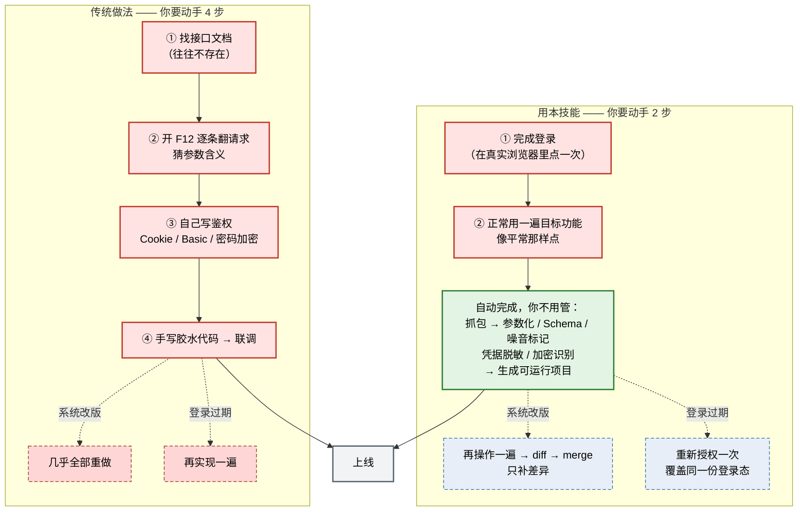

# 技术参考

> **简体中文** | [English](reference.en.md)
>
> 面向开发与运维。想快速上手请看 [README.md](../README.md)；Agent 的操作流程见 [SKILL.md](../SKILL.md)。

---

## 传统开发 vs 用本技能

对接一个「只有网页界面、没有 API」的系统，两条路的差别在这里 ——
**红框是你要动手的，绿框是工具自己做完的**：


```mermaid
flowchart TB
    subgraph T["传统做法 —— 你要动手 4 步"]
        direction TB
        T1["① 找接口文档<br/>（往往不存在）"] --> T2["② 开 F12 逐条翻请求<br/>猜参数含义"]
        T2 --> T3["③ 自己写鉴权<br/>Cookie / Basic / 密码加密"]
        T3 --> T4["④ 手写胶水代码 → 联调"]
        T4 -.->|系统改版| T5["几乎全部重做"]
        T4 -.->|登录过期| T6["再实现一遍"]
    end
    subgraph S["用本技能 —— 你要动手 2 步"]
        direction TB
        S1["① 完成登录<br/>（在真实浏览器里点一次）"] --> S2["② 正常用一遍目标功能<br/>像平常那样点"]
        S2 --> S3["自动完成，你不用管：<br/>抓包 → 参数化 / Schema / 噪音标记<br/>凭据脱敏 / 加密识别<br/>→ 生成可运行项目"]
        S3 -.->|系统改版| S4["再操作一遍 → diff → merge<br/>只补差异"]
        S3 -.->|登录过期| S5["重新授权一次<br/>覆盖同一份登录态"]
    end
    T4 --> D["上线"]
    S3 --> D
    classDef human fill:#ffe3e3,stroke:#c0392b,stroke-width:2px,color:#000
    classDef auto fill:#e3f4e4,stroke:#2e7d32,stroke-width:2px,color:#000
    classDef rework fill:#ffd6d6,stroke:#922b21,stroke-dasharray:5 3,color:#000
    classDef increment fill:#e8eef7,stroke:#2471a3,stroke-dasharray:5 3,color:#000
    classDef done fill:#f2f3f4,stroke:#566573,stroke-width:2px,color:#000
    class T1,T2,T3,T4,S1,S2 human
    class S3 auto
    class T5,T6 rework
    class S4,S5 increment
    class D done
```

> **读图**：红框 = 你要亲手做的事（传统 **4** 步 → 本技能 **2** 步，而且这 2 步就是「登录」和「像平常一样用一遍网站」，不需要敲代码）；
> 绿框 = 全自动，你不用管；红色虚线 = 传统路线遇到改版/过期的代价（重做），蓝色虚线 = 本技能的代价（只补差异）。
> 两条路最后都落在同一步「上线」—— 差别只在**上线之前你要亲手做多少**。

### 具体省在哪

| 传统做法 | 用本技能 |
|---|---|
| 对着 F12 手工翻请求、复制 curl | 打开浏览器正常使用网站，后台自动记录全部请求/响应 |
| 接口文档靠猜，参数靠试 | 从真实流量归纳参数结构、请求/响应 Schema；同构接口自动合并（`/user/123` + `/user/456` → `/user/{user_id}`） |
| 登录态、token、密码加密逻辑难复刻 | 识别账号密码登录接口（含密码加密策略与公钥提取），生成的 MCP 自带 `login()`，凭据加密持久化、401 自动重登录（**仅识别到登录接口时**；纯 Cookie / SSO 站点走交互式授权，见「续期语义」） |
| 拿到接口还要手写胶水代码 | 直接生成 registry 项目：多域名路由 + 类型化参数 + 实测鉴权 + 写操作护栏 + 冒烟测试 |
| 抓包数据含敏感信息，得人工清洗 | **请求侧**的 JSON 体、表单编码体与常见凭据请求头的值当场抹掉（保留长度/形态元数据，明密文仍可区分）；**URL 与响应体不脱敏**，这部分仍需自己留意。凭据加密存储只发生在**生成的子项目**里（DPAPI，仅 Windows，且需识别到账号密码登录接口）—— 本工具自身的登录态文件则把账号密码用 DPAPI 加密后存进 `secrets_enc`（同样仅 Windows、仅同一用户可解），其中的 Cookie 仍是明文。 |
| 初次漏抓的 API 要推倒重来 | registry 增量迭代：再抓一轮 → diff → merge → regenerate |

### 本质差别

传统路径的输入是**文档与推测**，本技能的输入是**你真实的操作**。这决定了三件事：

- **不需要文档** —— 没有 API 文档的系统一样能做，包括带验证码、短信验证、SSO 的内部系统
  （这类站点走交互式授权，**没有自动重登录**）；
- **不需要猜参数** —— 参数结构来自真实流量，而不是从 JS 里反推；
- **改版成本低** —— 端点只标 `unseen_since`、**永不自动删除**，所以增量合并即可，不必推倒重建。

---

## 安装形态

**A. 作为技能导入（推荐，使用者走这条）** —— 把技能文件夹（或 `web-api-extractor-agent.zip`
导入包）拖进 AI 助手的「技能 / Skill」设置页；或直接拖进对话，让 Agent 自己装。
**使用者不需要装库、也不需要跑任何命令**，首次使用的运行环境（含浏览器内核）由 Agent
引导完成（见下「环境准备」）。

技能文件夹里的 `SKILL.md`、`runbook/`、`bootstrap.*`、`start_server.py`、`mcp_call.py`
都是**给 Agent 消费**的文件，`docs/reference.md`（本文件）是给人看的技术文档。
`web-api-extractor-agent.zip` 由 `package-agent.py`（跨平台）或 `package-agent.ps1`（Windows）
打包 —— 两份脚本的清单与产物一致，用哪份都行；内容与技能文件夹相同。
**官方包挂在 GitHub Releases**（`v0.1.0` 起，每个 tag 挂一份对应的 zip），使用者直接下载即可，
不必自己拉仓库再打包。

**B. 从源码用（自己动手 / 二次开发）** —— 本节以下内容都是给这类使用者的。
**本项目未发布到 PyPI，必须先从源码取用。**

```bash
git clone https://github.com/SH-DaWushi/web-api-extractor.git
cd web-api-extractor
```

作为 Python 库可编辑安装：

```bash
pip install -e .
python -m playwright install chromium
```

此时入口为 `web-api-extractor`（stdio，见 `pyproject.toml` 的 `[project.scripts]`）与
`python -m webapi_extractor serve-http`；仓库内的驱动脚本（`mcp_call.py`、`start_server.py`
等）不在发行包里。运行时依赖只有 `fastmcp / httpx / playwright`；测试运行器（`pytest` /
`pytest-asyncio`）是**可选**的，`pip install -e .` **不会**装，要装用
`pip install -e ".[test]"`（等价于 `pip install -r requirements-dev.txt`），否则
`asyncio_mode=auto` 会被静默忽略（详见「测试」）。

### 发行版本与许可

本项目有**两个发行版本**，条款不同 —— **以你手上那份包里的 `LICENSE` 为准**：

| 版本 | 载体 | 适用许可 |
|---|---|---|
| 开源版 | 本仓库、GitHub Releases 的技能导入包 | 仓库根目录的 `LICENSE`（自拟**非商用**条款） |
| 商店版 | 技能商店分发的包 | 包内 `LICENSE`，内容即 `LICENSE-STORE`（自拟**商店分发许可**） |

商店版授予商店收录与最终用户使用（含内部业务用途），保留署名与免责声明，禁止转售、转出该商店、再许可与分发修改版（自用修改可以），且**不放弃开源版的非商用限制**。

两个版本不止许可不同，**打进包里的内容也不同**。清单的权威来源是 `package-agent.py` 的 `INCLUDE`（开源版）与 `--store` 的裁剪逻辑（`STORE_EXCLUDE` / `STORE_ADD` / `STORE_RENAME`；与 `package-agent.ps1` 逐项一致，见 `tests/test_package_agent.py`）：

- **开源版**打包 `INCLUDE` 的顶层项：`pyproject.toml`、`requirements.txt`、`requirements-dev.txt`、`README.md` / `README.en.md`、`SKILL.md`、`docs/`、`runbook/`、`LICENSE`、`DISCLAIMER.md`、`bootstrap.py` / `bootstrap.ps1` / `bootstrap.sh`、`install-agent.ps1`、`start_server.py`、`run_http.py`、`mcp_call.py`、`.vscode/`、`webapi_extractor/`、`tests/`。
- **商店版**在开源清单上**去掉**：`tests/`（整个测试套件）、`pyproject.toml`、`requirements-dev.txt`、`.vscode/`、`bootstrap.sh`、`install-agent.ps1`，以及 `LICENSE`；**只新增** `LICENSE-STORE`，并把它在包内**改名为 `LICENSE`**（商店包只能带一份授权文件，必须是商店版那份）。
- 两个分发包**都不包含** `package-agent.py` / `package-agent.ps1`（打包脚本本身）与 `.gitattributes` —— 它们不在 `INCLUDE` 里，只是仓库文件，**不是**被商店版单独裁掉的。
- **对使用者的实际影响**：商店包**没有 `tests/`**，也没有测试依赖（`requirements-dev.txt`）与打包元数据（`pyproject.toml`）。因此**想在包里跑测试请用开源版**（或直接用仓库源码）；商店包只提供运行所需文件。
- **授权与免责文件**：`DISCLAIMER.md` **两个版本都内置**（它不含任何许可条款，对两版都成立）。授权文件不同：开源包内是仓库根的 `LICENSE`（非商用），商店包内只有一份 `LICENSE`（内容即 `LICENSE-STORE`）。

构建：

- 开源版：`python package-agent.py`（Windows 下等价：`package-agent.ps1 -Store` 之外的默认调用）
- 商店版：`python package-agent.py --store`（PowerShell 版加 `-Store` 开关）

> 两份许可都是**自拟的使用边界声明，未经律师审阅**；需要正式法律约束前请先做法务审核。
> 请一并阅读免责声明（适用范围、凭据处理警告、无担保与责任限制）—— 两个版本的分发包都内置
> `DISCLAIMER.md`，仓库根目录也有同一份。

### 环境准备

```bash
# 推荐：纯 Python 引导（受支持的 Windows 路径；受限环境免疫，不依赖 PowerShell/bash）
python bootstrap.py                 # 建 venv + 装运行依赖 + Chromium + 跑自检
python bootstrap.py --with-tests    # 额外装测试依赖（requirements-dev.txt）

# 或平台脚本引导（现在只是 bootstrap.py 的薄封装，参数原样透传）
powershell -ExecutionPolicy Bypass -File .\bootstrap.ps1 -WithTests   # Windows（受支持）
bash ./bootstrap.sh --with-tests                                      # 非支持平台，见下方说明
```

> **venv 建在数据目录下**：`<数据目录>/venv`（默认 `~/.webapiextractor/venv`），**不在技能文件夹里** ——
> 技能目录由宿主应用管理，升级时会被重新同步/替换，把约 180 MB 的 venv 放在里面既可能被连带删除、
> 又得重拉一次 Chromium。历史部署若在技能目录里留有旧的 `.venv`，引导会**直接复用它**（打印提示），
> 不会再建第二份。

> **macOS / Linux 不受支持，也未经测试。** `bootstrap.sh` 仍留在仓库里（与 `bootstrap.ps1` 同在
> 仓库根目录），但**仅出于礼节保留、未经验证** —— 它只是 `bootstrap.py` 的 POSIX 薄封装。受支持
> 的引导路径是 `bootstrap.py` / `bootstrap.ps1`；完整平台说明见「平台矩阵」。

已装过环境，只做检查：

```bash
python -m webapi_extractor doctor             # 自检：依赖 / Chromium / 数据目录 / 端口
python -m webapi_extractor doctor --install   # 自检并自动补装缺失项
```

依赖：Python ≥ 3.10，`fastmcp / httpx / playwright` + Playwright Chromium 内核。

---

## 启动服务

```bash
# HTTP 传输（推荐）：务必用 start_server.py
python start_server.py              # 监听 http://127.0.0.1:8422/mcp
python start_server.py --status     # 查看状态（端口 / PID / 日志）
python start_server.py --stop       # 停止（按进程树；先校验 PID 归属）
python start_server.py --port 8423  # 换端口
python start_server.py --stop --force   # 跳过 PID 归属校验（确认该 PID 确为本项目服务再用）

# 或 stdio 方式（供 MCP 客户端直接拉起）：
python -m webapi_extractor
```

> `start_server.py` 挑解释器的顺序是 **数据目录 venv → 技能目录旧 `.venv` → 当前解释器**，
> 取第一个存在的 —— 所以 bootstrap 之后直接 `python start_server.py` 也会落到那份 venv。
> `--stop` 的判据是**端口是否真的空出来**（不是「记录的 PID 是否还在」）：它按进程树结束服务、
> 强杀前先确认该 PID 确实在跑本项目的 `run_http.py`，失败时会把真正占用端口的 PID 报出来。

> ⚠️ **不要用宿主 shell 的「后台任务」方式直接跑 `run_http.py`** —— 该脚本自己的
> docstring 也是这么写的。那样进程仍留在宿主 shell 的 job object 内，宿主回收
> shell 时，服务连同它拉起的 Chromium 会被一起杀掉：症状是浏览器窗口**一闪即消失**、
> 端口失去监听，而日志末尾完全正常，极易误判成「目标网站有问题」。
> `start_server.py` 用 `DETACHED_PROCESS | CREATE_NEW_PROCESS_GROUP |
> CREATE_BREAKAWAY_FROM_JOB` 让服务彻底独立，并把日志与 PID 落盘。

### 调用工具

宿主环境已注册本技能的 MCP 工具时直接调用；否则用自带驱动脚本：

```bash
python mcp_call.py probe_login '{"url":"https://example.com/"}'
# 复杂参数（含 Windows 路径）用文件或 stdin 传，避开 shell 引号问题：
python mcp_call.py start_capture @args.json
echo '{...}' | python mcp_call.py start_capture -
```

`mcp_call.py` 把会话 id 缓存到 `.mcp_session`，多次调用复用同一服务进程
（会话状态在内存里）。**服务中途重启会让已缓存的会话失效**，但驱动脚本检测到后会
自动重新初始化会话并重试一次（`.mcp_session` 自愈，见 `mcp_call.py` 的 `_is_stale`）。

> **Windows 传参**：JSON 里路径用正斜杠 `C:/dir/file.json`（反斜杠破坏 JSON 转义）。

**输出契约（结果只走 stdout，且一律 UTF-8）**：`mcp_call.py` 把工具结果按 **UTF-8 字节**
写 stdout（`json.dumps(..., ensure_ascii=False)` + 显式编码），**诊断/进度只写 stderr**，
两者绝不混流。解析失败时 **stdout 为空**并以非零退出码收场：

| 退出码 | 含义 |
|---|---|
| `2` | 服务没有返回会话 id（初始化失败）|
| `3` | 工具结果**不可解析**（诊断里带已截断的原始片段）|
| `4` | **连不上**服务（连接/OS 类错误；提示是否已 `start_server.py`）|
| `5` | 其它 HTTP 错误（非「会话失效」）|

**为什么必须这样**：Windows 中文控制台默认编码是 **cp936**，若沿用平台默认编码，结果里的
中文（用户名路径、提示语、URL）会以 cp936 字节写出，按 UTF-8 读的调用方在第一个中文字节上
就整体失败（`UnicodeDecodeError`）；而 stderr 上 cp936 的中文一旦被 `2>&1` 合流，就会插到
JSON 前面，整段输出从此不可解析。

**编码由脚本自己处理，使用者什么都不用设**（`harden_output_encoding()`，导入即生效）：

- **非 TTY**（管道 / 重定向 / 文件）：只写 **UTF-8 字节**，读它的程序拿到的编码是确定的；
- **TTY**（真控制台）：把控制台**输出代码页**切成 UTF-8（65001）并在进程退出时**还原**。
  这样「写 UTF-8 字节」在屏幕上也显示成中文 —— 中文 Windows 的默认输出代码页是 936，
  若不动它，`PYTHONLEGACYWINDOWSSTDIO=1`（或任何把控制台包成普通文件流的包装层）下
  屏幕会显示成「浣犲ソ」式乱码（真机实测矩阵见 `mcp_call.py` 的
  `harden_stream_encoding`）。**不需要**设 `PYTHONIOENCODING`、也**不需要** `chcp 65001`。

**调用方**：程序化读取请**直接按字节读 stdout 并用 UTF-8 解码**，且**不要**把 stderr 与
stdout 合流。

---

## 工具清单（21 个）

| 阶段 | 工具 | 作用 |
|---|---|---|
| 探测 | `probe_login` | 判断站点登录方式（SPA 友好，含登录入口探测） |
| 登录 | `http_login` / `open_browser_login` / `get_login_status` / `confirm_login` / `request_login_confirm_dialog` | 表单登录 / 交互式登录 / 查进度 / **用户确认登录完成** / 系统对话框兜底确认 |
| 抓包 | `start_capture` / `get_capture_status` / `stop_capture` / `resume_capture` / `confirm_login_ready` / `request_capture_confirm_dialog` | 开始 / 查看 / 结束 / 恢复抓包 / 确认已登录、开始记录 / 同上，改用系统对话框让用户点选 |
| 会话 | `list_sessions` | 列出历史会话 |
| 分析 | `analyze_traffic` / `update_endpoint` | 精简摘要 + 鉴权 scheme / 补充接口描述 |
| 加密 | `extract_crypto_logic` | 加密检测：URL 参数信号 + 密文形态 + JS 公钥 |
| 生成 | `generate_mcp_server` | 生成 registry 项目 |
| 迭代 | `diff_capture` / `merge_capture` / `regenerate_server` / `export_project` | 只读差异 / 确认合并（version+1）/ 从 registry 重生成 / 导出用户态分发包 |

### 工具参数速查（衔接键与容易漏的参数）

- `analyze_traffic` 返回的 `endpoints[].endpoint_id` 是**衔接键**：`update_endpoint` 与
  `generate_mcp_server(endpoint_ids=[...])` 都用它；不传 `endpoint_ids` 则生成全部端点。
  id **一次分配、全程不变**（合并/丢弃端点只留空档，不会让后面的端点继承编号），registry 也存它，
  `endpoint_ids` 按 id 解析而不是按列表位置。给一个**会被跳过**的端点（噪音 / 不可独立调用 /
  非 JSON 响应）传 id 会明确报 `Unknown endpoint_ids`，不会悄悄换成另一个端点。
  修改前写下的旧 registry 没有这个字段，会按 `(method, host, path)` 派生一个**确定性** id。
- **`include_endpoint_ids`**：复核 `not_generated` 之后「我就是要它」的唯一出口。写在这里的
  衔接键**绕过全部跳过规则**（噪音 / 不可独立调用 / 非 JSON 响应）照常生成；`endpoint_ids`
  的语义**一字未改**（仍然只接受可生成的键、对跳过的键报 `Unknown endpoint_ids`）。被点名的
  端点在 registry 条目上留 `forced_include: true`，生成的 README 单列一节说明它们为什么在，
  返回值 `forced_include` 列出**实际生效**的键（拼错的键不会被静默忽略）。
- **业务文件下载端点**（响应是 CSV / PDF / XLSX / ZIP 等，如 `GET /api/report.csv`）此前会被
  「非 JSON 响应」这条规则静默丢掉（实测 0 个端点进 registry，一个工具都不生成）。现在它们
  单独标 `file_response` 并照常生成：工具**原样返回响应体**（文本在 `text`、二进制在 `base64`，
  附 `content_type` / `status` / `content_disposition`），由调用方自行落盘，README 的清单里带
  `[FILE]` 标记。`analyze_traffic` 摘要的端点条目会带 `file_response: true`，`stats.file_response`
  给出计数。判定很窄（HTML 页面与追踪像素仍被过滤）：`Content-Disposition: attachment`、
  文档类 `Content-Type`（csv / pdf / ms-excel / openxmlformats / zip；`octet-stream` 还需再有
  文件名线索）、或文档扩展名路径 **+ GET**。
- `update_endpoint(session_id, endpoint_id, description=None, notes=None, param_provenance=None)`：
  `notes` 是自由文本备注，与 `description`（工具描述，会进生成物的工具清单）分开。
  `param_provenance` 按**参数**记录它的取值从哪来（`origin`）、影响什么（`impact`），形如
  `{"filter": {"origin": "界面上的筛选框", "impact": "限定返回的记录集"}}`（值也可给一段说明文字）。
  它按参数逐个并入、分多次补充不会丢，且**用户写的不被抓包值覆盖**；最终写进生成工具的
  **文档字符串**，让调用方 LLM 知道每个参数该传什么。
- `generate_mcp_server(..., endpoint_ids=None, include_endpoint_ids=None, language="python",
  framework="fastmcp")`：目前仅支持 python + fastmcp，其它取值直接报错。两个 id 列表取**并集**：
  `endpoint_ids` 圈定子集，`include_endpoint_ids` 逐条点名包含（见上）。
  **`output_dir` 里已经有项目时不拦**：先把整个目录**整份复制**到旁边的
  `<dir>.bak-<时间戳>`，再照常覆盖（一次性生成走 `init_project`，会把旧 registry 重建）。
  返回值的 `backup_path` / `message` 指明备份落在哪，**这句话要如实转告使用者** ——
  没有人会被告知「数据还在备份里」却仍以为丢了。续作仍推荐 `regenerate_server` /
  `diff_capture` → `merge_capture`（只增不减）。
  返回值还带 `param_defaults` / `param_defaults_notice`：哪些参数沿用了抓包取值作默认值
  （只有参数名与端点，没有取值）。
- `merge_capture(..., endpoint_keys=None, allow_auth_change=False)`：`endpoint_keys` 形如
  `["GET|api.example.com|/pets"]`；**鉴权方式变化必须显式传 `allow_auth_change=true`**。
  「这一轮一条 Authorization 都没再抓到」也算变化（修复前它被静默放过：合并后生成物不再发
  Authorization，Bearer 站点的工具会全部 401，而任何输出里都看不到发生过这件事）；合并本身
  也**绝不**把已有的 scheme 降级成空。**同一域名混用多种方式不是变化** —— 它只出现在返回值的
  `auth_conflicts` / `auth_conflicts_hint` 里（告知，不拦合并），因为生成物现在是按端点各自取用
  凭据的。
  **不传 `endpoint_keys` 时合并的是「这次抓包里全部会被生成的端点」**——不是「抓到的每一条」：
  噪音 / 不可独立调用 / 非 JSON 页面端点按既有规则不生成工具（`file_response` 文件下载端点
  例外，照常生成），因此也不并入 registry。它们不会凭空消失，而是逐条列在返回值的
  **`not_merged`**（衔接键 + `reason` / `reasons`）里，配一句可行动的 **`not_merged_hint`**
  （要其中某一条就用 `generate_mcp_server(include_endpoint_ids=[…])` 显式点名包含）。这两个键
  **常驻**（无事可报时是 `[]` / 空串），所以「只报 added/updated 就以为全都并进来了」这种误会不会
  发生；`not_merged` 非空**不是失败**，merge 仍然成功。
  合并同时修正「本轮见过」的判定：一条仍在抓包里、只是本轮被判成噪音的端点**不会**被标
  `unseen_since`（`diff_capture` 的「未见」同理，只统计抓包里根本没出现的端点）。
- `http_login(url, username, password, login_endpoint=None)`：给了 `login_endpoint` 才按 JSON POST
  登录，否则取首页第一个表单提交。
- `start_capture(url, auth_state_path=None, session_id=None, response_limit_bytes=None)`：`session_id` 可由调用方自定；
  `response_limit_bytes` 是**可选**的本次抓包体积上限（见「数据目录体积与响应上限语义」），不传就用
  默认上限（256 KB），行为与以前完全一致。
  调用内同步等待启动，**最多 15 秒**（超出即返回，不等于页面就绪）——语义见「典型工作流」的说明。
- 噪音端点的**批量**保留开关 `include_noise` 是 `project.py` 内部函数参数，**MCP 工具层不暴露**；
  工具层对应的能力是逐条点名的 `include_endpoint_ids`（见上），不是「全部放行」。

---

## 典型工作流

编号与 [`SKILL.md`](../SKILL.md) 的 7 步流程一一对应。

```
1. bootstrap → doctor                            环境准备（新机器只需一次）
2. probe_login(url)                              判断登录需求
   open_browser_login(url)                       弹浏览器 → 用户完成登录
   → 问用户 → confirm_login(login_session_id)     登录完成只由用户确认，不自动判定
3. start_capture(url, auth_state_path)           带登录态开始抓包
   ↳ 用户在浏览器里正常操作目标功能                 （想变成工具的功能都要真实点一遍）
   ↳ stop_capture(session_id)                     操作完结束收集
4. analyze_traffic(session_id)                   精简摘要：噪音标记 / 命名参数化 / 登录接口识别
5. 凭据与加密核实（强制，禁止跳过）                先核对本轮覆盖了凭据交换；crypto_found=true 时再按四层手段核实
6. generate_mcp_server(session_id, dir, endpoint_ids)   生成 registry 项目
7. diff_capture → merge_capture → regenerate_server → export_project   持续迭代
```

**数据从哪来、写到哪去（别把三个工具混着用）** —— 每一步只认**上一步落到磁盘上的那份文件**：

| 工具 | 读 | 写 | 说明 |
|---|---|---|---|
| `start_capture` | —（真浏览器） | `<会话>/capture.jsonl` + `session.json` | 只产出原始流量；**不产出 analysis.json** |
| `analyze_traffic` | `<会话>/capture.jsonl`（**从磁盘读**，不读内存里的实时流量） | `<会话>/analysis.json`（**整份覆写**） | 幂等，可重复调用；抓包有新流量后**必须重调一次**，否则后面三个工具用的还是上一版结论 |
| `generate_mcp_server` | `<会话>/analysis.json` | 目标项目目录 | **只读 analysis.json**，不会自己再分析一次；没分析过就返回 `analysis_not_found` 并指向 `analyze_traffic` |
| `diff_capture` / `merge_capture` | `<会话>/analysis.json` + 项目 `registry.json` | 只读 / `registry.json`（version+1） | 同一道 `analysis_not_found` 前置检查，同一句可行动的话 |

所以不存在「读哪份 analysis」的歧义：**一个会话只有一份 `<会话>/analysis.json`**，由
`analyze_traffic` 写、由后三个工具读；重复分析不会产生第二份结果，只会把这一份刷新。

> **`start_capture` 返回 ≠ 页面已就绪、更 ≠ 已在记录流量。** 它会在调用内**同步等待启动**
> （起 Playwright / Chromium 驱动、开浏览器、建上下文、挂 CDP、加载首个页面），但**最多只等 15 秒**
> （`server.py` 的 `_START_UP_WAIT_SECONDS = 15.0`，见其上方注释）：15 秒内启动完成就提前返回；
> 超过 15 秒（页面加载慢）也照样返回 —— 此时返回的 `status` 是**预期状态，不是「就绪」的确认**，
> 浏览器可能仍在加载（首个页面的 `page.goto(..., timeout=30000)` 自身上限是 **30 秒**，比这个等待更长）。
>
> **为什么刚发出 `start_capture` 就操作页面可能漏抓**：真正决定「是否在记录」的是
> `status == "capturing"` —— `capture.py` 的 `on_request` / `on_response` / `on_finished` 都先判它，
> 不是 `capturing` 就整条丢弃；而未挂 CDP 之前的请求也根本收不到。**不带 `auth_state_path` 时，
> 会话在 `confirm_login_ready` 之前一条都不记**，所以登录流程下「先操作、后确认」的流量全部丢失。
> （更早的版本曾在 `start_capture` 后约 6 秒**自动**翻成 `capturing`——那是登录页自设 Cookie 导致的
> 误判，已被移除，现在不会自动开始。）
>
> **该怎么等**：带 `auth_state_path` 时，等浏览器窗口打开、首个页面加载完成再让用户操作；
> 不带时，先等用户确认登录、调 `confirm_login_ready(session_id)`，并用 `get_capture_status` 轮询到
> `status == "capturing"` 后再开始操作。

> **登录确认是流程约定，不是服务端强制**：`confirm_login` / `confirm_login_ready` 都是普通工具调用，
> 服务端无法证明你问过用户。它能做的只是记录「收到过确认请求」（`open_browser_login` / `start_capture`
> 以「请用户确认」返回时、或确认对话框真的弹出过时各记一笔），并在成功响应里附一个旁证字段 ——
> 查无记录时给 `confirmation_evidence="none"` + `confirmation_warning`，**只提示、不拒绝**。
> 所以「先问用户、拿到答复再调」仍必须由 Agent 自己守；`auth_evidence` 只是旁证，不能当放行依据。

**持续迭代（漏了 API 不用推倒重来）**：命令序列与注意事项见
[`runbook/06-iterate.md`](../runbook/06-iterate.md)，本节只定义语义 —— `registry.json` 由 merge
维护、每次合并 `version+1`、端点一轮没抓到只标 `unseen_since`（**永不自动删除**）。

> 提示：抓包记录的是**真实用户操作**——你操作了什么，才会发现什么接口。

---

## 数据目录与环境变量

```
~/.webapiextractor/
├─ sessions/<id>/          # 每次抓包：capture.jsonl / analysis.json / session.json / scripts/ / owner.json
├─ instances/<token>.json  # 运行中实例的身份 + 心跳（pid / 启动时间指纹 / heartbeat_at）
├─ auth_states/<site_key>.json   # 登录态（Cookie 明文、账号密码 DPAPI 加密，禁止提交/同步/截图），文件名规则见「安全设计」
└─ audit.log               # 工具调用审计日志
```

- **`sessions/<id>/owner.json`**：这个会话由哪个实例（`instances/<token>.json`）创建。
- **`instances/`**：每个正在运行的实例一个文件，含 `pid`、**进程启动时间指纹**与心跳时间；心跳每 15 秒
  刷新一次，服务每次处理工具调用也会顺手刷新。

### 多个实例共享一个数据根

`WEB_API_EXTRACTOR_DATA` 可以把多个同时运行的实例指到同一个数据根。此时**「活动状态」不等于
「孤儿」**：另一个实例完全可能正在抓那些会话。启动时的 `recover_orphans` 只回收 **owner 可证明已消失**
的会话，判定顺序（每一步都往保守方向兜底 —— 宁可先不回收，也不误杀活实例）：

1. 会话没有 `owner.json`（本机制之前创建的旧会话）→ 按旧行为回收，否则升级后老孤儿会变成永久垃圾；
2. owner 记录读不出来 / 实例文件缺失 → 判定不了 → **不回收**；
3. 心跳新鲜（≤ 90 秒）→ 还活着 → 不回收；
4. 心跳陈旧 → 用 `pid` **加**进程启动时间指纹复核：pid 不存在，或 pid 存在但启动时间对不上
   （Windows / POSIX 都会复用 pid，只看 pid 会把无关的新进程误认成老实例）→ 判明已死 → 回收；
   指纹对得上 → 不回收；取不到指纹 → 判定不了 → **不回收**。

判明是「owner 已死」而回收的会话，元数据里会留下 `orphaned_owner` 与 `orphaned_owner_state`。

### 空闲暂停不会丢数据

`WEB_API_EXTRACTOR_IDLE_TIMEOUT`（默认 300 秒）无操作会把会话置为 `paused`（**不结束会话**，可
`resume_capture`）。这一步不是丢弃点：

- 已经抓到、还没落盘的事件先写进 `capture.jsonl`；只存在内存里的「未配对请求头」
  （`request_extra_info_unpaired`）也一并落盘，配对缓存保留（恢复后仍能配上）；
- 这次转换写进会话元数据（`status` / `pause_reason` / `paused_at` / `captured_bytes`，以及
  `status_history` 里带 `reason` 的一条），`list_sessions` 与 `get_capture_status` 都看得到，并附一句
  可读提示（含已落盘体积与下一步该怎么做）——**不会静默发生**。

环境变量的**完整清单以本表为准**；实现见 `webapi_extractor/config.py`（**例外**：
`WEB_API_EXTRACTOR_PROBE_TIMEOUT` 实现在 `probe.py`，不在 `config.py`）。

| 环境变量 | 默认值 | 说明 |
|---|---|---|
| `WEB_API_EXTRACTOR_DATA` | `~/.webapiextractor` | 数据根目录 |
| `WEB_API_EXTRACTOR_RESPONSE_LIMIT` | `262144` | 响应体截断上限（字节）；可按会话覆盖：`start_capture(response_limit_bytes=…)` |
| `WEB_API_EXTRACTOR_IDLE_TIMEOUT` | `300` | 无操作自动暂停（秒） |
| `WEB_API_EXTRACTOR_MAX_SESSIONS` | `3` | 并发抓包会话上限 |
| `WEB_API_EXTRACTOR_PROBE_TIMEOUT` | `15000` | 登录探测超时（毫秒） |
| `WEB_API_EXTRACTOR_NOISE_RESPONSE_BYTES` | `1048576` | 单端点累计响应体超此值 → 标记待复核 |
| `WEB_API_EXTRACTOR_NOISE_SAMPLE_COUNT` | `50` | 单端点采样次数超此值 → 标记待复核 |
| `WEB_API_EXTRACTOR_PROXY_MODE` | `auto` | 抓包浏览器代理模式：`auto`=先直连、代理类失败自动改用系统代理重试一次 / `direct`=只直连 / `system`=只跟随系统代理 |

### 抓包浏览器的代理模式（默认 `auto`：零配置）

`start_capture` 起的 Chromium **默认从直连开始**（等价 `--no-proxy-server`）；首个页面若以
**代理类形态**失败（`ERR_EMPTY_RESPONSE`、`ERR_CONNECTION_TIMED_OUT`、
`ERR_PROXY_CONNECTION_FAILED` 等），就**自动改用系统代理重试一次**，并在 `start_capture`
的响应里明确告知（`proxy_fallback` 字段 + `message` 里的一句「已自动改用系统代理重试」）。
**使用者不需要设任何环境变量**：直连通的站点直连走，必须经代理才通的站点自动退到系统代理。

为什么不是「默认只直连」：直连是**正确的起点**（Chromium 不加参数会静默跟随系统代理，
非回环主机的请求被代理吃掉后只回报一句 `net::ERR_EMPTY_RESPONSE`，极难归因——实测加
`--no-proxy-server` 才通），但对本来就要经系统代理出网的机器等于直接判死。

三个取值的语义：

- **`auto`（默认）**：`direct` 起步；代理类失败 → 自动回退 `system` **一次**。
- **`direct`**：只直连，**失败也不回退**（例如代理会篡改流量、必须绕开它时）。
- **`system`**：只跟随系统代理，**失败也不回退**（例如所在网络只允许经代理出网时）。

自动回退的边界（都是刻意的）：

- **只回退一次**，不做无限重试；两次都失败就**照旧失败**（不会把失败吞成成功），
  诊断里会写清「两种模式都试过了、各自怎么失败的、接下来查什么」；
- 回退会**重建浏览器**（`--no-proxy-server` 是进程级参数，改不了），旧的那台会被收干净
  （不留半开窗口 / 多余进程），被放弃的那次尝试的事件也不会写进 `capture.jsonl`；
- 与代理无关的失败（例如 Chromium 内核缺失）**不回退**，也不扣代理的帽子。

改法：设 `WEB_API_EXTRACTOR_PROXY_MODE=direct`（或 `system`）后**重启服务**，
新开的抓包会话才生效（已开着的窗口不会变）。

**失败诊断**：首个页面导航失败时，若错误码属代理类（`ERR_PROXY_CONNECTION_FAILED` /
`ERR_TUNNEL_CONNECTION_FAILED` / `ERR_NO_SUPPORTED_PROXIES` 等几乎可断定；`ERR_EMPTY_RESPONSE` /
`ERR_CONNECTION_RESET` / `ERR_TIMED_OUT` 等**可能**是，也可能是目标站自身不可达），
`start_capture` 的响应里会带 `proxy_hint`，并在 `message` 末尾给出可行动提示（当前模式 +
该切成什么）。与代理无关的失败（例如 Chromium 内核缺失）**不会**被扣上代理的帽子。

### 数据目录体积与响应上限语义

- **响应上限不是「截断」，是整条丢弃**：`WEB_API_EXTRACTOR_RESPONSE_LIMIT`（默认 256 KB）按
  **解码后字节数**判定；超限的响应体整条不记录，只留 `size` / `body_truncated` / `body_dropped`
  元数据。**后果**：该端点拿不到 `response_schema`，生成的工具也就没有结构化响应。
  **丢弃不是静默的**：会话元数据与 `analyze_traffic` 摘要都会如实报出
  `dropped_response_bodies`（计数）与 `dropped_response_bodies_hint`（一句面向使用者的可行动
  提示），端点条目上带 `response_body_dropped: true` —— 免得据不完整的数据推断出错的参数。
  **补救是一条命令级动作，不是「让使用者去设环境变量」**：提示语里直接给出下一步 ——
  重新调 `start_capture` 并传 `response_limit_bytes=<建议值>`（例：4 MB = `4194304`），
  抓完再跑一次 `analyze_traffic`。`response_limit_bytes` 是 `start_capture` 的**可选**参数，
  只对本次会话生效，不传则沿用 `WEB_API_EXTRACTOR_RESPONSE_LIMIT`（默认 256 KB），
  与改动前完全一致；会话元数据里会记下这个生效值（`response_limit_bytes`），
  所以事后 `analyze_traffic` 的提示语引用的是**那次抓包真正生效**的上限，而不是全局默认值。
  合法范围 `1 ~ 67108864`（64 MB）。**上限为什么是 64 MB**：该值决定每一条响应体 / 请求体 /
  WebSocket 帧要不要整条落盘，而 `capture.jsonl` 只追加、不轮转，一个「随手填的」巨大值能让
  **一条**响应就把磁盘写满；64 MB 已是默认值的 256 倍，足以装下现实中会被抓的 JSON / 文档响应。
  非法值（0 / 负数 / 非整数 / 超过 64 MB）**不会**开始抓包，直接返回
  `error="invalid_response_limit_bytes"` 与一句写明合法范围、并给出一个可照抄合法值的 `message`。
- **`capture.jsonl` 只追加，无轮转、无保留期**：静态资源（图片 / JS / CSS）的响应体也照写，
  长会话会持续增长，需人工清理。脚本类响应另存 `sessions/<id>/scripts/`（每个最多取前 2 MB，
  加密检测从中提取 PEM 公钥）。
- **分析逐行流式**：`analyze_capture` 按行扫描 `capture.jsonl` 建索引，**不会**把整份文件先
  读成一个大字符串（有回归测试守护）；内存只随「真正会被用到的记录」增长。

### 摘要体积（有损但可解释）

`analyze_traffic` 的摘要是喂给 LLM 的，不是给人翻的完整报告。摘要在**小规模时**大致线性
增长（线性区每端点约 160 ~ 210 字节，随端点自身字段多寡浮动），但这只是**区间**，不是常数：
实测同一套合成语料、每端点各 2 个**不同**请求（证据充分），20 个端点 ≈ 4.2 KB、50 个 ≈ 9.0 KB、
300 个 ≈ 25 KB；若每个端点只抓到一个请求（参数全落入 `baked_param_defaults` /
`needs_more_samples`），同样 300 个端点 ≈ 43 KB。**绝对值随语料形态浮动，别把它当常量**；
真正决定上界的是下面这组**上限**（`endpoints` 150 条；
`not_generated` / `needs_more_samples` / `baked_param_defaults` 各 100 条）—— 它们让摘要
**在长抓包下停止增长**（上面那个 300 端点的例子已经触到上限：端点清单只列 150 条、
另两个列表各列 100 条）。超过上限时只列前 N 条，并在：

- `truncated`：每个列表**被省略的条数**（无事可报时是 `{}`）；
- `truncated_hint`：一句给使用者看的话 —— 省略了多少、完整清单在 `full_result_path`
  的 `analysis.json` 里**一条不少**、以及**生成不受影响**（不传 `endpoint_ids` 时全部**可生成的**
  端点照旧生成，被标记跳过的仍会跳过）。

被省略的信息没有丢，只是没塞进 LLM 上下文。

### capture.jsonl 事件类型与会话维度

`capture.jsonl` 每行一个 JSON 事件：

| 类型 | 内容 |
|---|---|
| `request` | 请求行：URL / method / **已脱敏**的请求头与请求体，外加 `postData_size` / `body_dropped` / `redaction_meta`（形态元数据）|
| `response` | 状态码 / **已脱敏**响应头 / `mimeType` / `resourceType` |
| `response_body` | 响应体；超体积上限（`WEB_API_EXTRACTOR_RESPONSE_LIMIT`，可由 `start_capture(response_limit_bytes=…)` 按会话覆盖）→ `body: null` + `body_truncated` + `body_dropped`（**整条丢弃**）；取不到时只有 `body_unavailable_reason` |
| `headers_patch` | `requestWillBeSentExtraInfo` 晚到时的**原地补丁**（Cookie / `Sec-*` 这类浏览器合成头的权威来源）|
| `websocket` | WebSocket 建立（`webSocketCreated`）|
| `websocket_frame` | **WebSocket 帧内容**（`webSocketFrameSent` / `webSocketFrameReceived`）：`direction` / `opcode` / `payload`（走 `redact_payload`，与请求体**同一套脱敏**：凭据遮蔽 + 保留形态元数据）/ `payload_size` / `payload_dropped` / `token_paths` / `redaction_meta`。体量语义与响应体**完全一致**：超限则 `payload: null` + `payload_dropped: true`（二进制帧按 base64 解码后的长度算）。帧事件自带不带 url，`url` 取自 `webSocketCreated` 记下的地址 |
| `websocket_frame_error` | 帧发送/接收失败（`error_message`）—— 免得只看到「帧突然没了」|
| `loading_failed` | 请求失败 |
| `request_extra_info_unpaired` | 从未配上 `requestWillBeSent` 的 ExtraInfo（暂停 / 结束时会一并落盘）|

**会话维度（OOPIF）**：跨进程 iframe 在**另一个 target** 里，主页面会话收不到它的 Network
事件，所以会为它单独挂一个 CDP 子会话（`BrowserContext.new_cdp_session(frame)`）。**子会话**
的事件多带两个字段 `cdp_session`（`sub1` / `sub2` …）与 `source_target`
（`{kind, frame, url}`）；**主会话事件不带**这两个字段。

`requestId` 的命名规则：**主会话保持原样、无前缀**（既有的配对、重定向 hop、脚本文件名因此
逐字节不变）；**子会话统一加 `sub<n>:` 前缀** —— CDP 的 requestId 只在各自会话内唯一，不加
前缀会把两个 target 的同名请求串在一起（ExtraInfo 补错人、响应体挂错请求）。脚本另存文件
名里的 `:` 会换成 `_`。

**已知边界**（如实说明，不是 bug）：

- **iframe 生命周期最前约 50–60 ms 的请求仍可能漏**：能挂上子会话的最早时机就在这个量级
  （真机实测 `frameattached` / `framenavigated` 约 **+31 ms**、`Target.attachedToTarget` 约
  **+62 ms**），实现只做**有界重试**（25 × 20 ms）尽量赶在那批子请求之前挂上；
- **iframe 自己那次导航 / 文档请求**由父框架发起、走**父会话**，因此它只可能出现在父会话的
  事件里（若发生在子会话挂上之前，也会随上面那个窗口一起漏）；
- **Worker / Service Worker 内部发起的请求仍未覆盖**：Playwright 没有公开 API 可对 worker
  target 挂 CDP 会话，这些请求不会被记录。

---

## 安全设计

- **脱敏保留形态**：凭据值抹为 `***`，但保留长度/形态元数据（`len` / `shape` =
  `base64` / `hex` / `plain`）——下游可判明密文而不见值。`shape` 是**严格分类**：先判严格
  十六进制（全 `[0-9a-fA-F]`、偶长度、≥ 32 字符），再判「像密文的 base64」（字符集合规、可解码、
  解码后 ≥ 16 字节、且非低熵退化串），其余一律 `plain` —— `password123` 这类普通 ASCII 现在是
  `plain`，不再被误报成 `base64`。密文的判定门槛是 `shape ∈ {base64, hex}` 且 `len >= 128`：
  这是**长度下限**、不是等号 —— 不同算法与密钥长度会给出不同长度（别拿某个固定长度去否定真密文），
  但判定确实用到长度门槛，并非与长度无关；
- **「像凭据的字段名」一律遮蔽，不再有值长度门槛**：字段名匹配凭据同义词
  （`password` / `passwd` / `pwd` / `pass` / `pin` / `otp` / `secret` / `token` /
  `access_token` / `refresh_token` / `api_key` / `apikey` / `client_secret` / `sms_code` /
  `verification_code` / `auth_code` / `captcha` …，`login_password` / `oldPwd` / `smsCode`
  这类复合命名也命中），只看名字、**不再要求值 ≥ 16 字符**；
- **表单体失败即闭合（fail-closed）**：表单编码请求体逐字段判「是不是凭据」；含 `&submit`
  这类**只有键名、没有值**的控制项时，键名与顺序照常保留、值位置仍是 `***` —— 不会再因为
  一个无值段就把整个请求体（包括其中的明文密码）原样写进 `capture.jsonl`；
- **请求头**：`authorization` 保留 scheme（analyzer 靠它生成鉴权代码）、`cookie` 只保留
  Cookie 名；无 scheme 的 `Authorization: <裸 token>` **整串遮蔽**，`x-auth-token` /
  `x-api-key` / `x-access-token` 这类名字含 `token` / `api-key` / `secret` 的头也整段遮蔽；
- **脱敏的覆盖范围（别想当然）**：只有**请求**侧的 JSON 体、表单编码体与上述请求头会被清洗。
  以下**不脱敏**：
  - **URL 原样记录**——query 里的 token 会留在 `capture.jsonl` 与 `analysis.json` 里；
  - **响应体完全不脱敏**（原样写入，只做大小判断）；
  - **非 JSON、非表单编码的请求体不脱敏**（`multipart/form-data`、XML、部分纯文本原样保留）；
- **生成的子项目不落明文凭据**：`.env` 无需填写（它只是旧配置的**兼容通道**，填了能用但会
  以明文留在磁盘上，登录成功后服务会提示把这两行删掉）；调用一次 `login()` 即可 ——
  无参数时它会在**本机弹窗**问一次账号 + 掩码密码，口令不进对话、不进日志、不写明文。
  成功后凭据与 token 以 **DPAPI 加密**持久化（`cred_cache.bin` / `token_cache.bin`，
  仅同一 Windows 用户可解密；**非 Windows 上退化为仅内存**，重启不恢复），401 自动重登录
  （仅识别到登录接口时）。**换了电脑、或换了另一个 Windows 登录用户后，密文再也解不开**：
  出路只有「删掉项目里的 `cred_cache.bin`，再 `login()` 一次」——`auth_status()` 会把这个状态
  （`credentials_cache_state: missing` / `ok` / `unreadable`）与下一步建议一并给出，401 报错里
  也带同一句。**把生成的服务分享给同事时凭据不随包走**（加密文件只在本机同一用户下可解），
  对方自己 `login()` 一次即可；
- **本工具自身的登录态：Cookie 明文、账号密码加密**：`auth_states/<site_key>.json` 里，
  `open_browser_login` 存下的 Cookie 是**明文**（这是 Playwright `storage_state` 的格式，
  功能上必需）；`http_login` 则把**账号与密码**用 DPAPI（用户作用域）加密、base64 后存进
  `secrets_enc` 字段，**不再写明文**——只有同一台机器上的同一个 Windows 用户能解开，文件被
  复制到别处时密码读不出（不会报错）。DPAPI 不可用或加密失败时**绝不回退成明文**：凭据只留在
  本次服务进程内存中，`http_login` 返回 `secrets_persisted: false` 并附
  `warning: "secrets_not_persisted"`。旧版遗留的明文 `secrets` 字段仍可读，且会在**被读取时**
  迁移为 `secrets_enc`（`read_auth_state_secrets()` 的定位是**迁移 / 排查工具**：生产路径
  刻意不调用它——抓包与分析只要 Cookie，生成物与它的自动重登录用的是生成物自己的
  `cred_cache.bin`；既没有真实调用点就不虚构一个，故未被读取的旧文件在磁盘上仍是明文）；
  `open_browser_login` 用 Playwright 的 `storage_state` 整体重写该文件，**写入前先取出旧的
  `secrets_enc`、写完后合并回去**，因此不再丢掉加密凭据。文件名由目标站点推导：取 netloc
  并把 `.` 与 `:` 换成 `_`（`https://oa.example.com/` → `oa_example_com.json`）。它只应留在本机
  数据目录（`config.py` 会在该目录写入 `*` 规则的 `.gitignore`），**禁止提交、同步、截图或分享**。
  复用它给子项目时，真正被需要的是其中的 Cookie，不是密码；
- **审计规范**：日志只记脱敏账号与加密策略，永不记密码；
- **强制核实规则**（步骤 5）：抓包中凭据字段明密文不可区分，禁止假设。该步骤**不可跳过**，
  但「核实什么」取决于本轮抓到了什么：先核对**本轮抓包确实覆盖了凭据交换**（摘要的
  `auth_schemes` / 端点 `auth_required` 能否给出凭据信号），`crypto_found=true` 时再按四层
  手段核实；本轮确实覆盖了凭据交换、而 `crypto_found=false` 时，四层密文核实才可跳过。
  此时这个 `false` 只说明「本轮没有可核实的密文」，**不能**读成「该站点明文传输」——
  脱敏边车只对**被遮蔽过**的值保留 `len`/`shape`，抓包里没有凭据就没有可供判定的元数据，
  那样的 `false` 是空的（详见 `runbook/04-crypto.md`）。

---

## 分析器内置能力

- **噪音标记**（`noise: true`，不删除）：埋点/心跳/面包屑/菜单配置/第三方统计域名，
  生成时默认跳过；域名比对**忽略端口**，遥测域名挂在非默认端口上（`aegis.qq.com:8443`）也照样命中；
- **可独立生成性**：只把**真** OData 绑定函数（命名空间限定名，或 `记录键调用/函数名` 的
  `name(guid)` 形态）判为 `not_independently_callable` —— 带扩展名的普通导出端点
  （`/api/report.csv`、`/export/report.pdf`、`/api/files/readme.txt`）不再被误杀；
- **业务文件下载**（`file_response: true`）：响应是 CSV / PDF / XLSX / ZIP 之类的端点单独打标，
  不再按「非 JSON」丢掉。判定窄到三条证据之一（`Content-Disposition: attachment`、文档类
  `Content-Type`、文档扩展名路径 + GET），故 HTML 页面、追踪像素与无名的 `octet-stream` 仍被过滤；
- **跳过项可见**：会被跳过的端点（噪音 / 不可独立调用 / 非 JSON 响应）由 `analyze_traffic`
  摘要的 `not_generated` 列出并附 `reason`（`reasons` 给出全部命中项；`detail` 带不可独立
  调用的原因）。端点本身在 `analysis.json` 里**只标记不删除**；待复核的端点则是端点自带的
  `review_suggested`，它**不会**让端点消失，摘要里还附一句人话解释 `review_suggested_hint`
  （响应体积大 / 请求频繁），免得使用者只看到一个裸布尔值；
- **先有标记才谈跳过**：跳过只按 `noise` / `not_independently_callable` / `non_json_response`
  三个标记判定，**没有任何标记的端点一个都不会被跳过**。噪音标记是**规则匹配**（遥测/埋点
  域名 + `/system/stat/`、`/tracking/`、`/_static/` 一类路径模式），**不是按响应体积自动判噪**：
  体积很大、路径不在规则内、响应又是 JSON 的静态资源会被原样保留、照常生成工具。因此
  「分析阶段会自动滤掉没用的端点」不成立 —— 到底跳过了哪些，只以 `not_generated` 为准；
  想强制包含一个已被标记跳过的端点，用 `generate_mcp_server(include_endpoint_ids=[...])`；
- **命名参数化**：单样本数字段也参数化（`/user/127733/info` → `/user/{user_id}/info`），
  同构自动合并；
- **登录接口识别**：识别「账号+密码换 token」接口（含密码加密策略与 PEM 公钥提取）；
- **登录 query 参数的来源判定（能取用就自动取用）**：对登录接口的每个 query 参数，**按抓包
  的时间顺序**（不是按字典顺序 —— `_index_capture` 已丢掉跨 requestId 的先后，实现另按文件
  顺序扫一遍）判断它的值是不是「疑似来自前面某个响应」，**逐参数的完整结论**写进
  `auth_login["query_param_provenance"]`。`class` 只有两种：`suspected_response`（能定到
  **唯一**来源，给出 `{method, host, path}` 与可能的响应字段路径）或 `unknown`（不可知：
  脱敏哨兵 / 长度 < 8 / 常见短值 / 前序多命中歧义 / 循环依赖 —— 来源就是登录端点或校验端点、
  或带了与登录请求相同的鉴权头 / 时序不成立 / 前序响应体被丢、不可用或非 JSON）。
  **能定到唯一来源、且五条时序闸门全中时**（来源唯一 · 公共无鉴权 GET · 来源接口自身无参数 ·
  不是登录/校验端点 · 早于登录且响应是完整 JSON），记录里会多一份 `fetch` **取用计划**，
  生成器据此发射「先取后用」的代码：生成的服务在登录前自己去调那个接口、取出该字段再用于登录，
  **使用者什么都不用填**（对不懂 HTTP 的人，「值疑似来自某个响应」这条线索本身无法行动）。
  闸门**任一不中** → **不发射取用代码、也不烘任何抓包取值**，改走**运行时取值链**：
  调用入参 → `.env` → **本机原生弹窗询问**（名字像密码 / 令牌 / 密钥的用掩码输入，取值不进
  对话、不进日志）→ 都取不到才**明确报错并点名缺的是哪个参数**（`.env` 通道保留，供 401
  自动重登录使用）。这些参数**不标必填**（关键字限定 + 默认值 `None`）：不填也要能进入函数体 ——
  否则参数绑定阶段就 `TypeError: login() missing 1 required keyword-only argument`，
  「弹窗拿账号密码、口令不进对话」那条路根本走不到。取用代码**绝不走 `_request`**（它 401 会
  触发自动重登录 → 递归），而是独立 httpx 调用；运行时取不到值就**明确报错并建议重新抓包**，
  不静默失败、不硬着头皮登录。两条路**都不烘任何抓包取值**。
  （上面这条是**登录 query 参数**的取值链，与「交互式浏览器登录」是两件事：只有
  **POST 登不进去**的站点（验证码 / MFA / SSO / 前端加密复刻不出来）才在生成时改发射交互式
  登录 —— 判据见下文「登录方式判定：能不能靠构造请求登录」。）
  `analysis.json` 里是逐条全量；`analyze_traffic` **摘要**只给**可行动的**（`class` 为
  `suspected_response` 且**真给出了**来源端点）那几条，列在 `auth_login_query_leads`，其中
  `auto_fill` 给出取用计划（`{from, field}`）或 `null`（不满足自动取用条件）；
  其余「不可知」只汇总成一个 `auth_login_query_unknown_count` 计数 —— 因为「不可知」是
  **常态**（登录前必然先加载 HTML/JS/图片），逐条列就是每个登录 query 参数一条、既不指向
  行动又制造噪音。两个键都**常驻**（无事可报时是空列表 / `0`），风格同 `needs_more_samples`。
  **分析侧元数据本体**（逐值结论 / 原因码 / note）不进生成物：生成器在把 `auth_login` 烘进
  `_AUTH_LOGIN_CFG` 前显式剔除 `query_param_provenance`，只把**取用计划**（来源 URL + 字段路径）
  发射进代码 —— 那是功能本身，不是元数据（registry.json / analysis.json 照旧保留整份记录）。
- **站点档案**：可选的 `webapi_extractor/site_profiles/` 支持为已知站点应用语义化工具
  命名与中文描述；仓库不内置任何档案，其它站点走通用推导。

## 生成的子 MCP 自带的能力

- **多域名路由 + 类型化签名**（query/path 样本 → `page: int = 1`）。能不能把某个抓包值写成
  默认参数，规则是「**良性就保留默认值**」，两条路任一条成立即可：
  `fixed`（对该端点抓到 **≥ 2 个「不同」请求**、每个都带它且值完全一样）→ 烘；
  **没有证据**（证据重做之前生成的老项目 / 手写 registry）→ 只要**观测取值唯一**且过了
  名字与值的闸门就烘 —— 值会变的话至少能看到两个取值，只看到一个说明本次只见到一个。
  明确**不烘**的三类（前两类是我们**确切知道**它可变，第三类见下节
  「取值会切换响应形态的参数」）：`variable`（值会变）
  暴露为**必填输入**；`occasional`（有的请求没带）可选、无默认值；**取值会切换响应形态的**
  同样不烘 —— **实测过**（`behaviour_switch is True`）的必填，**只是名字/取值像开关、
  没实测证据**的则是可选、无默认值（`| None = None`，不传就**不发**这个键，服务端用自己的
  默认值）。名字与值的闸门：长度 ≤ 24、
  纯 ASCII、不含逗号、参数名不属于身份/时间类、**且值本身不像具体数据**。名字按**切词**判定
  （`id` / `tenant` / `email` / `phone` / `recipient` / `memberId` 都算身份类）；值只要像邮箱 /
  电话 / 长数字串 / UUID / 长 token 就一律不烘，脱敏哨兵 `***` 与空值同样不烘 —— 两头夹住，
  抓包当时那个人的用户 ID、邮箱、手机号、时间戳都进不去。
  不烘的后果不是「工具用不了」：**签名的差别是「有没有默认值」**，`page: int | None = None`
  这种「有参数、无默认值」的形态会让调用方回头来问使用者 —— 而他根本不知道 page 是什么。
  登录 query 参数里「来源确定」的（见上一节）**不烘快照**：值来自别处本身就是可变性知识，
  取用不了就走运行时取值链（入参 → `.env` → 弹窗询问 → 明确报错点名，**不标必填**）。
  **用了抓包取值做默认值的参数会如实列出来**（`analyze_traffic` 摘要的
  `baked_param_defaults` / `baked_param_notice`，生成结果的 `param_defaults`，以及生成物 README
  的一节）—— **只给参数名与端点，不给取值**（把取值写进摘要等于把抓包数据塞进 LLM 上下文，
  既噪音又多一个泄漏面）；措辞面向使用者：「以下参数使用了抓包时的取值作为默认值，分享这个
  MCP 给他人前请检查：…」；
- **抓到的文本只当字符串 / 校验过的标识符**：路径、host、method、参数名、描述、站点名一律转义成
  字面量或切成合法标识符，不再拼进源码（否则一个引号或 `{...}` 就能在生成物里注入可执行代码）。
  可见后果有二：参数名是 Python 关键字（如 `class`）或撞上生成器自己注入的 `confirm` / `payload`
  时**改名保留**（`class_` / `confirm_2` / `payload_2`），而不是被丢弃或产出编译不过的文件；
  发给服务端的 query / 表单 **wire key 保留原始拼写**（`$filter`、`a.b`、非 ASCII 键照原样发，
  不会被改写成 `filter` / `a_b`）；
- **冒烟脚本不烘真实抓包值**：生成的 `smoke_test.py` 只保留**过了上面同一套门槛**（名字与值都安全）
  的 query 参数，抓包当时那个人的 token / uid / 邮箱不会被写进去（此前是把每个 query 参数的
  第一个样本原样打进分发包）；
- **冒烟端点按「最可能无副作用、最可能一次就通」挑**：只选 **GET**（绝不发 POST/PUT/DELETE），
  再按优先级挑无需鉴权、无路径参数、无「省略后退化成无界查询」的必填参数、不是文件/流式下载、
  不在「体积/频次大」之列的那个；`smoke_test.py` 的文档字符串写明**选中了哪个端点、为什么选它**，
  以及未能满足的注意事项（例如「该接口需要鉴权，先配好凭据，否则会 401」）。若该端点确有
  「查询即内容」的必填参数，脚本与生成的工具**用同一份安全默认值**（不烘抓包取值）；
- **站点名 / env 前缀对 IP 型主机可读**：生成项目名与 env 前缀取自会话里的 host。正常域名取
  首个标签（`oa.example.com` → `oa`、env 前缀 `OA_`）；IPv4 主机**保留全部四段**并把点换成
  连字符（`10.0.0.5` → `10-0-0-5`、env 前缀 `10_0_0_5`），不再退化成
  `10` 这种既难认、又会让同网段多台设备互相撞名的名字；
- **鉴权按实测方式生成，且是「每个接口各发各的」**（Basic / Bearer / Cookie 分别处理）：
  实测同一台服务器上可以一部分接口用 `Authorization: Bearer`、另一部分**只认 Cookie**
  （且服务端不认缺了谁的半罐 Cookie）。所以 analyzer 逐端点记下它**自己**观测到的鉴权载体
  （`auth_hint`：`Bearer` / `Basic` / `cookie`，可同时有多种），生成物按端点取用凭据 ——
  只认 Cookie 的接口不会再被硬塞一个 `Authorization`、也不会漏发整罐 Cookie。Cookie 名单
  跨该域名的全部流量取**并集**（修复前是「最后一个带 Authorization 的分组覆盖前面所有分组」，
  实测把 `NITRO_SK` 这类无标记名字整类丢掉）。纯 Cookie 站点不会被误写成「公开接口」，
  同一域名混用多种方式时 README 会点名说明「你不需要手动区分」（均有回归测试守护）；
- **登录工具**（**仅当识别到账号密码登录接口时**）：`login()` / `auth_status()`——凭据与
  token 以 **DPAPI 加密**持久化（**仅 Windows**，其它平台退化为仅内存），重启自动恢复，
  **401 自动重登录并重试一次**；密码按前端实测策略加密传输（如 RSA-OAEP + 前端 JS 公钥）；
  **无参 `login()` = 在本机弹窗问用户一次**（账号 + 掩码密码，口令不进对话/日志/返回值；
  弹不出窗口则返回 `missing_credentials`，由 Agent 在对话里问一次再带参调用）——这就是
  「一次输入」，不需要任何配置文件；若登录接口另有**取值来源未能确认**的 query 参数（如
  `tenant`），它们**不标必填**，`login()` 会按 入参 → `.env` → 本机弹窗询问 取值，
  弹窗取消才返回 `missing_login_query_params` 并在 `missing_params` 里点名缺哪个
  （名字像密码 / 令牌 / 密钥的掩码输入，取值不进对话）；`auth_status()` 另给出
  `credentials_cache_state`（`missing` / `ok` / `unreadable`）与「换电脑后删
  `cred_cache.bin` 重登」的下一步建议；
- **写操作护栏**：非 GET 工具需显式 `confirm=true`，执行写 audit.log；工具描述里写明**实质
  后果**（会真的修改服务器上的数据、可能无法撤销），生成的 README 另有一节**写操作清单**
  列出哪些工具会改数据 —— `confirm` 拦的是一次误触，拦不住调用方自己重试，用户必须能一眼
  看到「哪些工具会动数据」；
- **文件 / 流式响应工具**（`[FILE]` 标记）：端点响应不是 JSON 时（CSV / PDF / XLSX / ZIP 等）
  工具**不假装有 schema**，而是原样返回响应体 —— 文本类放 `text`，二进制放 `base64`，并附
  `content_type` / `status` / `content_disposition`；**服务不写磁盘**，由调用方自行落盘。
  这条通道与其它工具**共用同一套鉴权与 401 自动重登录**（不另起一份网络实现）；
- **只读诊断**：`tool_catalog`（工具清单 + registry_version）/ `error_log_tail`。

### 取值会切换响应形态的参数（`count` / `pagesize` / `bulkbindings` …）

**这类参数一律不烘快照值，并在工具文档字符串里说明原因；「必填」还是「可选、无默认值」
按**有没有实测证据**分两档 —— 见下面「两档收口」。**

事故形态（Citrix ADC / NITRO 这类设备管理 API 最典型）：抓包时工具带的是
`count=yes`、`pagesize=25`、`bulkbindings=yes`，于是生成的签名变成
`list_vserver(pageno: int, count: str = 'yes', pagesize: int = 25, bulkbindings: str = 'yes')`。
后果是**静默的错误业务结论**：NITRO 语义下 `count=yes` **只返回 `{"__count": N}`**、不返回
对象列表 → LLM 拿到 `{"__count": 0}` 就告诉使用者「设备上没有对象」，而设备上可能有几十个。
HTTP 200、JSON 正常、没有任何报错 —— 使用者无法察觉。`pagesize=25` 同理：恒定只返回
25 条，使用者以为「就这么多」。而且使用者**不懂 HTTP、不知道这些参数存在**，所以几乎总是
走默认值，触发面很大。

判据（`analyzer.is_switch_risk_param`，同一份判据供分析与生成两侧使用）：

- **名字**像开关：`count` / `filter` / `pageno` / `pagesize` / `page` / `top` / `skip` /
  `limit` / `offset` / `sort` / `order` / `scope` / `view` / `format` / `expand` /
  `fields` / `all` / `detail` / `verbose` / `raw` / `stats` / `search` / `query` /
  `csv` / `export` / `download` …（完整名单见 `analyzer._SWITCH_PARAM_NAMES`）；或
- **取值**本身像开关：`yes` / `no` / `true` / `false` / `on` / `off`（无论叫什么名字）。

命中者一律**不烘**（快照值不进签名）。但「必填」还是「可选、无默认值」分**两档**：

- **实测档** —— `behaviour_switch is True`（对照抓包真的观测到响应结构变了）→ **必填**。
  既不烘快照值，也不给 `| None = None`：写死那个值会**静默**给错数据，省略它又等于让
  服务端按自己的默认行为回，同样不是调用方要的那个形态。docstring 用**面向不懂 HTTP 的
  使用者**的话说明：「这个参数的取值会改变返回内容（同一个接口换个值，可能从「一串列表」
  变成「只有计数」或只给前几条）。**必填**：抓包时的那个值只代表当时那一次，写死就可能让
  你拿到不完整的数据，所以本次不替你写死默认值，请显式传一个值。」
- **名字/取值档** —— 只是名字像 `count` / `page` / `sort` / `format` / `view` / `search` /
  `query` / `filter` …，或取值是 `yes` / `no` / `true` / `false` / `on` / `off`，但**没有
  任何实测证据** → **可选、无默认值**（`| None = None`）。名字表很宽（见上面的
  `_SWITCH_PARAM_NAMES`），普通 CRUD 项目里这类参数遍地都是，而它们**大多并不切换响应
  形态**；一律逼成必填只会让调用方回头问使用者「page 填几」，而他不知道。这一档的关键
  性质是「**不传就不发**」：调用方不传时请求里**根本不会出现**这个键（`_clean` 丢掉
  `None`），服务端用自己的默认值 —— 那正是抓包当时的常态。docstring 说：「**可选**：不填时
  服务端会用它自己的默认值；拿回来的东西看起来不完整时，可以显式换一个取值再调一次。」
- `occasional`（抓包里有的请求没带它）**两档都一样**：可选、无默认值 —— 事实就是「不带它
  也能通」，没有逼调用方填的道理。

这条判据**不看有没有证据**：只抓到**一个**请求时 `classify_request_params` 少于 2 个不同
请求就什么都不分类（证据为空），而第一次抓包恰恰经常只有一个请求 —— 按证据判会漏掉最常见
的那一次。也正因为如此，「没有证据」不等于「不会切换响应形态」，只等于「**没实测过**」，
所以这一档只降级为「可选、无默认值」而**不是**必填。

**当前的局限（未决，如实记下）**：上面这条只回答「这个参数的取值**会**切换响应形态」，
**不回答「哪个取值返回完整数据」**，所以做不到「烘那个能返回完整数据的取值」。原因是
证据本身不够：`behaviour_switch` 是三态布尔（`True` / `False` / `None`），
`detect_behaviour_switch` 只比较「带它（取此值）」与「不带 / 取别的值」两组的**结构签名
集合是否相等**，逐取值 → 结构签名的映射**从不落盘**，生成器也就无从查表。要做到那一步，
需要先让分析期产出「每个观测取值 → 该取值下的响应结构」并写进参数证据。在那之前，
本仓库**不猜**哪个取值对（猜错就是把「静默给错数据」换成「烘了另一个错值」），
只做到「不烘 + 文档说明 + 实测过才逼调用方显式传」。

### 登录方式判定：能不能靠构造请求登录

**判据是两层，以实测为准**（`analyzer.login_post_verdict` → `auth_login["post_login"]`）：

1. **第一层（静态，预判）**。只看登录请求**自己**的字段名与取值形态，产出 `signals`：
   `captcha_field`（验证码字段）/ `mfa_field`（二次验证字段）/ `signed_params`（签名、时间戳、
   随机数）/ `encrypted_password`（前端加密口令但**取不到可复现的公钥**）。
   只有前三个中的**强信号**（验证码 / 二次验证 / 加密口令）才预判「不能 POST」——
   `signed_params` 单独出现时**不判死**：很多站点的登录并不校验它们，据此改发射「弹浏览器」
   反而会把本来能用的自动登录弄丢。取到 PEM 公钥的加密（`encrypt=2` 那类）同样不判死 ——
   生成物本来就会复现该加密（`_encrypt_password`）。
2. **第二层（实测，决定性）**。`http_login` **真的 POST 一次**；失败就换个形态**再 POST 一次**
   （JSON ⇄ 表单，参数承载方式一并修正；最多两次，绝不反复重试以免锁账号），把结论落盘成
   `<数据目录>/auth_states/<site_key>.login_mode.json`：

   | 边车里的 `verdict` | 含义 |
   |---|---|
   | `post_ok` | 真的 POST 出去了，且响应给出 token（含嵌套，如 `data.token`）或**新增的**凭据类 Cookie |
   | `interactive` | 两次都失败（`reason` 为原因码，如 `interactive_required` / `rejected_credentials`） |
   | `no_evidence` | 工具按旧判据算「成功」（多半是登录页自己下发的 JSESSIONID），但没有凭据证据 → **不下结论**，交回静态预判 |

   边车**只有**判定事实（`host` / `verdict` / `attempts` / `reason` / `statuses` / `checked_at`），
   **不含**账号、口令、Cookie 或响应正文。它落在 `auth_states/` 目录但**不是**登录态文件 ——
   失败时没有登录态可写，而一个「其实没登录成功」的 auth_state 被 `start_capture` 复用会是个
   假绿灯（这点是刻意的）。`analyze_traffic` 把实测结论并入
   `auth_login["post_login"]`（`basis: "measured"`），**实测覆盖静态预判**：静态说验证码、
   实测真能登录 → 按能登录处理。读不到边车（没传过 auth_state、文件损坏、别的 host）只是
   退回静态预判，不会让分析失败。

**生成物分支**：只有 `verdict == "interactive"` 才改产物；**键缺省**（老 registry / 老
`analysis.json`）或 `post_ok` / `no_evidence` 时产物与以前**逐字节相同**（`post_login` 是分析侧
元数据，不进 `_AUTH_LOGIN_CFG`）。判为交互式时：

- `requirements.txt` 追加 **`playwright==1.63.0`**（**钉死**：浏览器内核按 playwright 版本缓存，
  `1.63.0 ⇄ chromium-1243`，本机缓存里已有该内核 → 零下载；写成版本范围会让新装版本带来新
  修订号，逼用户重下整个浏览器）；
- **不发射** `login()` / `_do_login()` / `auth_status()`（那套在这类站点上必然失败），改发射
  `login_interactive()`（拉起真实浏览器窗口，**立即返回**）/ `get_login_status()`（只读轮询 +
  `auth_evidence` 旁证）/ `confirm_login()`（**用户在对话里确认后**才保存登录态）；
- **绝不自动判定登录完成**：状态只由 `confirm_login()` 翻转（技能侧 `auth.py` 记过这次事故，
  见该文件 420 行附近的注释）；
- 登录态存项目里的 `auth_state.json`，工具**自动带上**其中的 Cookie（`_cookies_from_auth_state`），
  用户不必手工往 `.env` 粘；`.env.example` 里**不再**放 `_ACCOUNT` / `_PASSWORD`（登录不经过它们）；
- MCP 初始化时在守护线程里**尽力自动安装** playwright（`pip install playwright==1.63.0`），
  内核缺失时再补一次 `playwright install chromium`；装不上只写 `error.log`，**绝不让服务起不来**；
- 401 提示直接指向 `login_interactive()`，**不声称**会自动重登录。

### 续期语义（什么时候才有自动重登录）

`login()` 与 401 自动重登录**只在识别到账号密码登录接口、且判为「能靠构造请求登录」时才生成**
（见上一节）。所以：

- **表单 / JSON 登录的站点**（判为 `post_ok`）—— 有 `login()`，token 过期可自动恢复；
- **纯 Cookie / SSO / 验证码站点**（判为 `interactive`）—— **没有自动重登录**。产物自带
  `login_interactive()` / `confirm_login()`：过期时在弹出的真实浏览器窗口里重新登录一次即可
  （端点与工具集不受影响，不必重建项目）；技能侧仍可用 `open_browser_login` 覆盖同一份
  auth_state 来续期，两条路等价。

**角色分离**：**IT 管理态**（装本工具）可 diff/merge/regenerate；**用户态**（只拿分发包）
的 server.py **不含任何修改工具集的能力**（没有 registry 写入与再生成代码），AI Agent 只能
调用其中的业务工具与只读诊断。注意：业务写操作工具**仍在**分发包里（带 `confirm=true` 护栏），
被剥离的是「改工具集」的能力，不是「写业务数据」的能力。

---

## 能力边界（做不到什么）

按「最容易被误以为支持」排序。这些不是缺陷清单，而是设计边界——遇到时应改用别的手段。

| 做不到 | 说明 | 代码依据 |
|---|---|---|
| **文件上传** | `multipart/form-data` 的上传体既**不解析为参数**、也**不脱敏**；附件内容不分析 | `analyzer.py`、`bodies.py`（只处理 JSON 与 urlencoded）、`redaction.py` |
| **实时推送** | WebSocket **帧内容会被记录**（`websocket_frame`，与请求体同一套脱敏与「超限整条丢体」语义，帧收发失败也会留 `websocket_frame_error`），但**不会**被分析成端点、也不生成工具；SSE / 流式响应仍无专门处理 | `capture.py`（`webSocketCreated` / `webSocketFrameSent` / `webSocketFrameReceived` / `webSocketFrameError`） |
| **文件下载（自动落盘 / 流式）** | 业务文件下载（CSV / PDF / XLSX / ZIP 等）**已识别并生成 `[FILE]` 工具**：工具把响应体原样返回（文本在 `text`、二进制在 `base64`，附 `content_type` / `status` / `content_disposition`），**由调用方自行落盘**（判定见上文「业务文件下载」）。仍不支持的是把下载**自动 / 流式写入磁盘**；`multipart` 上传同样不支持（见上一行） | `analyzer.py`（`is_business_file_download`）、`project.py`（`FILE_RESPONSE_EXEMPT_FLAGS`）、`generator.py`（`[FILE]` 工具） |
| **GraphQL 语义** | 当普通 POST 端点处理，不展开 query / mutation | 无相关实现 |
| **protobuf / 二进制响应** | 不解码（base64 只用于算长度），拿不到结构化字段 | `capture.py`、`analyzer.py` |
| **超大响应拿 Schema** | 超响应上限（默认 256 KB，可 `start_capture(response_limit_bytes=…)` 调大，最多 64 MB）的响应体**整条丢弃**，该端点没有 `response_schema`（见「数据目录体积与响应上限语义」） | `capture.py` |
| **纯 Cookie / SSO / 验证码站点自动续期** | **没有自动重登录**（构造请求过不了验证码 / 二次验证），过期须重新授权一次。判为这类站点时，**生成物自带交互式登录**（`login_interactive()` 弹真实浏览器窗口 + 用户确认），用户不必回头找 Agent 重跑技能；但仍**不会自动续期**（见「续期语义」「登录方式判定」） | `generator.py`（`_interactive_login_required` / `_render_interactive_login_tools`）、`auth.py`（`record_login_mode`）、`analyzer.py`（`login_post_verdict`） |
| **无桌面环境** | 抓包与交互式登录必须弹出真实浏览器窗口，只有登录探测是无头的 | `capture.py`、`auth.py`、`probe.py` |
| **Worker / Service Worker 内部请求** | 没有公开 API 可对 worker target 挂 CDP 会话，这类请求不被记录 | `capture.py`（只对 page 与 OOPIF frame 挂会话）|
| **iframe 最早几十毫秒的请求** | 子会话挂载存在窗口（真机最早 **+62 ms** 量级，只有有界重试 25 × 20 ms），该窗口内的请求仍可能漏 | `capture.py`（`_OOPIF_ATTACH_ATTEMPTS` / `_OOPIF_ATTACH_INTERVAL`）|
| **非 Windows 的加密持久化** | DPAPI 不可用 → 凭据/token 只在内存，重启不恢复（静默降级） | `generator.py` |

另外两点如实说明：

- **只有你操作过的功能才会被发现**——没点过的接口不会被猜到；
- **不提供验证码 / 登录加密的逆向或绕过**，遇到就走交互式授权（见 `runbook/01-authentication.md`）。

---

## 平台矩阵

**本项目只支持 Windows。** 抓包与交互式登录必须**有桌面环境**（`headful`，即必须能弹出
真实浏览器窗口），只有 `probe_login` 是无头的；凭据加密持久化依赖 Windows DPAPI。
**macOS 与 Linux 不受支持，也未经测试** —— 原因具体如下：

- **凭据加密**：DPAPI 是 Windows 专有 API，其他平台没有等价实现，凭据 / token 只能留在内存里，
  重启即丢。
- **交互式抓包与登录**：必须弹出真实桌面浏览器窗口，无头 / 无桌面环境无法完成。
- **进程脱离与入口脚本**：`start_server.py` 的进程脱离标志
  （`DETACHED_PROCESS | CREATE_NEW_PROCESS_GROUP | CREATE_BREAKAWAY_FROM_JOB`）与 PowerShell
  入口（`bootstrap.ps1`）都是 Windows 专有的。

| 能力 | Windows | macOS | Linux |
|---|---|---|---|
| 抓包（headful） | ✅ | ❌ 不受支持 | ❌ 不受支持 |
| 交互式登录（headful） | ✅ | ❌ 不受支持 | ❌ 不受支持 |
| 登录探测（headless） | ✅ | ❌ 未测试 | ❌ 未测试 |
| 凭据 / token 加密持久化 | ✅ DPAPI | ❌ 不支持 | ❌ 不支持 |
| 401 自动重登录 | ✅ | ❌ 不支持 | ❌ 不支持 |
| `bootstrap.ps1` / `start_server.py` 的进程脱离 | ✅ | ❌ Windows 专有 | ❌ Windows 专有 |
| **支持级别** | **完整（唯一支持的平台）** | 不支持 | 不支持 |

`pyproject.toml` 的平台 classifier 与 README 徽章都只声明 Windows，与上表一致。
`bootstrap.sh` 仍留在仓库里，但**仅供参考、未经验证**：它只是 `bootstrap.py` 的 POSIX 薄封装，
本项目不为 macOS / Linux 提供支持 —— 受支持的引导路径是 `bootstrap.py` / `bootstrap.ps1`。

---

## 项目结构

```
WebAPIExtractor/
├─ SKILL.md                     # Agent 操作手册主索引（按步骤照做）
├─ README.md                    # 人类入口：这是什么、怎么用起来
├─ docs/reference.md            # 本文件（技术参考）
├─ runbook/                     # SKILL 的分步模块，按需加载
│                               #   00 环境 / 01 登录 / 02 抓包 / 03 分析 / 04 加密
│                               #   05 生成 / 06 迭代 / 90 参考 / 99 排错
├─ bootstrap.py / .ps1 / .sh    # 环境引导（纯 Python 版免疫受限环境；.sh 不受支持、未验证）
├─ start_server.py              # 启动 HTTP 服务的推荐方式（脱离 shell job object）
├─ run_http.py                  # 等价的 HTTP 启动器（勿用后台任务方式直接跑）
├─ mcp_call.py                  # MCP 工具驱动（@file / stdin 传参，404 自愈）
├─ install-agent.ps1            # 装依赖 + Chromium（供 Agent 导入）
├─ package-agent.py / .ps1      # 打包成可分发的 zip（清单一致，产物相同）
├─ pyproject.toml               # 打包元数据（含 license / readme / classifiers）
├─ requirements.txt             # 运行依赖（fastmcp / httpx / playwright）
├─ requirements-dev.txt         # 测试依赖（-r requirements.txt + pytest / pytest-asyncio）
├─ LICENSE                      # 自拟使用条款（非 SPDX / OSI）
├─ .gitignore / .gitattributes  # 忽略运行产物；锁定行尾（*.sh 必须为 LF）
├─ .vscode/mcp.json             # 把本服务注册为 stdio MCP（无本机绝对路径）
├─ tests/                       # pytest 套件（35 个文件）
└─ webapi_extractor/
   ├─ __main__.py               # CLI：doctor | serve-http |（默认）stdio
   ├─ server.py                 # MCP Server 与工具注册
   ├─ auth.py                   # 登录流程（用户确认完成，不自动判定）+ 实测登录方式落盘
   ├─ capture.py                # Playwright/CDP 抓包
   ├─ analyzer.py               # 参数化 / 噪音标记 / 登录识别 / 「能不能构造请求登录」两层判据
   ├─ crypto_analyzer.py        # 加密检测 + PEM 公钥提取
   ├─ generator.py              # registry 驱动的项目生成（含交互式登录产物）
   ├─ project.py                # registry 唯一事实源（diff / merge / export）
   ├─ redaction.py / bodies.py  # 脱敏（保留形态元数据）/ 请求体解析
   ├─ dialog.py                 # 系统原生确认对话框（登录与抓包共用一份实现）
   ├─ doctor.py                 # 环境自检
   ├─ domain.py / probe.py / proxy_env.py
   ├─ audit.py / storage.py / config.py
   └─ site_profiles/            # 站点档案（可选加载，仓库不内置）
```

---

## 测试

```bash
# pytest 配置在 pyproject.toml（testpaths + asyncio_mode=auto）
uv run --with pytest --with pytest-asyncio --with httpx --with playwright \
       --with fastmcp python -m pytest tests -q

# 装了环境的话直接：
python -m pytest tests -q
```

注意三点：

- **测试依赖与运行依赖已分离**：`requirements.txt` 只有运行时依赖（`fastmcp` / `httpx` /
  `playwright`），`pytest` / `pytest-asyncio` 移到 `requirements-dev.txt`（也就是
  `pyproject.toml` 的 `[project.optional-dependencies].test`）。**bootstrap 默认只装运行依赖**，
  要跑测试需显式开启：`python bootstrap.py --with-tests`、或 `pip install -r requirements-dev.txt`、
  或 `pip install -e ".[test]"`。缺了测试运行器时 `asyncio_mode=auto` 会被静默忽略、异步用例全部失败。
- 套件是单元级的，**不会启动浏览器**。
- **测试没覆盖什么**（如实说明，别把「没测到」当成「没问题」）：
  - `server.py` 的**会话与抓包类**工具（probe / login / capture / analyze / update_endpoint /
    extract_crypto）仍无测试 —— 它们要真实浏览器；**项目类 4 个工具与 doctor 已覆盖**
    （`tests/test_iterate_tools.py`、`tests/test_doctor.py`，导入 `server.py` 前把数据目录
    指到临时目录，不碰本机 `~/.webapiextractor`）；
  - 迭代链路（`runbook/06-iterate.md`）、用户态隔离、`locked` 拒绝由
    `tests/test_iterate_chain.py` 覆盖（此前无覆盖，本轮补上）；
  - `test_proxy_env.py` 有一条 POSIX-only 用例，在 Windows 上会被 skip（属预期）。
  - 抓包浏览器的**代理模式**（默认 `auto`：先直连、代理类失败自动回退系统代理 / 显式
    `direct`、`system` 不回退 / 两次都失败的诊断 / 非法设置值报错）由
    `tests/test_capture_proxy.py` 覆盖：启动参数与回退过程用**假 playwright** 截取，
    **不真的开浏览器**（套件仍是单元级的）。
  - `mcp_call.py` 的**输出编码**由 `tests/test_mcp_call_driver.py` 覆盖：非 TTY 走
    子进程管道做**严格 UTF-8 解码**；真控制台那几条会 `AllocConsole()` 建一个隐藏的
    真控制台、把 `CONOUT$` 当子进程 stdout 跑一遍输出路径、再读回**屏幕缓冲区里的字符**
    （断言「人眼看到的是中文」）。这一条在非 Windows 上 skip。
